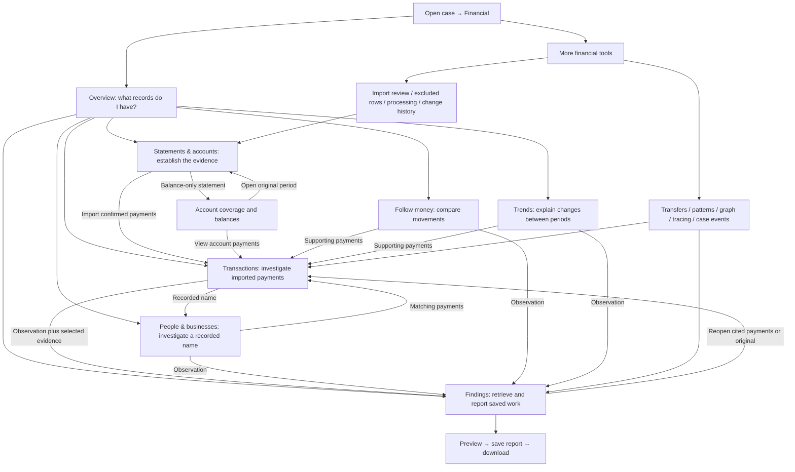
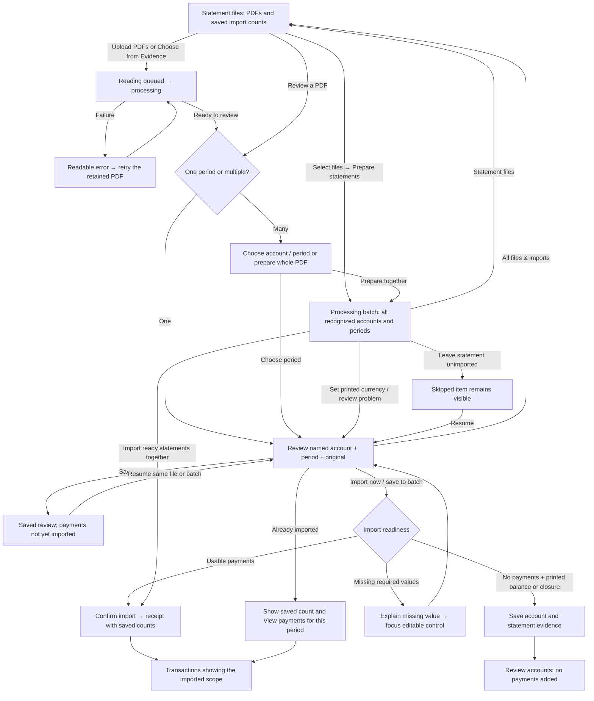
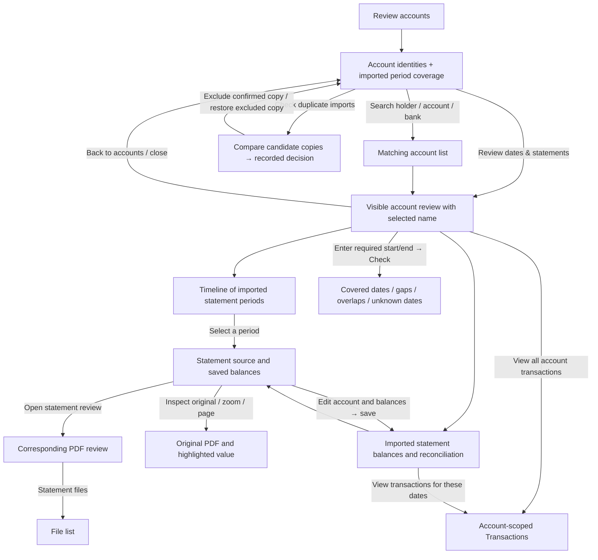
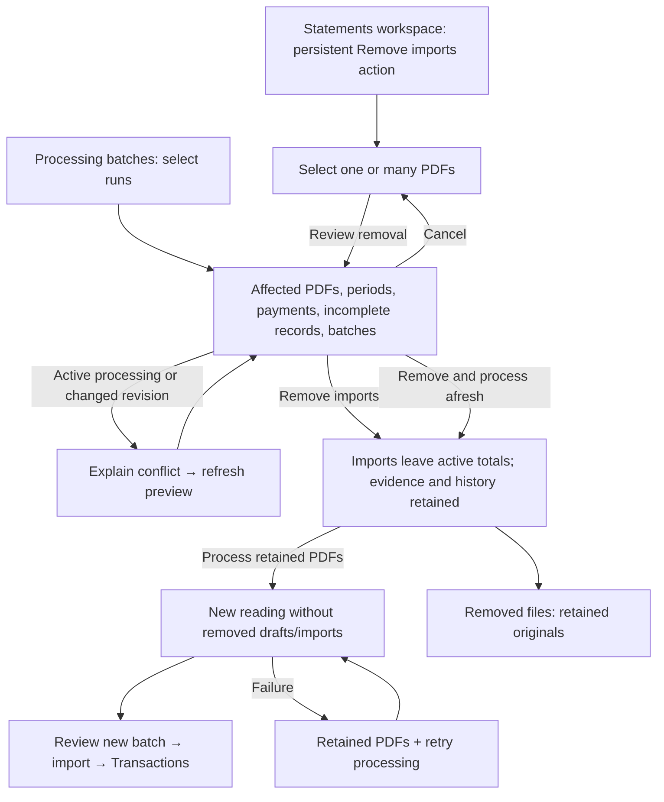
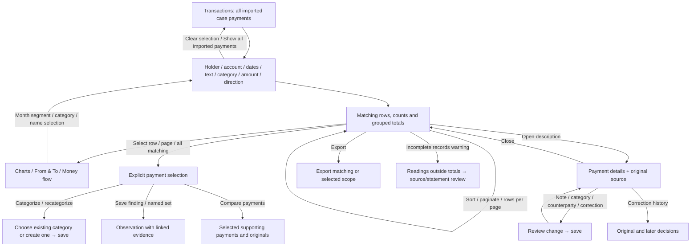
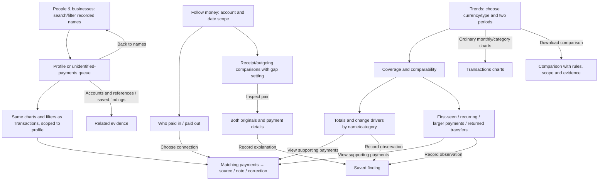
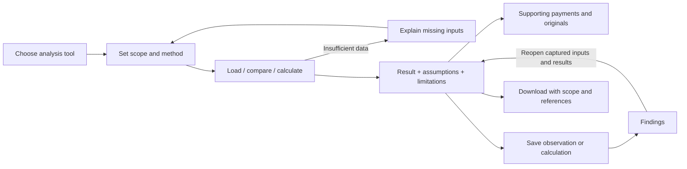
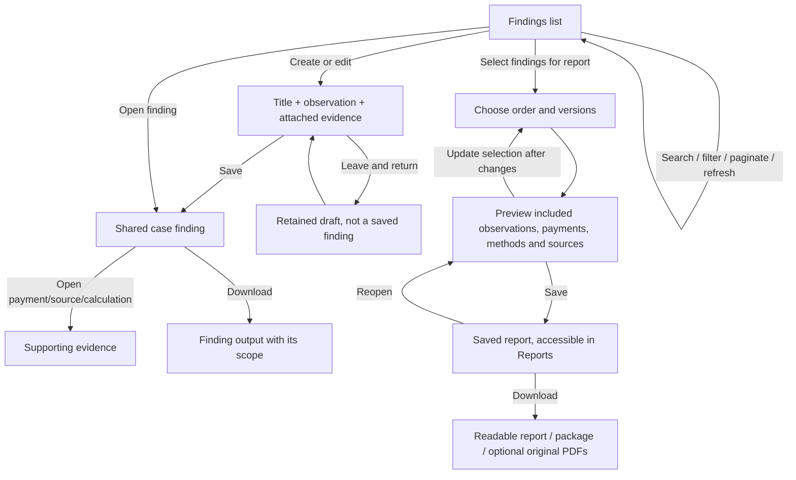

# Loupe financial investigator workflow reference

Owner: the product workflow, not an individual component. Updated 21 September 2026.

This reference records the agreed investigator journey and maps the implemented controls to it. **A diagram is not acceptance evidence.** Use the acceptance register below to distinguish a designed path, an automated check and an observed live result. Earlier checked plans do not override a newly reported usability failure.

The detailed [action inventory](action-inventory.md) is generated from every financial TSX file. It includes conditional controls, fields, menus, callbacks and legacy views, with source locations; [JSON](action-inventory.json) retains full handlers and disabled expressions. Regenerate it with `node scripts/financial-workflow-inventory.mjs` after changing controls. Dynamic labels represent families of actions, such as selecting any transaction or any statement period. Shared native controls, source viewing and permission/error paths are described below. This catalog is a code inventory, not proof that every runtime branch has been exercised.

## Navigation map

Every primary section is directly reachable from the top navigation. Clicking **Transactions** starts with all imported case payments. Explicit drill-downs may narrow to a statement, account, date range or saved set; that scope must be visible and removable. Totals remain separated by currency and bank/card account type.

## 1. Establish the evidence: files, batches and import

Investigator's question: **What did I upload, what has been read, and what is actually in my analysis?**

Actions and state:

- **Files:** upload multiple PDFs, choose evidence files/folders, search filename, filter status, refresh, open a PDF, select/clear/select all shown files, prepare selected files, review removal, view removed files, restore an older hidden file or process a removed PDF afresh. A file card summarizes its periods; it must not expand all 51 periods and hide its actions.
- **Batches:** list latest/older runs; distinguish date, starter, file count and ID; open a run; select/remove several runs; inspect progress; refresh/retry; filter problems; paginate; choose currencies; review an item; save progress; move to previous/next problem; skip/resume; check for additional periods; import ready items; open imported payments. Removing a file from a shared batch must retain unrelated items.
- **Period choice:** choose an account, choose/search a period, previous/next period, return to the period list. The selected account, dates and PDF pages remain visible. A period count is not a transaction count.
- **Single review:** compare original and extraction, inspect/edit printed values, edit holder/account/bank/dates/currency/balances, inspect arithmetic, correct one or several rows, add missed transactions, include/exclude/restore readings, assign unassigned rows, save progress, import. Suggestions and original readings remain distinguishable from investigator corrections.
- **Balance-only/closure:** explicit saved account/period/balances or closure, with zero payments. Missing is different from zero. No invented transaction is required.
- **Already imported:** the saved statement is identified as imported; the primary action opens its saved payments. Editing saved account/balance details updates that statement. A different reading requires the replacement/recovery path below, not a silent second import.
- **Wire/deposit documents:** their document review and saved finding are separate from a bank-statement import. Back returns to the same PDF's choices.

## 2. Check completeness, then inspect the right original

Investigator's question: **Do I have the statement dates I need, and do the imported payments reconcile?**

Account coverage uses **imported** statement dates. No internal gaps does not establish complete historical coverage before/after those dates, or perfect extraction. Unknown dates need review. Date-range and balance results must explain their actual scope.

Common source actions: open PDF, next/previous/direct page, source zoom, fit width, highlight amount/row, close source, inspect retained original text and provenance. Opening a source never changes the evidence. If the source fails, show the error and retry without losing the originating selection.

## 3. Recover a bad ingestion in the same case

Investigator's question: **How do I remove the bad financial records without losing my client's case or original evidence?**

This is an explicit financial removal, not deletion of the case or evidence PDF. A preview must identify scope **before confirmation**. Cancel must not mutate records. A failed restart after successful removal must say which operation succeeded and offer recovery. Reprocessing is allowed in the same case; it must not silently reuse the removed bad reading. Earlier citations and history remain available.

The separate **Read the statement again** path compares a new extraction with the current import; it may protect saved edits and require an explicit replacement decision. It is not synonymous with removing all prior imports. The UI must explain which path is being used.

## 4. Investigate transactions and retain context

Investigator's question: **Which payments matter, who is involved, and what evidence supports my interpretation?**

- Normal charts belong inside Transactions. Selecting a donut segment, category list item or bar section filters the relevant dashboard, not just a disconnected table. All categories must be reachable; no unexplained top-seven cutoff.
- Sender/recipient and perspective selections are visible chips with clear/reset actions. State intersections are explained. Money flow distinguishes external inflow/outflow from movement within a selected set.
- Main totals and selected totals identify their scopes. Bank cash and card debt are labeled distinctly; different currencies are never silently summed or converted.
- Names/categories inferred from descriptions are suggestions with inspectable origins. Unknown counterparties are an investigation queue, not a fictional person or a single common recipient.
- Manual categorization can override automatic choices; categories can be created and applied to individual or all matching transactions. Bulk operations show the true selection count across pages.
- Exports identify filtered versus selected scope and retain the evidence references. Notes CSV import/export is an explicit operation with mapping/validation and a visible outcome.

## 5. People, follow money and meaningful trends

A name in a payment does not prove legal identity or account ownership. Timing does not prove that a receipt funded the next debit. Trends must show the transactions driving a difference and whether missing coverage could explain it. A zero or empty chart bucket is not proof of inactivity. “First seen” means within available records, not first ever.

## 6. Further analysis and history

| Entry from More financial tools | Investigator actions and exit |
| --- | --- |
| Compare transfers | Set scope/rules; find candidates; inspect both sides and references; accept/reject/record rationale; inspect the linked payments; save/reopen the finding. A proposed match is distinct from a confirmed one. |
| Look for patterns | Choose supported check and settings; run; inspect explanation and supporting payments; change settings/retry; save an observation. Pattern suggestions are not conclusions. |
| Payment graph | Choose scope; select a node/connection; inspect linked payments and source; clear selection; return to Transactions or save a finding where offered. |
| Trace funds | Choose single-account, network or indirect method; choose account/currency/dates; load payments; choose source funds; enter assumptions; calculate; inspect allocations/limits; verify source support; save/reopen/download the calculation. Invalid/insufficient inputs explain what to fix without discarding the working form. |
| Payments and case events | Set account/date scope; inspect payments beside events; select evidence; record the observation with both references; reopen from Findings. |
| Import review | Filter/paginate imported rows; inspect source and source standing; review PDF candidates/duplicates; correct, exclude or restore with a recorded decision; inspect history and return to relevant statement/payments. |
| Excluded transactions | Inspect why a row is outside totals, inspect original and history; correct/restore through the permitted decision path. Do not present exclusion as physical deletion of evidence. |
| Processing history | Inspect runs and failed/incomplete attempts; open related evidence/import review; retry only the supported operation; retain prior attempt history. |
| Change history | Filter and inspect recorded decisions and replaced values; open original/affected payments; preserve the historical record. |
| Other financial records | Explicitly switch from statement payments to legacy/graph records; use that view's filters, tables and supported editing/export; switch back without merging the two datasets' totals. |

## 7. Findings and reports

Draft, saved finding, saved report and downloaded snapshot are separate states. Exporting does not silently save an unfinished note. Later transaction corrections do not rewrite historical report snapshots. Source packages disclose inclusion of complete PDFs and avoid claiming overlapping findings add to a meaningful global total.

## 8. Rules that apply to every action

| Situation | Required visible behavior |
| --- | --- |
| Action changes screen/context | Destination title and selected object visible; focus/scroll follows the transition. Back/close returns to the initiating task. No unseen result far down another scroll container. |
| Loading | Name what is loading. Retain the prior selection; prevent conflicting repeated writes. |
| Empty | Distinguish no source files, no imported payments, no matches, zero-valued data and data that could not be loaded. Offer the relevant next step. |
| Error | Explain the failed operation and what is still saved; retry without losing edits. Do not turn a failed read into a zero count. |
| Save | Say whether it saves a draft, confirms imports, changes a saved payment or saves a finding. Show the result in its destination. |
| Read-only access | Browsing/source/analysis remains available where permitted; writing controls are hidden/disabled with an intelligible access state. |
| Concurrent change | Refuse stale confirmation, explain the conflict and refresh/compare before a new write. |
| Scope change | Account/date/category/selection changes update dependent counts and charts together. Hidden filters are visible in the scope summary and clearable. |
| Switch tab / reopen | Keep unfinished work where promised; distinguish browser-tab drafts from saved shared case data. |
| Pagination | State total and current page; selection across pages has explicit scope. Search/filters remain available and clearable. |
| Remove/reprocess | Preview exact affected records; preserve original evidence/history; report removal and restart separately if only one succeeds. |

## Acceptance register — do not equate implementation with completion

| Journey | Current evidence / remaining work |
| --- | --- |
| Files → review → files → remove preview → cancel | Chromium passes a 51-period PDF journey with the removal control visible within a 1280×900 viewport. Preview cancellation sends no removal confirmation. Live acceptance follows deployment. |
| Account list → dates/statement dialog | Live click opened the selected ARRENDO account and matching dates/balances on 21 September. The user's earlier no-visible-result report has not been reproduced; do not claim its root cause proven. Navigation is being simplified and will be rechecked after deployment. |
| Multi-period context | Chromium verifies the compact card, explicit 51-period context, saved payment count, payment destination and return to the file list. Source-to-review navigation now carries the clicked period ID; a legacy source without an ID clears the unrelated remembered period. API and component regressions pass; live handoff remains to be checked. |
| Upload draft → leave → resume | Component regression passes: switch account/transaction/file/removal views, then resume the same unfinished uploaded PDF without losing it. |
| Broad financial analysis and reports | Mapped from current source and prior acceptance records; not all re-exercised live in this change. Use the linked action catalog to audit each conditional action before claiming comprehensive acceptance. |
| Alex's complete 588-file corpus | Still not certified by this reference. See [Alex's acceptance record](../alex-financial-acceptance.md). |

Further workflow audits must update this register with the tested revision, route, visible outcome and limitations. Fix newly found broken transitions before marking that journey accepted. The map must evolve with the product rather than remain a diagram of an earlier design.

Local validation for this change: 117 focused component tests, seven Chromium workflow tests and eight statement-source backend tests passed. Production build, scoped lint and diff checks pass. The build retains existing large-chunk warnings. Browser fixtures validate interactions and layout, not extraction of the full client corpus.
