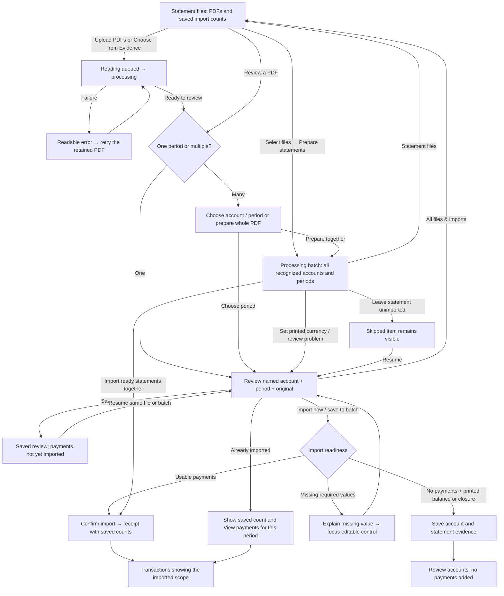
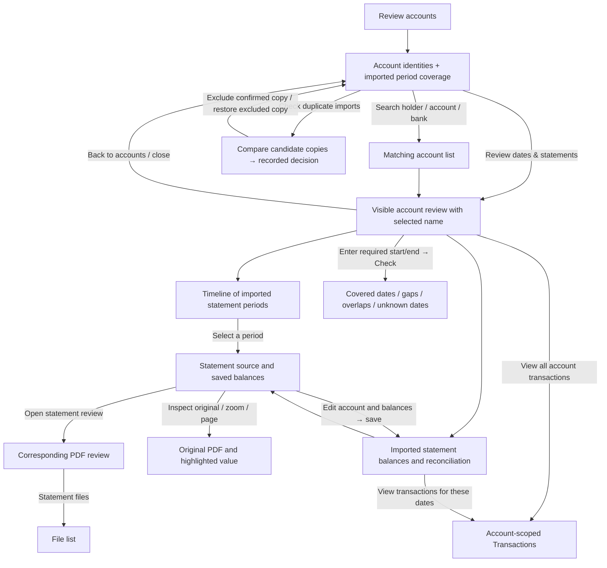
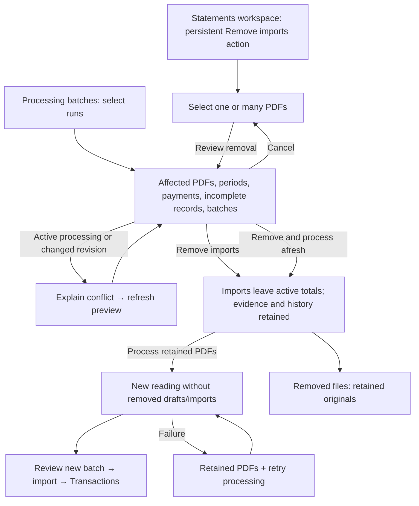
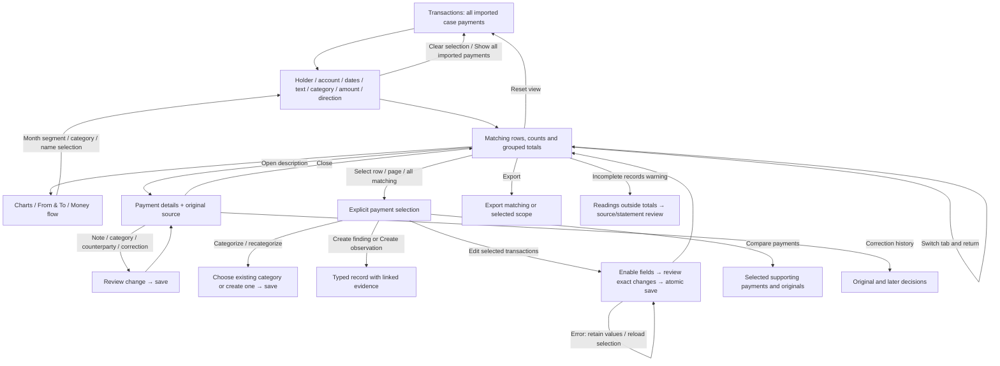
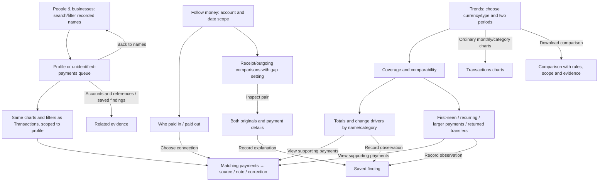
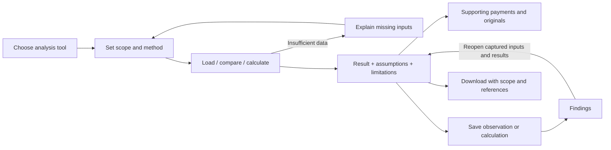
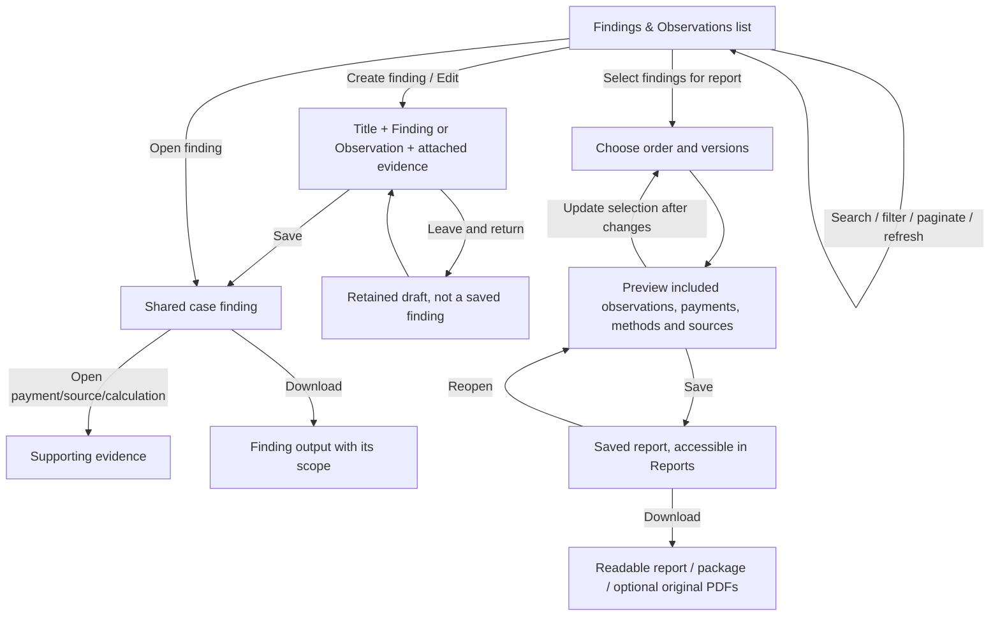
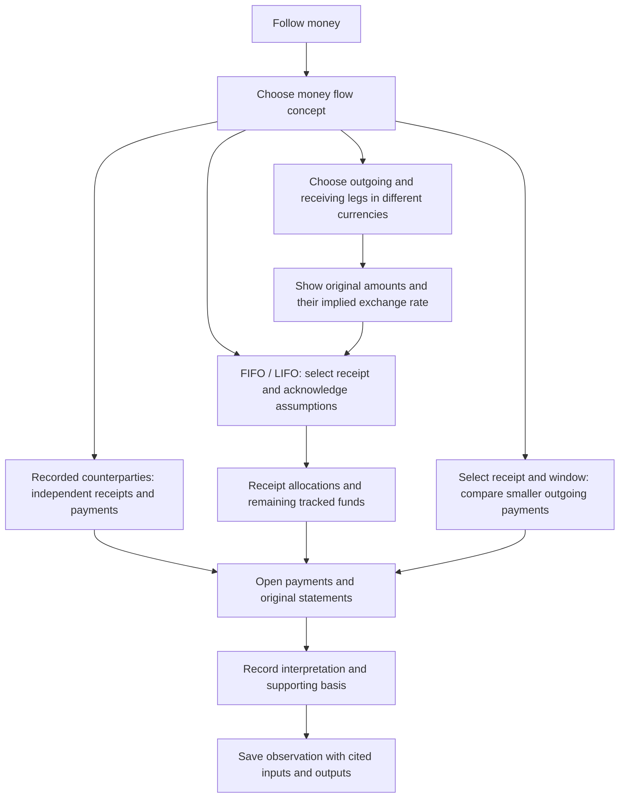
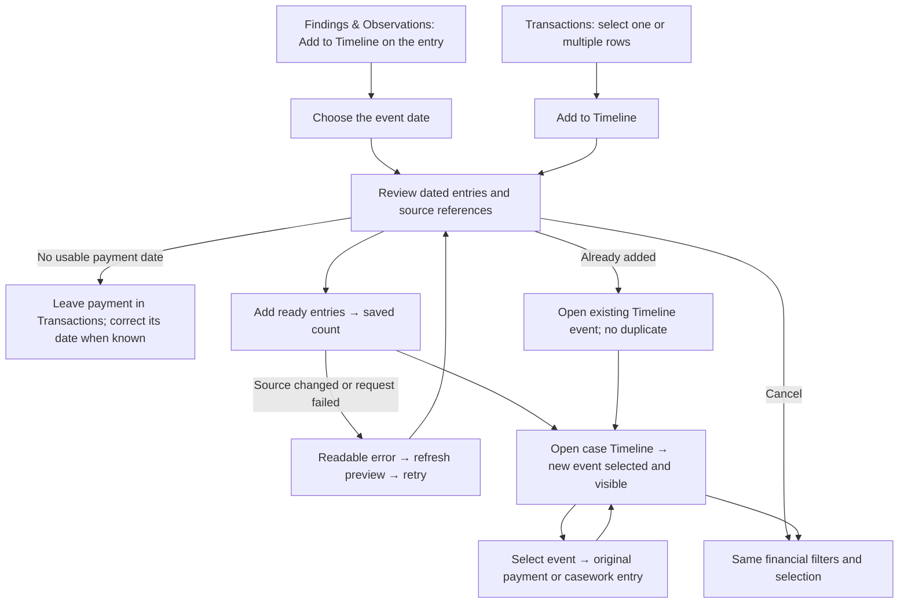

# Loupe financial investigator workflow reference

**Current work — 24 September collected feedback:** [prepare details → reconcile → save transactions or inactive periods → compare account history](reconciliation-and-account-history-plan-2026-09-24.md) covers batch dates/month shortcut, Apply USD, copying/opening the source, strict reconciliation and visible zero-activity history. Its admission policy supersedes earlier descriptions of optional unresolved statement checks. Implementation/acceptance remain open in that plan.

**24 September duplicate-review follow-up:** [unchanged preparation → matching-statement hold → compare → leave copy unimported or record an exception → import once → reopen](duplicate-statement-review-2026-09-24.md) records the shared safeguards, retained decisions and live-incident limits.

**24 September saved-work follow-up:** [compact finding cards and readable saved text](finding-cards-2026-09-24.md) replaces full-width rows with square cards, groups Edit/Timeline beneath each title and fixes visible storage headings in existing notes with empty follow-up fields.

**24 September ready-to-import follow-up:** [counter → ready periods → review → import → return](ready-statement-workflow-2026-09-24.md) records direct period actions, visible focus/navigation, persisted results and the final local checks.

**Processing capabilities:** [banks, statement families and source formats](processing-capabilities.md) records the shared readers and their specific limits.

**24 September statement collections:** [reusable bank/card readers and acceptance](statement-collections-2026-09-24.md) records the Credit One layout, Andrews date spacing, targeted image rereads and the mixed-account import/reopen journey. These shared readers apply to future files in every case; private source material is excluded from the repository.

**24 September connected release:** [source selection, compact saved work and one-time recovery](next-release-2026-09-24.md). Local implementation and workflow verification are recorded there, including the later missing-reading Retry repair and batch-wide review-reason workflow. Review reasons now distinguish import blockers, importable checks and already-imported checks; selecting a reason retains that scope through review, correction and return. The newly reported live BBVA failures still require their matching sources/error records; the supplied zero-activity statement passes local import. The content/provenance cleanup remains a separate scheduled production pass; publication and live results are recorded separately.

Owner: the product workflow, not an individual component. Updated 23 September 2026.

**24 September correction:** [Evidence uploads and Financial scope](evidence-file-scope-2026-09-24.md). Ordinary files uploaded to Evidence stay there until explicitly selected for Financial. Financial relevance is based on content across CSV, Excel, Word, images, PDFs and other formats; reader capability is separate from file membership. Existing financial reviews/imports and reading history remain available; merely displaying a file never starts processing.

**Current feedback plan:** [23 September complete review/import implementation plan](feedback-implementation-plan-2026-09-23.md). The user's feedback collection and follow-ups reopen statement extraction, corrections, repeated bulk edits, manual payment entry, review-filter persistence, import/retry recovery, readiness, batch navigation and account discovery/consolidation, and add existing-counterparty/account selection with explicit payment direction. It maps 28 reports to nine connected workstreams and twelve acceptance journeys. All 28 reports are implemented and locally verified in the [current acceptance record](implementation-progress-2026-09-23.md), including real-service browser save/import/repeated-correction checks. Publication and independent live acceptance are recorded separately.

Latest implementation and acceptance: [23 September release verification](release-verification-2026-09-23.md) and the [completion register](completion-register.md). The user confirmed that release was deployed; pushes trigger automatic deployment. The reported existing-data incidents and independent live acceptance remain distinct. The [recovery and identity flows](recovery-and-identity-workflows.md), [ownership design](account-ownership-and-money-trails.md) and [bank-layout record](bank-layout-acceptance.md) retain the intended journeys and source-coverage limits.

This reference records the agreed investigator journey and maps the implemented controls to it. **A diagram is not acceptance evidence.** Use the acceptance register below to distinguish a designed path, an automated check and an observed live result. Earlier checked plans do not override a newly reported usability failure.

Current planning priority: [platform-wide statement ingestion, correction and import workflow](statement-ingestion-workflow-plan.md), 22 September. This addresses Alex's new reports together: wrong/locked currency, missing account details and dates, concurrent processing, an import with no visible outcome, unresolved flags, duplicates and ambiguous status. BNB2 is the reproduction case; the requirements apply to all existing/future Financial cases and ingestion paths. The suspected creation of duplicate financials requires tracing generated source versions through folder selection, processing and current ledger totals. The plan contains the connected flow, per-journey acceptance checks, cross-case regression matrix and delivery order. **It is a plan, not evidence of implementation or deployment.** Its live BNB2 observations supersede earlier descriptions of that case as empty; the case has changed since those earlier checks.

The detailed [action inventory](action-inventory.md) is generated from every financial TSX file. It includes conditional controls, fields, menus, callbacks and legacy views, with source locations; [JSON](action-inventory.json) retains full handlers and disabled expressions. Regenerate it with `node scripts/financial-workflow-inventory.mjs` after changing controls. Dynamic labels represent families of actions, such as selecting any transaction or any statement period. Shared native controls, source viewing and permission/error paths are described below. This catalog is a code inventory, not proof that every runtime branch has been exercised.

## Navigation map

Every primary section is directly reachable from the top navigation. The first visit to **Transactions** starts with all imported case payments; returning retains its filters, selection, panels and page. **Reset view** explicitly resets presentation state. Explicit drill-downs may narrow to a statement, account, date range or saved set; that scope must be visible and removable. Totals remain separated by currency and bank/card account type.

## 1. Establish the evidence: files, batches and import

Investigator's question: **What did I upload, what has been read, and what is actually in my analysis?**

Actions and state:

- **Files:** upload multiple PDFs, choose evidence files/folders, search filename, filter status, refresh, open a PDF, select/clear/select all shown files, prepare selected files, review removal, view removed files, restore an older hidden file or process a removed PDF afresh. A file card summarizes its periods; it must not expand all 51 periods and hide its actions.
- **Batches:** list latest/older runs; distinguish date, starter, file count and ID; open a run; select/remove several runs; inspect progress; refresh/retry; filter problems; paginate; choose currencies; review an item; save progress; move to previous/next problem; skip/resume; check for additional periods; import ready items; open imported payments. Removing a file from a shared batch must retain unrelated items.
- **Period choice:** choose an account, choose/search a period, previous/next period, return to the period list. The selected account, dates and PDF pages remain visible. A period count is not a transaction count.
- **Single review:** compare original and extraction, inspect/edit printed values, edit holder/account/bank/dates/currency/balances, inspect arithmetic, correct one or several rows, add missed transactions, include/exclude/restore readings, assign unassigned rows, save progress, import. Suggestions and original readings remain distinguishable from investigator corrections.
- **Balance-only/closure:** explicit saved account/period/balances or closure, with zero payments. Missing is different from zero. No invented transaction is required.
- **Already imported:** the saved statement is identified as imported; the primary action opens its saved payments. Editing saved account/balance details updates that statement. A different reading requires the replacement/recovery path below, not a silent second import.
- **Wire/deposit documents:** their document review and saved finding are separate from a bank-statement import. Back returns to the same PDF's choices.

## 2. Check completeness, then inspect the right original

### Bulk account details — added after Alex's 23 September feedback

Investigator journey: **Statement files → select PDFs → Edit account details →
select statement periods → tick fields → review each change → Save**. The same
editor is directly available in **Processing batches**. It includes imported and
unimported statements and retains search-hidden selections across its pages.

The fields are holder, account number, bank, currency and statement dates.
**Fill missing details only** is the default; replacing populated values is an
explicit choice. Unticked fields, transaction dates and printed amounts are
preserved. Currency correction is relabelling with exact decimal rescaling, not
FX conversion. The preview identifies every affected PDF/period and shows before
and after values. Save reports imported statements updated, drafts saved for later
import and unchanged statements. Closing retains the draft; reopening or retrying
does not repeat a completed save. Active batch work and stale edits are refused
without partial writes. Unread or conflicting statements explain the individual
review needed; they are not silently included. Original evidence and corrections
remain in history.

This is distinct from selecting accounts as filters or bulk editing transaction
rows. Alex identified this missing journey after the earlier release; that release
had only individual account correction and bulk currency selection.

Local verification covers mixed imported/draft selections, preserving payments
and row edits, all-or-nothing rollback, lost-response retry, stale/cross-case edits,
batch/individual draft consistency, currency decimal changes and both browser
entry points including narrow-screen controls. Publication status is recorded in
the completion register.

Investigator's question: **Do I have the statement dates I need, and do the imported payments reconcile?**

Account coverage uses **imported** statement dates. No internal gaps does not establish complete historical coverage before/after those dates, or perfect extraction. Unknown dates need review. Date-range and balance results must explain their actual scope.

Common source actions: open PDF, next/previous/direct page, source zoom, fit width, highlight amount/row, close source, inspect retained original text and provenance. Opening a source never changes the evidence. If the source fails, show the error and retry without losing the originating selection.

## 3. Recover a bad ingestion in the same case

Investigator's question: **How do I remove the bad financial records without losing my client's case or original evidence?**

This is an explicit financial removal, not deletion of the case or evidence PDF. A preview must identify scope **before confirmation**. Cancel must not mutate records. A failed restart after successful removal must say which operation succeeded and offer recovery. Reprocessing is allowed in the same case; it must not silently reuse the removed bad reading. Earlier citations and history remain available.

The separate **Read the statement again** path compares a new extraction with the current import; it may protect saved edits and require an explicit replacement decision. It is not synonymous with removing all prior imports. The UI must explain which path is being used.

## 4. Investigate transactions and retain context

Investigator's question: **Which payments matter, who is involved, and what evidence supports my interpretation?**

- Normal charts belong inside Transactions. Selecting a donut segment, category list item or bar section filters the relevant dashboard, not just a disconnected table. All categories must be reachable; no unexplained top-seven cutoff.
- Sender/recipient and perspective selections are visible chips with clear/reset actions. State intersections are explained. Money flow distinguishes external inflow/outflow from movement within a selected set.
- Main totals and selected totals identify their scopes. Bank cash and card debt are labeled distinctly; different currencies are never silently summed or converted.
- Names/categories inferred from descriptions are suggestions with inspectable origins. Unknown counterparties are an investigation queue, not a fictional person or a single common recipient.
- Manual categorization can override automatic choices; categories can be created and applied to individual or all matching transactions. Bulk operations show the true selection count across pages.
- Exports identify filtered versus selected scope and retain the evidence references. Notes CSV import/export is an explicit operation with mapping/validation and a visible outcome.

## 5. People, follow money and meaningful trends

A name in a payment does not prove legal identity or account ownership. Timing does not prove that a receipt funded the next debit. Trends must show the transactions driving a difference and whether missing coverage could explain it. A zero or empty chart bucket is not proof of inactivity. “First seen” means within available records, not first ever.

## 6. Further analysis and history

| Entry from More financial tools | Investigator actions and exit |
| --- | --- |
| Compare transfers | Set scope/rules; find candidates; inspect both sides and references; accept/reject/record rationale; inspect the linked payments; save/reopen the finding. A proposed match is distinct from a confirmed one. |
| Look for patterns | Choose supported check and settings; run; inspect explanation and supporting payments; change settings/retry; save an observation. Pattern suggestions are not conclusions. |
| Payment graph | Choose scope; select a node/connection; inspect linked payments and source; clear selection; return to Transactions or save a finding where offered. |
| Trace funds | Choose single-account, network or indirect method; choose account/currency/dates; load payments; choose source funds; enter assumptions; calculate; inspect allocations/limits; verify source support; save/reopen/download the calculation. Invalid/insufficient inputs explain what to fix without discarding the working form. |
| Payments and case events | Set account/date scope; inspect payments beside events; select evidence; record the observation with both references; reopen from Findings. |
| Import review | Filter/paginate imported rows; inspect source and source standing; review PDF candidates/duplicates; correct, exclude or restore with a recorded decision; inspect history and return to relevant statement/payments. |
| Excluded transactions | Inspect why a row is outside totals, inspect original and history; correct/restore through the permitted decision path. Do not present exclusion as physical deletion of evidence. |
| Processing history | Inspect runs and failed/incomplete attempts; open related evidence/import review; retry only the supported operation; retain prior attempt history. |
| Change history | Filter and inspect recorded decisions and replaced values; open original/affected payments; preserve the historical record. |
| Other financial records | Explicitly switch from statement payments to legacy/graph records; use that view's filters, tables and supported editing/export; switch back without merging the two datasets' totals. |

## 7. Findings and reports

Draft, saved finding, saved report and downloaded snapshot are separate states. Exporting does not silently save an unfinished note. Later transaction corrections do not rewrite historical report snapshots. Source packages disclose inclusion of complete PDFs and avoid claiming overlapping findings add to a meaningful global total.

## 8. Rules that apply to every action

| Situation | Required visible behavior |
| --- | --- |
| Action changes screen/context | Destination title and selected object visible; focus/scroll follows the transition. Back/close returns to the initiating task. No unseen result far down another scroll container. |
| Loading | Name what is loading. Retain the prior selection; prevent conflicting repeated writes. |
| Empty | Distinguish no source files, no imported payments, no matches, zero-valued data and data that could not be loaded. Offer the relevant next step. |
| Error | Explain the failed operation and what is still saved; retry without losing edits. Do not turn a failed read into a zero count. |
| Save | Say whether it saves a draft, confirms imports, changes a saved payment or saves a finding. Show the result in its destination. |
| Read-only access | Browsing/source/analysis remains available where permitted; writing controls are hidden/disabled with an intelligible access state. |
| Concurrent change | Refuse stale confirmation, explain the conflict and refresh/compare before a new write. |
| Scope change | Account/date/category/selection changes update dependent counts and charts together. Hidden filters are visible in the scope summary and clearable. |
| Switch tab / reopen | Keep unfinished work where promised; distinguish browser-tab drafts from saved shared case data. |
| Pagination | State total and current page; selection across pages has explicit scope. Search/filters remain available and clearable. |
| Remove/reprocess | Preview exact affected records; preserve original evidence/history; report removal and restart separately if only one succeeds. |

## Acceptance register — do not equate implementation with completion

| Journey | Current evidence / remaining work |
| --- | --- |
| Files → review → files → remove preview → cancel | Chromium passes a 51-period PDF journey with the removal control visible within a 1280×900 viewport. Live `43f465b` in finance sunday shows compact cards and persistent removal navigation. Selecting all three PDFs previews 53 periods / 672 transactions / 0 incomplete records / one batch. Cancel and Show all imported payments leave 672 of 672 transactions available. No live removal or reprocessing was confirmed. |
| Account list → dates/statement dialog | Live `43f465b`: Review accounts → Capital One date review opens a visible dialog with 51 periods and matching balances. Before the change, ARRENDO also opened correctly; the user's earlier no-visible-result report has not been reproduced, so its root cause is not claimed as proven. |
| Multi-period context | Chromium verifies compact cards, explicit period/import status and the payment action within that context. Live `43f465b`: December–January review opens six payments. Account balance review → first period → Review or reread opens 30 November–23 December 2020 and five payments, instead of the remembered second period. The final follow-up connects the timeline source to the same handoff and moves View payments into the first-screen context panel. |
| Upload draft → leave → resume | Component regression passes: switch account/transaction/file/removal views, then resume the same unfinished uploaded PDF without losing it. |
| Broad financial analysis and reports | Mapped from current source and prior acceptance records; not all re-exercised live in this change. Use the linked action catalog to audit each conditional action before claiming comprehensive acceptance. |
| Alex's complete 588-file corpus | Still not certified by this reference. See [Alex's acceptance record](../alex-financial-acceptance.md). |

Further workflow audits must update this register with the tested revision, route, visible outcome and limitations. Fix newly found broken transitions before marking that journey accepted. The map must evolve with the product rather than remain a diagram of an earlier design.

Local validation for this change: 117 focused component tests, seven Chromium workflow tests and eight statement-source backend tests passed. Production build, scoped lint and diff checks pass. The build retains existing large-chunk warnings. Browser fixtures validate interactions and layout, not extraction of the full client corpus.

The live walkthrough prompted a final layout/handoff follow-up: remove a duplicate back control, place View payments beside the saved status, and expose the period review link from both timeline and balance sources. Six Chromium checks and 57 account/timeline/navigation component checks pass for that follow-up. Live observations above are from the actual authenticated case at `/cases/1c75e65e-d28d-4de2-8eb1-0c03b218700e/financial`; they do not imply all other branches have been re-exercised.

Final live verification, `c350c0c`, 21 September 2026: Review accounts → Capital One → timeline period 2 → Inspect statement source → Review or reread statement opens 24 December 2020–23 January 2021, with its six saved payments. At the observed 1243×913 viewport, the period, imported status and primary View payments button are visible together without scrolling. The button opens exactly six matching payments; returning to Statements keeps the visible workspace navigation, and Remove imports opens its dedicated selection/explanation screen. The final code build and scoped lint passed. The removal demonstration remained cancelled; the 672-payment case was preserved.

## Working-session acceptance — 22 September 2026

The transaction toolbar keeps text/Boolean search, Category, Filters and Charts / From & To / Money flow together beside the table. Multiple holders include their accounts across banks; multiple account selections are any-match, intersected with selected holders. The shared server filters apply to transactions, incomplete records, summaries, snapshots and export. Export verifies the account-selection digest. Account choices load through all directory pages. Amount ordering uses displayed amount size with currency decimal exponents, without FX conversion.

Single-row **Edit transaction**, **Edit selected transactions** and **Categorize selected** open the same reviewed edit workflow. Enabled fields only are changed. Amount/date/source corrections retain original readings and append correction history; labels apply to the resulting current rows in the same database transaction. A stale selection or failure rolls back the entire save. Categories can be entered and added to the library. Account identity and currency remain statement/account properties, not arbitrary per-payment overrides.

**Create finding** stores a Finding; **Create observation** replaces Mark for follow-up and uses observation modal/save wording. Both and selected export are directly visible with a transaction selection. Existing kind tags remain compatible: former `financial-observation` entries display Finding; former `financial-question` entries display Observation. New entries additionally have explicit `financial-entry-finding` / `financial-entry-observation` tags. The destination is **Findings & Observations**, with **Edit** per entry. Navigation retains tab state. Reset clears that view’s filters/layout rather than saved records or unfinished statement/finding/report drafts.

The recorded diagram explains that arrows show independent directions, not receipt-to-withdrawal causation; totals include unnamed counterparties. FIFO/LIFO exploration explicitly assumes zero opening funds and source-document/row order for same-day entries, and requires acknowledgment. It excludes undated, card, noncurrent and unusable rows. It identifies withdrawals not covered by preceding imported receipts. Full opening-fund and attributed-claim analysis remains available in the existing tracing workbench. Split-payment results are timing candidates, never claimed as confirmed funding. Cross-currency investigation uses two explicitly chosen legs; the ratio is derived from their recorded amounts and may include fees, not a market FX quote or automatically verified link. Onward allocations remain in the received currency. Saved observations retain the full applied calculation input order and supporting citations. No automatic multi-hop FX matching or evidence of legal applicability is claimed.

Local checks cover real database removal preview/conflict/confirmation with original PDFs retained, atomic edit rollback/source history, holder/account intersections and new ingestions, Boolean query and export ordering, plus Chromium account selection/return/reset, edit review/recovery, Finding/Observation save labels, cross-currency onward flow and one/eight-file removal dialogs at small viewport. Deployment/live evidence is recorded separately below; a synthetic browser check is not full live-corpus acceptance.

## Add financial evidence to Loupe Timeline — 22 September 2026

Investigator objective: place a selected payment, Finding or Observation alongside the other dated events in this case, with an inspectable source and a way back to the investigation.

- The Timeline receives one event per selected dated transaction; maximum 5,000 per addition. Original currencies and exact amounts remain separate. No synthetic payment time or statement-end placeholder is used. The preview states whether it used the transaction, posted, value or effective date.
- Findings and Observations keep their classification and linked evidence. Their event date is explicitly chosen by the investigator, independently of the note's creation date. Re-adding an existing entry preserves its already chosen date.
- Explicit additions are case-scoped, permission checked and idempotent. Correcting a payment updates the same Timeline event through its correction chain. Its as-added snapshot remains stored. A removed/excluded source leaves a labelled saved copy in Timeline; it does not restore the financial import or change its totals.
- Opening Timeline clears stale Timeline filters to reveal the new event. Source inspection and Back to Financial preserve the originating financial filters and selection. Regular Timeline filters, saved views and CSV/PDF export include the added entries. Account connections remain account references; counterparty strings are not promoted into verified identities.
- Source removal is distinct from removing an event from a chronology. This change does not add a separate Timeline deletion/editor workflow.

Implementation evidence: isolated SQL-backed tests cover preview/confirm/reopen, duplicate additions, corrections, undated rows, removed sources, chosen dates, Finding/Observation classification, case isolation, permissions and saved-view/CSV resolution. Chromium fixtures cover Transactions → Timeline → original payment → return, both casework types → Timeline → source-entry handoff → return, and small-screen stale-preview recovery. The browser check opens the actual Workspace detail sheet and verifies the saved explanation, then returns to Findings & Observations. Validation: 19 backend tests, 26 component/hook tests and five Chromium workflow tests pass; the production build passes with existing chunk-size warnings. Deployment is now verified at `73e9cf45` after the user authorized all ready work. Live payment and Finding Timeline previews, bulk-edit field discovery, Boolean search and retained Transactions state were checked and cancelled/reset without saving client-case changes. Saved Timeline creation remains covered by isolated SQL and Chromium fixtures, not a live client-case write.

## Balance interpretation and false-record recovery — 22 September 2026

- A complete zero-activity statement follows Review → confirm printed account/period/balances → Save statement balances and open account → saved period with zero payments. It must not tell the investigator to invent or fix transactions.
- An unchanged older import containing only false incomplete readings follows Transactions warning → Review named statement → visible explanation of the bad earlier reading → Save statement balances and open account. Replacement removes the false warning from active totals while retaining original PDF, import history and investigator account corrections. Actual transaction edits prevent automatic replacement.
- BBVA operation balances are paired with the operation-column movements; liquidation balances are kept as separate source information. The review names the chosen basis beside opening/closing controls. Prior-period movements explicitly repeated for settlement are kept with their source page, outside the current-period payments and totals. They must not become a second set of payments or missing-value errors.
- NOVAC actual-PDF replay: three-page complete zero-activity MXN statement; zero transactions and zero-valued opening/closing balances. A local legacy generic import's 163 false records become zero active incomplete records (Alex's earlier stored OCR had 162); no missing values were invented.
- ARRENDO January 2026 actual-PDF replay: 148 transactions, 24 credits and 124 debits, no row/statement reading issues. Operation opening and closing reconcile, both printed totals match, and 21 running-balance intervals match. Page 11's prior-period payroll explains the operation/liquidation opening difference. Save/reopen is idempotent in isolated SQL.
- Chromium tests cover balance-only review/save, old false-record recovery → return to Transactions with warning cleared, and the operation/settlement explanation beside editable balance controls. The provided PDFs and OCR remain local, outside committed fixtures; regression fixtures use synthetic identities.

The earlier ready releases `e0bce92c`/`73e9cf45` are live with current database schema and healthy services. Live walkthrough in monday finance verified Timeline previews (payments and a Finding), direct bulk-edit controls, Finding/Observation labels, Boolean search and tab-state retention; all mutation previews were cancelled. The BNB2 client Financial case was already empty when the NOVAC warning was investigated; no files were restored or altered there. New repair deployment/live verification remains to be recorded below.

Upload gate: automatic approval review rejected sending the two supplied financial PDFs to live neil finance without explicit file-and-destination authorization. The user has been asked; neither file was uploaded. Local actual-PDF tests and release deployment continue independently.

Deployment verified: `2327d9bb` is live. The version endpoint identifies `2327d9b`; Admin Updates identifies the same deployed/latest revision. Deploy log `deploy-20260922-014132.log` completed in 195 seconds, with current database schema, healthy Postgres/Neo4j/evidence engine, and compiled frontend served on 5174. Read-only live verification in neil finance reopened the existing January 2021 MXN statement with its 137 saved payments intact and the new operation-balance explanation visibly beside its opening/closing controls. A screenshot at 1280×720 confirmed readable placement in dark mode. No supplied PDF was uploaded and no live case records changed: the explicit upload question is still pending. Therefore the two new source PDFs are locally verified, deployed reader/UI is verified, but their full live upload/import journey remains unverified.
