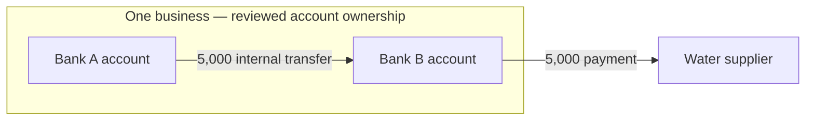

# Account ownership and an onward money trail

22 September 2026. Design and implementation reference. Current implementation and verification are recorded in [the September 23 release record](release-verification-2026-09-23.md); no live deployment is claimed. Applies to all cases and future ingestions. No live records were edited. Examples below are synthetic; client documents and identifiers remain outside this repository.

## Investigator outcome

An investigator starts with a receipt in one account, establishes that the sender's account belongs to the same business, pairs the two statement entries for the internal transfer, follows the receiving account's payment to an outside supplier, and saves a sourced explanation. The same account ownership and transfer decisions must be visible in Statements & accounts, Transactions, People & businesses, Follow money, Findings & Observations and Timeline.

This illustration describes the intended interpretation. In actual results, distinguish each link supported by statement entries from an investigator's allocation assumption. Two accounts and two real payment events must remain distinct. The sending debit and receiving credit of one transfer are two legitimate statement entries, not duplicate transactions to delete.

## What the evidence can establish

| Evidence | Use | Limit |
|---|---|---|
| Holder name in the account header | Suggested account holder | Name normalization alone cannot establish legal identity |
| Holder RFC or another jurisdiction's business/person identifier | Stronger suggestion that differently named accounts have the same holder | Extract the account holder's field, not the bank's footer identifier; preserve source, jurisdiction and date |
| CLABE/IBAN/account number, bank and currency | Resolve a referenced account to an imported account or a reference without statements | Identifier aliases need source evidence; matching a suffix or customer number is insufficient |
| Explicit sender/recipient fields in a transfer description | Suggest payment endpoints with source spans | Bank names are payment institutions, not necessarily payer/payee; do not concatenate both sides into one person |
| Tracking key and bank/date/account context | Compare the sending and receiving entries | Preserve ambiguity, returns, amount/currency conflicts and reused ordinary references |
| "Transfer between accounts" wording | Suggest an internal transfer for review | It does not independently establish common ownership |
| Running balance before and after receipt/payment | Explain the observed sequence and available balance | Missing entries, an opening balance and same-day ordering can change a funding interpretation |
| Investigator knowledge | Save a reviewed ownership or payment relationship with a reason | Label its basis as investigator knowledge; never manufacture a statement citation |

Banco de México describes the CLABE as an 18-digit account identifier, distinguishes the ordinary numeric reference from the tracking key, and describes the CEP as confirmation of the credit based on information supplied by the receiving institution. A CEP can be attached as additional transfer evidence. Its existence does not establish that a later withdrawal was funded by that receipt. [Official SPEI and CEP guidance](https://www.banxico.org.mx/servicios/mi-spei_-transferencias-ban.html).

The SPEI rules explicitly qualify the supplied beneficiary name with “Dato no verificado por esta institución.” Keep this qualification as provenance, not as part of a business's display name. [Banco de México, Circular 14/2017](https://www.banxico.org.mx/marco-normativo/normativa-emitida-por-el-banco-de-mexico/circular-14-2017/%7BA06FBFEE-06BB-F249-32FC-25B334B2A744%7D.pdf).

## 1. Establish the right account before linking ownership

Start: statement review, an account card or a payment's account link.

Show the printed holder, bank, account identifier, currency, period and source page together. Preserve distinct typed identifiers: account number, CLABE/IBAN, customer number, contract/statement number and tax identifier. Multiple account numbers can be documented aliases of one account; a customer or statement number shared by several products must not merge those products.

A statement PDF may contain several currency-specific accounts or subaccounts under one customer header. Scope each balance table and transaction block to its own account and currency, including continuation pages. Never choose a currency for every payment merely because USD appears elsewhere in the PDF. If the scope is uncertain, present the source blocks and ask which account they describe. The investigator can correct one block/account without relabelling an unrelated account in the same PDF.

For existing mixed imports, show a preview mapping each affected payment and balance to its corrected account/currency. Retain original readings and all payment/finding/Timeline citations. Changing a currency label is not FX conversion. Apply no automatic client-case repair as part of development.

## 2. Link accounts to their owner

Entry points: **Link account to person or business** on an account/payment, **Link selected accounts** in Review accounts, and **Add linked accounts** on a People & businesses profile. These open the same review, without navigating away or discarding filters.

1. Select one or several accounts, across banks and currencies.
2. Choose an existing person/business or create one. Show possible existing matches before creating another spelling of the same entity.
3. See any suggestion and its reason: matching holder identifier, matching source holder name, or a referenced account. Open the cited header in place.
4. State the relationship: recorded account holder; authorized signatory/controller where relevant; or group member for analysis. Only a reviewed holder relationship supports “same owner.” Common control, a shared signatory and beneficial ownership are separate assertions.
5. Record the basis: source document/page, other evidence, or investigator knowledge and a note. Allow a supported effective period, or explicitly leave it unspecified. A later statement must not silently establish ownership throughout all earlier dates.
6. Preview the accounts, existing links and effect on grouping. Save gives a visible receipt and linked-owner badge. Source holder strings remain unchanged.

The profile then lists each bank account separately, with currency, identifier, dates and evidence. Company selection uses the canonical identity plus its reviewed account links, rather than relying exclusively on normalized holder text. Group membership with shared ownership must not imply exclusive ownership: allow joint holders and keep controlling/signatory links out of the default owner filter.

Correction: change/unlink with a reason and history. Explain which saved trails require review. A stale concurrent edit preserves the draft and shows the changed link; it must not overwrite another investigator's decision. Case access rules apply on every endpoint.

## 3. Mark the transfer from the payment being investigated

Start: **Link transfer** on a receipt/debit, or select two rows and choose **Link as transfer** beside the table. Suggested matches are useful but manual linking cannot depend on a match appearing in the algorithm's candidate list.

1. Show **From: business / Bank A / account** and **To: business / Bank B / account** separately.
2. Look across the case for the opposite statement entry, not just the currently filtered account/file. Explain the expanded search scope and preserve the original filters for return.
3. Rank candidates by structured tracking key, source/destination account identifiers, currency, amount and transaction/posted/value date. Show why each candidate matches and conflicts. An amount/date-only match remains a suggestion.
4. Show both source rows side by side, including source date/row order and balances when available. Same ownership does not make every equal-value pair the same transfer.
5. Save **Internal transfer — same owner** only after the owner relationship is reviewed; otherwise save a transfer between accounts with ownership unknown/different. Record reviewer, reason, citations and revision.
6. Both rows acquire one shared transfer link. Reopening either shows the other entry and its original PDF. Per-account reconciliation retains both entries. Repeated save/resume is idempotent.

If the other statement is missing: **Record referenced account** retains the account number, bank and suggested holder from the source, explicitly marked “No statement imported.” The transfer can be saved as supported on one side. Do not invent a debit, balance or transaction date. A later ingestion can suggest the missing matching entry without duplicating the saved movement or discarding edits.

Reject accidental reuse of a posting in two active equal-value pairs. Split, fee and FX cases need explicit multi-leg allocation, with remaining/unallocated amounts visible, rather than silently reusing the entire amount.

## 4. Follow the receiving account's onward payment

From the saved transfer, **Follow this money** opens the receiving account with the receipt selected and nearby outgoing entries. An investigator can also select the receipt and water payment directly in Transactions and choose **Add to money trail**.

Keep two distinct relationship types:

- **Same transfer:** the debit in Bank A and credit in Bank B are opposite entries of one movement.
- **Onward allocation:** some or all of Bank B's receipt is attributed to a later payment. This is a separately reasoned link, not a second “same transfer” pairing.

For the onward payment, the supplier's recorded name belongs in **To**; its receiving bank is a separate field. SPEI is the payment method. An investigator can categorize the purpose as water/utilities without destroying the transfer method or internal-transfer relationship.

Display the receipt, any opening funds/intervening movements, outgoing payment, original running balances and coverage. Offer the existing FIFO/LIFO/other supported allocation methods with a plain explanation of the selected method. Manual attribution records its amount and basis. Do not default to zero opening funds or invent same-day chronological order. Where the trace does not require an allocation method, say what the source sequence directly supports and what remains inferred.

If the accounts/currencies differ, retain both original amounts and an explicit conversion link, implied rate, fees and residual. Same ownership does not prove an FX event. No automatic market-rate conversion or addition of unlike currencies.

The example's visible story should read: “The business moved 5,000 between its accounts. The receiving account then paid 5,000 to the water supplier.” The evidence detail distinguishes a confirmed/reviewed transfer pair from the basis for the onward attribution. Additional bank fees and credits remain separate; a zero account net is not a zero company expense.

## 5. Use and save the result everywhere

| Destination | Expected result |
|---|---|
| Individual account | Its own receipt/debit, running balances and source references remain intact |
| Company profile | Both accounts under the same reviewed identity; account-by-account and consolidated views |
| Transactions and charts | Optional **External activity / Include internal transfers**; visible scope; unmatched entries separately identified |
| Company totals | Internal transfer shown once in an internal-movement figure; paired internal legs excluded from external receipts/spending; water expense counted once |
| Follow money | Account nodes nested under owner, directed movement edges and explainable onward allocations; source on every edge |
| Findings & Observations | Save the trail with narrative, references, original currencies, ownership basis and allocation method |
| Timeline | Add the real transfer and subsequent payment as distinct dated events; retain both transfer postings as support without making duplicate events |
| Export/report | Same reviewed decisions, limitations, links and scope as the UI |

An account with no reviewed owner and an unpaired potential transfer must not silently disappear from external totals. Show the unclassified amount explicitly or label totals provisional. Currency groups remain separate. Current analysis refreshes after corrections; saved findings retain their captured basis and show **Source changed — review trail**, with the earlier source still inspectable.

## Starting implementation and gaps found (September 22)

- `account_parties.py` and `AccountPartyDirectory.tsx` already save case-scoped account-to-party decisions, reasons and ordered history. The directory is exposed inside `AccountFlowPerspective`, itself inside the advanced `LedgerTransfersWorkbench`. Reuse and extend this contract; do not create a parallel person registry. Today it is a grouping link, not a complete ownership assertion with typed relationship, effective dates and structured source citations.
- `TransactionAccountFilters.tsx` groups source holder labels. Shared filters/profiles must resolve reviewed identity links consistently, while retaining original holder-name search and supporting joint holders.
- `ledger_transfers.py` and `linkage.py` already distinguish legitimate opposite-account postings from same-side duplicates. Current workbench pairings are conditional calculations over a captured scope, not a persistent reviewed transfer graph automatically used throughout Financial. Manual choice is currently restricted to suggested pairs; candidate capture is limited to 500 rows and must not become an unexplained obstacle to the primary workflow.
- `account_mentions.py` currently recognizes labelled English account/IBAN references. It does not provide typed extraction of the supplied pipe-separated Mexican transfer fields or CLABE aliases. `payment_inference.py` supports a different BBVA descriptor format, not the full incoming/outgoing Kapital structure.
- Structured SPEI parsing must preserve directional roles, tracking key versus reference, holder qualifier, both institutions and account identifiers, with raw source spans. Unknown layouts must remain reviewable without guessing long numeric strings into account IDs.
- Account/currency block identification comes before suggestions and pairing. A wrong-currency import can otherwise prevent the right match or create a false cross-currency flow.
- Existing findings, Timeline, correction history and tracing facilities should consume the same saved identity/movement/attribution records, preserving their distinct meanings.

## Delivery and acceptance order

Each item is a complete journey. These were the starting acceptance gates; the linked September 23 record reports the implemented paths, local evidence and remaining live/sample limits.

1. **Read and correct identity:** a synthetic PDF with a shared header and separate local-currency/USD subaccounts → correctly scoped accounts/payments/balances → source comparison → correction → reopen. Include a bank RFC in the footer to prove it is not used as the holder RFC.
2. **Review ownership from the working screen:** suggest a shared owner from supported identifiers → inspect two sources → confirm or record investigator knowledge → return to the same transaction → profile and all account filters agree. Include shared names, different tax IDs, joint ownership and different cases.
3. **Link a transfer without losing rows:** select debit/credit from different accounts → explain match/conflicts → save → reopen from either leg → retry lost response → exactly one movement, unchanged account reconciliation. Include missing other statement, ambiguous equal amounts and a manually chosen match outside the suggestion window.
4. **Follow to a supplier:** start at receipt → inspect incoming balance and intervening entries → select one/many outgoing payments → choose basis/allocation → show residual and sources → save trail. Include same-day ambiguous ordering, opening funds, fees, returns, FX and partial coverage.
5. **Carry through investigation:** view company totals/charts → save Finding or Observation → Timeline → original source → back with state retained. Correct/re-ingest a source and demonstrate changed-evidence review without a duplicate trail or lost investigator edits.
6. **Release gate:** focused domain/database checks, browser journeys at normal and small viewport, permission/concurrency/retry checks and unrelated-bank/new-case regression. The subsequent explicit release authorisation lifts the earlier hold; protect active ingestions during deployment. The client example needs read-only reconciliation before any separately authorized correction.

## Decisions retained

Ownership, transfer identity, purpose/category and onward funding attribution are separate records. A business may own many accounts; accounts may have joint holders. An account may have several documented identifiers; a single PDF may contain several accounts. Suggestions remain distinct from investigator decisions. Neither choosing a category nor editing a From/To string establishes ownership or a money trail. The source record remains inspectable throughout.
