# Bank statement layout workflow acceptance

Current inventory: [shared processing capabilities](processing-capabilities.md).
Later collection work: [24 September bank/card acceptance](statement-collections-2026-09-24.md).
The historical limits below are scoped to their original verification date.

22 September 2026. Implementation and verification are local. The user has
subsequently authorised completion, commit, push and deployment of all relevant
implementation. No client case, worker, upload or live import was changed by
the local checks documented here.
All repository test fixtures added for this work are synthetic; supplied PDFs, screenshots,
OCR text and temporary case databases remain outside Git.

## Connected workflow

```mermaid
flowchart TD
  PDF[Upload or select an existing Evidence PDF] --> READ[Read native text and scanned pages]
  READ --> SECTIONS[Choose the printed account, currency and period]
  SECTIONS --> CHECK[Compare source, account details and printed controls]
  CHECK --> PAYMENTS[Payments found: review and import the rows]
  CHECK --> BALANCES[Explicit no activity: save account, dates and balances]
  CHECK --> UNKNOWN[Uncertain row or section: show the source and correction required]
  UNKNOWN --> CHECK
  PAYMENTS --> SAVED[Receipt with the exact saved count]
  BALANCES --> SAVED
  SAVED --> REOPEN[Reopen the same account, currency and period]
  REOPEN --> EDIT[Edit saved account details, dates, currency or balances]
  EDIT --> REOPEN
  REOPEN --> NEXT[Choose another currency section]
  NEXT --> CHECK
```

The same statement catalog, proposal, arithmetic, confirmation and saved-detail
services are used for every case. These are bank-layout recognisers, not file-name,
case-ID, account-number or transaction-amount patches. Original rows and locations
remain available, including headings and non-payment information.

## Scanned BBVA dollar statements

Reproduced a supplied scanned statement with no embedded text. OCR merged the
address and period fields, combined date-column headings, damaged printed page
numbers/dates, and placed adjacent financial summaries in the same text rows.
The original catalogue recognised no period. A separate currency failure used
the glossary definition of national currency against the account's explicit
dollar heading.

The shared reader now accepts source-bound adjacent label/value pairs and
merged date headings, reads each right-hand summary control independently, and
uses BBVA's financial currency heading rather than glossary definitions.
Damaged page numbers and dates are reread from their original image regions;
multiple agreeing readings are required, conflicting readings stay unresolved,
and the original words, rectangles and all crop observations remain recorded.
No transaction amount or date is inferred from another payment or a balance.
OCR checkpoint revisions prevent pre-repair page readings being reused after
the change.

Actual supplied-PDF verification used production OCR and an isolated database:
all printed payments were recovered, both direction counts and totals matched,
opening/closing and all comparable running-balance intervals reconciled, and
import/reopen/retry preserved the exact saved set without duplication. The PDF,
extracted text, client values and temporary database are outside Git. Synthetic
regressions cover merged rows, glossary conflicts, unclear crop results and
unrelated references. This repair is local; the existing live reading has not
been reprocessed or edited. Live recovery remains part of the release journey.

## Monex: covered and tested

- A complete, numbered contract statement with explicit no-activity currency
  summaries. The cover supplies the holder, contract and complete period.
- Each currency summary is a separate review. Labels are read from the printed
  section; the file name, routing instructions and another section's currency
  cannot set its currency.
- Opening balance, closing sight balance and separate credit/debit totals are
  controls, not additional transactions. Zero activity requires both printed
  movement totals to be zero and unchanged balances. Missing controls, unreadable
  values, conflicting contracts, incomplete pages, unknown pages and movement
  pages prevent this balance-only recognition.
- Currency compartments of an explicitly identified multi-currency contract
  have separate account identities. Ordinary account identity rules are unchanged;
  a currency disagreement alone does not create a new compartment. A corrected
  compartment retains the original document and leaves other compartments alone.
- Shared cover and reference pages do not make one currency section a duplicate
  of another. Retry is idempotent. Physical section scope still protects against
  rereading the same section as a second import.
- The account chooser includes currency. A saved balance-only statement states
  that its account/dates/balances are saved and that no payments were added. It
  does not offer to edit nonexistent saved payments.
- The explicitly scoped RFC TITULAR can supply a source-cited common-holder
  suggestion. Bank RFCs and routing beneficiaries cannot supply that identity.

**Limit:** this sample establishes the no-activity layout. Monex movement tables,
FX executions and other products need representative samples and validation.
They must not be labelled supported by extrapolating from this test.

## Kapital: covered and tested

- Each printed product is scoped to its CLABE, labelled currency and period.
  The monthly header Numero is retained as a statement reference, not used as the
  permanent account number. Header holder evidence can accompany a later currency
  product without adding the cover's transactions to that product.
- Day-only transaction dates are resolved only when the complete statement period
  gives one valid date. Deposit/withdrawal direction comes from source columns.
  Small opposite postings remain distinct even when their folio is the same.
  Trailing-minus printed balances retain their negative sign.
- Wrapped transfer descriptions keep their continuation source locations. A
  matching continued payment table before the next currency product stays with
  the preceding account. The next product's balances/payments remain separate.
- Summary totals, glossaries, tax certificates and statement information are not
  payments. An unreadable amount stays flagged. Payment-like rows with a missing
  table header remain unresolved payments for correction, rather than vanishing.
- A known product with an unreadable neighbour does not claim complete page
  coverage. Its unassigned section remains visible as a scope issue.
- Fresh import, separate currency import, reopen and retry were tested. Holder
  identifier observations cite the cover, not bank footer identifiers.

**Limits:** unusually merged OCR cells, continuation pages missing their table
headings and unrecognised product layouts can require review. Existing incorrect
combined imports are not silently split or rewritten. Their reviewed recovery
journey remains a release acceptance item, including preservation of edits and
source links. Persistent ownership/trail UX remains tracked in the separate
account-ownership design; these parser changes do not complete that workflow.

## Verification evidence

- Direct local extraction and temporary database confirmation of both supplied
  PDFs, including repeating each confirmation: the appropriate payments/balances
  were saved separately with no incomplete records or duplicate additions.
- 189 backend regressions passed across statement layouts, currencies, saved
  details, account identity, party links and shared selection. A later targeted
  rerun passed 14 Monex/Kapital tests including source-holder identifiers.
- 54 existing statement panel/section-picker tests passed.
- Chromium at 1280 × 900: select currency, save, leave/reopen, switch currency,
  save the other section, return, verify saved balances and no error. The test
  uses synthetic API responses; it is local UI evidence, not a live deployment
  claim. The rendered screenshot was inspected.
- Frontend TypeScript check and whitespace/diff check passed.

Still open: safe deployment and live verification under the current authorisation;
existing incorrect combined-import recovery; additional Monex payment samples;
complete common-ownership/transfer/trail acceptance; interruption/resume release
acceptance for ingestion. Do not describe this change as completing those items.
