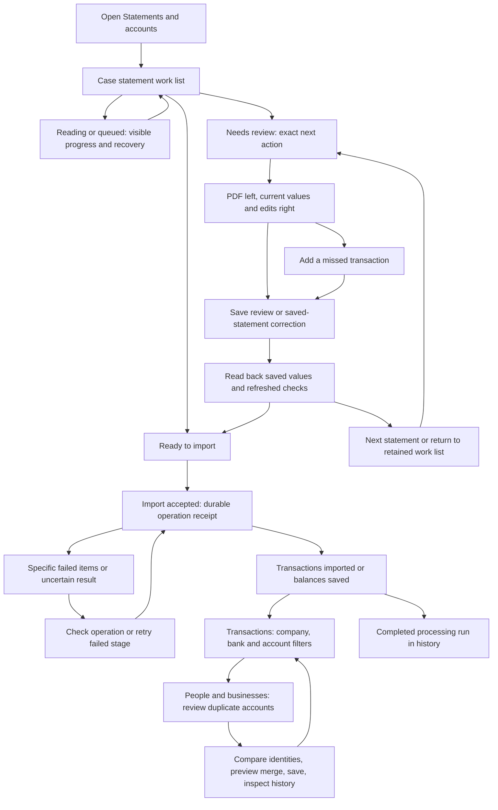

# Financial review and import: complete implementation plan

23 September 2026. Baseline inspected: `00c60340`.

**Status: implemented and locally verified; publication and independent live acceptance are recorded separately.** Track actual changes, checks and next actions in the [implementation checkpoint](implementation-progress-2026-09-23.md). This plan covers the entire feedback collection that the user closed on 23 September, including F27/F28 follow-ups. New failures reopen affected acceptance items even where earlier tests passed. Historical verification remains historical evidence, not proof that these reports are resolved.

## 1. Outcome and operating rules

An investigator must be able to open Financial, see exactly what has and has not reached Transactions, review a statement beside its PDF, correct it once or repeatedly, add missing payments, move through the remaining work, import safely, and investigate by company, bank and account. The same workflow must work for existing records and future ingestions in every case.

The acceptance unit is that complete journey. A new button, a passing component test, or a parser that extracts a few rows does not complete it.

The rules in the root [AGENTS.md](../../AGENTS.md), [workflow reference](README.md), and [Alex acceptance record](../alex-financial-acceptance.md) apply throughout:

1. Every change specifies the investigator's objective, entry screen, action, visible result, next step, failure recovery and return path.
2. Preserve originals, source locations, existing transactions, investigator corrections, findings, observations, Timeline links and history. Do not use client records for destructive testing.
3. Work across cases, users, individual review, batch review and future ingestion. No production exception keyed to a client, filename, account number or transaction amount.
4. Keep real PDFs, screenshots, extracted values, client names, account identifiers and private reproduction data outside Git. Repository fixtures must be synthetic. This document uses private sample aliases only.
5. Record separately: implemented, locally verified, pushed, deployed, and live verified. A new report reopens the relevant acceptance test. Do not convert a local pass into a live acceptance claim.
6. Push triggers automatic deployment. At release, push the verified code using an explicit reviewed file list; do not initiate a separate manual deployment. Protect active ingestion jobs during the transition.
7. Keep the entire scope visible. New messages update this register; they do not discard unfinished work. Record a next action and evidence for every unfinished item before any handoff.
8. The user approved implementation of the full plan on 23 September after confirming both late additions. Complete and verify the connected workflows. Existing code-only publication authorization and automatic deployment apply; record outstanding acceptance honestly.

## 2. Feedback coverage register

Each item below is required. The workstream and acceptance IDs make omissions checkable.

| ID | Reported problem or requested outcome | Workstream | Required acceptance |
|---|---|---|---|
| F01 | One statement fails although another from the same bank works | W5 | J06, J07; bank/product/input variants tested separately |
| F02 | Merge duplicate accounts from People & businesses | W8 | J10; reviewed, reversible consolidation |
| F03 | See ready statements and statements needing revision without opening batches | W2 | J01; case-wide work list with direct actions |
| F04 | Completed batches should leave the active list | W2 | J01; history retained and unresolved work remains visible |
| F05 | New Santander cheques format | W5 | J06; native and scanned forms, separate products |
| F06 | Correct currency and values after import without unnecessary re-ingestion | W3, W4 | J02, J03; saved payments and balances update and reopen |
| F07 | Raw balance validation error when completing an incomplete payment | W4 | J03; valid correction succeeds with optional balance unchanged |
| F08 | Edit beside the PDF, on its right, without repeated page scrolling | W3 | J02, J04; desktop and narrow-screen layout checks |
| F09 | Previous/Next statement while reviewing a batch | W6 | J04; retains draft, source page, queue and return position |
| F10 | Adding an amount makes an unfinished transaction disappear | W4 | J03; active row stays until explicit completion/cancellation |
| F11 | Santander statements reportedly yield no transactions | W5 | J06; every supplied Santander sample accounted for |
| F12 | Only one account holder appears despite several companies' statements | W2, W7 | J08; distinguish pending imports, missing identity and hidden filters |
| F13 | Bank-account choices are filenames and repeated statement entries | W7, W8 | J08, J10; real account directory with unresolved entries separated |
| F14 | Filter by bank across owners, or a particular account at that bank | W7 | J08; shared semantics across Financial and exports |
| F15 | Deselect individual choices and clear selection without Reset view | W7 | J08; independent clear actions preserve other work |
| F16 | Additional scanned peso statement reportedly has no transactions | W5 | J07; OCR and BBVA product recognition, source reconciliation |
| F17 | Supplied scanned dollar statement reportedly has no transactions | W5 | J07; correctly distinguish printed zero activity from failed reading |
| F18 | Repeated “Statement not found in this case” and disabled Retry | W1 | J05; repairable stale references versus genuine missing source |
| F19 | Individual statement currency correction unavailable; only bulk works | W3 | J02; direct correction whether currency missing or populated |
| F20 | Closing balance and period dates do not update after repeated saves | W3 | J02; persisted read-back and consistent visible values |
| F21 | Intercam misses transactions and manual balances are not reflected | W3, W5 | J02, J06; retained corrections plus correct product/row extraction |
| F22 | Add a missed transaction does not work on an imported statement | W4 | J03; supported path even when current import has zero payments |
| F23 | Cannot correct earlier wrong bulk account edits | W3 | J09; a second deliberate replacement succeeds |
| F24 | Retry appears to do nothing | W1 | J05; accepted job or precise actionable outcome |
| F25 | Import stops with `crypto.randomUUID is not a function` | W1 | J05; supported browser context, one durable import request |
| F26 | Check import result produces no visible outcome | W1 | J05; request-specific result and reachable recovery |
| F27 | Show excluded rows turns itself back on after adding a row; review filters must respect user choice | W4 | J03; default off, no automatic filter toggles, manual additions and active edits remain visible |
| F28 | Choose an existing person, business or bank account in Paid by / paid to; make debit/credit counterparty roles explicit | W4, W7, W8 | J03, J08, J10; direction-aware typed links persist through import/correction and resolve consistently across views |

Private source register: S1 scanned Santander cheques; S2 native-text Santander cheques; S3 scanned BBVA peso product; S4 scanned BBVA dollar product; S5 native-text Intercam multi-product statement. Filenames and private page observations belong in a local, untracked source register, not repository fixtures. Previously supplied Kapital, Monex, BBVA, Scotiabank and card examples remain regression inputs where available.

## 3. Evidence established during planning

These are inspection findings, not completed fixes or a diagnosis of all live incidents.

| Finding | Evidence in current source | Consequence for implementation |
|---|---|---|
| Batch import uses an unguarded browser UUID API | `FinancialBatchPanel.tsx`, import mutation, calls `crypto.randomUUID()`; `src/lib/browser-crypto.ts` already has `randomRequestId()` | Reuse one compatible request-ID helper and test the actual unavailable-API case. Preserve request identity across retries. |
| Result checking does not identify an operation or display its own check outcome | The Check import result button calls `refresh`, which invalidates queries | Add a request-specific result check with explicit not-submitted, pending, completed, failed and unknown states. |
| Individual currency selection is only rendered for a missing currency | Batch card checks `!item.currency && item.status === "attention"` | A populated wrong currency needs the same accessible correction route as an empty one. |
| A saved statement has another editor above the source | `StatementImportPanel` renders `ImportedStatementDetails` without its source option; the PDF appears later | Unify the review workspace around one source pane and a contextual right-hand editor. |
| Imported readings are deliberately read-only in the original-reading editor | `canEdit` excludes `importedHere`; Add a missed transaction inherits this flag | Provide an explicit append-to-saved-statement operation, rather than enabling edits against the sealed original import. |
| Incomplete-record completion resubmits an untouched invalid balance | `ImportedRecordsPanel.tsx` uses `fields.balance_minor` when changeBalance is false, then includes it in the row payload | Separate raw evidence from valid typed values and support preserve/set/clear semantics. Do not silently make invalid evidence a zero. |
| Editing can change membership of the displayed correction rows | Correction rows are filtered using current validation problems and then paginated | Reproduce disappearance under issue filters and paging; pin the active draft independently of those projections. This is a risk visible in code, not yet the proven cause of Alex's exact event. |
| Adding a manual row explicitly changes both review filters | `StatementImportPanel.tsx` initializes showExcluded to false, but Add a missed transaction calls `setShowExcluded(true)` and `setOnlyIssues(false)` | The initial default alone cannot fix the reported behavior. Remove implicit filter changes from the add/edit journey, keep active/manual rows visible independently, and audit other reveal-row handlers. |
| Direction is already recorded, but the reported counterparty input is plain text | `StatementImportPanel.tsx` sets direction from the Credit or Debit amount input; Paid by / paid to edits a string. `payment_labels.py` maps credit to counterparty → statement account, debit to statement account → counterparty | Preserve the existing bank-account direction meaning; expose a clear role label and a real identity/account picker rather than interpreting typed names as confirmed links. |
| Audited payment-to-party links already exist separately | `counterparty_parties.py` accepts selected transaction IDs and an existing party ID, preserves raw names and replays identity decisions | Reuse this decision infrastructure, extend it for explicit counterparty account identity and pre-import drafts, and connect the reported editor to it. Existing identity inheritance and investigator From/To overrides need compatibility tests. |
| Bulk edits default to filling blanks and use revision checks | `BulkStatementDetails.tsx` and `bulk_statement_details.py` | Test actual replacement, a second save, stale revisions and active-worker conflicts. Do not assume Alex merely selected the wrong mode. |
| Filters expose a candidate-oriented directory | `TransactionAccountFilters.tsx` reads `/ledger-accounts`, prefers display labels, and has no independent bank selector | Introduce a case account directory suitable for investigation, with bank grouping and explicit unknown-account work. |
| Clear behavior exists but its label is ambiguous | `AccountMultiSelect` clears via the “All …” button, expands every selected label, and renders individual removal chips | Make Clear selection explicit and keep large selections compact. The report is a usability failure even if a callback already exists. |
| Navigation currently targets problems | Batch review has a `next-problem` route, rather than a complete statement review sequence | Add explicit Previous/Next statement and optionally a needs-review queue. |
| Existing file status already carries some readiness counts | `statement_file_status.py` derives imported/prepared/available/pending/check counts with bounded queries | Reuse and correct this projection; avoid creating another inconsistent status system. |
| Dedicated layout coverage is incomplete | Catalog registers BBVA cash management, Scotiabank, Monex, Kapital and card layouts; no dedicated Santander or Intercam recognizer. BBVA product matching requires `CASH MANAGEMENT` | Add product-aware recognition; similar column structures must not depend on one bank's branding or one product name. |
| Supplied input types differ | Local inspection of all pages' text layers: S1/S3/S4 have no embedded text; S2/S5 contain embedded text. Representative pages were rendered and inspected | Test OCR and native geometry independently through the production reader. No-text does not mean no transactions. |
| One reported zero-payment file is actually a no-activity example | All six S4 pages visually inspected: movement summary explicitly reports zero debit/credit activity and unchanged balances; remaining pages are informational | Include a positive no-activity acceptance case. Success means saved account/period/balances and an understandable explanation, not inventing payments. |

The browser API restriction is documented by [MDN randomUUID](https://developer.mozilla.org/en-US/docs/Web/API/Crypto/randomUUID); the existing fallback can use [getRandomValues](https://developer.mozilla.org/en-US/docs/Web/API/Crypto/getRandomValues). A secure localhost test alone will not reproduce a non-secure remote-origin failure.

Still unproven: the live cause of missing statement IDs, whether individual balance failures are failed persistence or stale presentation, the precise bulk replacement failure, and which stage failed on each retained OCR reading. These require reproduction and request/record traces. Do not label hypotheses as fixes.

## 4. Shared workflow and state contract

Use separate facts instead of one overloaded “processed” status:

| Fact | Examples | What it tells the investigator |
|---|---|---|
| Reading stage | Queued, reading page, paused, failed, read | Whether the PDF was successfully read |
| Extraction assessment | Payments found; verified no activity; possible missed payments; unsupported/unreadable section | Whether the reading supports a payment/no-payment conclusion |
| Review readiness | Ready; ready with nonblocking checks; missing required details; conflict to compare | What needs to happen before import |
| Import state | Not imported; accepted; importing; imported; balances saved; partially imported; left unimported | What is in case analysis now |
| Current edits | Unsaved draft; saved review; saved correction; changed elsewhere | Whether the investigator's work is durable |
| Batch lifecycle | Active processing; awaiting user action; finished in history | Whether the run requires attention |

An imported statement may retain review checks. A fully read batch may still contain unimported statements. A balance-only import may be complete with zero transactions. A failed extraction may not be called a balance-only statement solely because it found no rows.

Implementation contract:

- Preserve distinct original Evidence file, reading version, statement section, imported source, account and operation identifiers. Resolve their relationships centrally, always within the current case.
- Present current saved values after import. Original extracted values remain available in a labelled comparison, never as an apparently unsaved duplicate edit surface.
- Use revision-based saves and durable operation receipts. A retry of the same intent returns the same outcome; a new correction is a new intent.
- Prefer a shared read model and existing mutation services over parallel per-screen state. Return current revision, affected identities, changed counts and enough saved values to refresh immediately.
- Every failed action states whether anything was saved, retains user input, and points to the next valid action. Technical diagnostics remain available without dumping JSON into the main form.

## 5. W1 — Submit, check and recover imports reliably

**Objective:** Click Import once, know whether it was accepted, and recover an interruption without duplicate payments or repeated blind clicks.

**Entry:** Statement work list, batch, or individual review. **Exit:** exact imported scope in Transactions, saved balance-only account review, or named items that still require action. Back returns to the same list and filter.

### Implementation

1. Route request creation through the existing compatible UUID helper. Audit all relevant Financial mutations and upload handoffs for direct use of context-dependent APIs. Keep randomness secure; do not replace it with timestamps or `Math.random`.
2. Create and persist an operation intent before submission, scoped to user/case/batch and the reviewed selection/revision. Reuse it after transport errors or reload. Allocate a new ID when the user changes the operation's intent, not on every retry.
3. Distinguish a local failure before submission from an ambiguous network response after submission. The former should say that import did not start. The latter must query the operation before offering another submission.
4. Extend/reuse the existing import-operation receipt API to look up the exact request. Check import result must show Checking, then accepted/running/completed/failed/not accepted, or Result still unknown with a retryable check. Never interpret a failed lookup or a transient not-found response as proof that no import occurred.
5. Render the result beside the clicked action, focus its heading and announce status. Include saved payments, incomplete records, balance-only periods, already present items and failed items with direct links.
6. Review current polling. Keep polling while an accepted operation has pending work, independently of the batch's preparation label. Leaving and returning must recover the operation. Completion refreshes the work list, batch, account directory and Transactions scope together.
7. Give file retry its own pending/result state. Return a structured acknowledgment: queued, already running, paused, cannot retry until the current protected write finishes, source unavailable, or current reading available. A successful response with no action must explain why.
8. Trace “Statement not found” across original-file ID, current reading ID, batch item and imported-source ID. Add a case-checked lineage resolver and use the correct ID domain in each route. A replaced reading can offer Open current reading; a genuinely deleted/unavailable original gives a precise reason. Never search another case or pick a different PDF with the same filename.
9. Allow a failed file to be retried without restarting healthy sibling work. Where a worker holds the relevant lease, provide its actual state and a safe queued retry or a clear wait-and-retry path; do not cancel the whole batch.
10. Preserve pause/resume/checkpoints, separate AI and Financial job ownership, and import idempotency. Log operation/stage identifiers and sanitized error codes so the next failure can be diagnosed without logging financial contents.

### Acceptance

- Disable `crypto.randomUUID` in a browser test while retaining `getRandomValues`; import succeeds once, reload recovers the receipt, repeated click creates no second import.
- Exercise supported HTTP remote-like and HTTPS contexts; do not depend solely on trusted localhost.
- Lose the response before and after server acceptance; check result resolves the correct operation and all uncertain states retain the same ID.
- Partial batch failure leaves successful imports intact and exposes only unresolved items for recovery.
- Retry shows immediate acknowledgment, survives navigation, and does not reset another AI/Financial job.
- Replace a reading, leave an old batch reference, and verify source/history resolution; missing and cross-case sources are refused correctly.

**Likely code:** `FinancialBatchPanel.tsx`, `ReprocessStatement.tsx`, `BatchReadingJobs.tsx`, `lib/browser-crypto.ts`, `import_batches.py`, statement import router, import-operation/worker services, source lineage and statement-progress services.

## 6. W2 — One statement work list with trustworthy readiness

**Objective:** Know what can be imported and what needs work without opening every processing batch.

**Entry:** Statements & accounts → Statement files. This becomes the normal place to continue work. Batches remain accessible as processing history and grouped progress, not a prerequisite for finding ready statements.

### Investigator experience

- Visible filters: All statements, Reading, Ready to import, Needs review, Imported, Left unimported. Counts name their unit: PDFs, statement periods or transactions.
- A compact PDF row shows account(s), period(s), current reading state, imported count, ready count and outstanding checks. A multi-period PDF can expand to individual account/currency/period rows.
- Direct actions: Review, Import ready statements, View imported payments, Edit statement details, Retry failed reading. Each is offered only where meaningful; unavailable actions explain why.
- Selection works across pages and search with an explicit count. Preview importing a mixed selection states which periods will import, which are already imported and which remain blocked.
- A permanent path to Processing history shows completed runs, receipts and retained PDFs. An unresolved statement stays in the work list even when its reading batch is finished.

### Implementation

1. Extend the existing file-status projection into a paginated case-level statement work projection. Reconcile individual and batch saves by current source lineage and statement identity, avoiding counts duplicated by several batch snapshots.
2. Keep readiness and checks orthogonal. A missing optional name, unreadable amount, incomplete source coverage and an arithmetic discrepancy require different actions; “needs attention” alone is insufficient.
3. Establish completion semantics: a processing run leaves Active when no active job/import or unhandled outcome remains. Ready-but-unimported work is not silently marked complete. Explicitly left-unimported items remain accessible. Nonblocking post-import checks live in the statement work list and do not keep a finished processing job looking active forever.
4. Recompute statuses after corrections, individual imports, replacement readings and new batch results. Detect revisions rather than depending only on a changing imported count.
5. Return honest totals for the whole selection. Existing response caps/truncation must produce pagination or an explicit incomplete result, never invented “not imported” counts.
6. Make the difference between reading and importing plain: “Read; ready to import”, “Imported: N payments”, “Balances saved; no payments”, and “Some sections still need review”.

### Acceptance

J01 starts with a mixed, multi-company case containing pending reads, ready periods, blocked periods, an imported-with-checks period, a zero-activity period and a multi-period PDF. From the main list, review one, import the ready selection, reopen Transactions, return, and find every remaining item without entering its batch. Finished batches are in history; unfinished work is not hidden. Refresh and a second user see the same durable state.

**Likely code:** `StatementFilesPanel.tsx`, `StatementRegister.tsx`, `FinancialBatchPanel.tsx`, `statement_file_status.py`, batch item summaries and a shared statement-status response contract.

## 7. W3 — Correct statement details, then correct them again

**Objective:** Enter or change holder, bank, account number, dates, currency and balances beside the original; save once and see the result everywhere. Correcting a mistake in an earlier correction must be routine.

**Entry:** Review from a file, batch item, account coverage, or bulk selection. **Exit:** the same statement with saved values, refreshed checks and an obvious Next statement or return action.

### A. One visible editing workspace

1. Use a PDF pane on the left and the active editor on the right at desktop widths. Keep file/account/period and saved/imported status in a compact header. Keep Save/Cancel and statement navigation reachable.
2. Reuse one source viewer; opening account, balance, currency, row or incomplete-record editing must not send the user to a disconnected form above/below the PDF. Each field can show its source page; choosing a page moves the PDF without discarding input.
3. Keep current saved values primary. Label original extraction and alternative balance readings as source evidence. After saving, every summary shows the saved value; original competing readings remain visible only in their comparison/history role.
4. At narrow widths use an explicit Source/Edit arrangement that retains the same page and form, with reachable controls and no obscured input. Check at 1280×800, 1440×900 and a narrow mobile viewport, including browser zoom.

### B. Single-statement save contract

1. Reproduce each balance/date failure before changing the writer. Trace values from editor payload through saved details, period record, read-back, checks, batch summary and source comparison.
2. Save to the actual current imported source when imported; save review progress when unimported. A saved zero-payment statement must support the same details operation.
3. Preserve omitted fields; explicit blank means clear/unknown. Zero is a valid value. Dates use unambiguous ISO transport and locale-aware labels, and do not change individual transaction dates.
4. Default a newly entered balance's source page to the page being viewed where that page is valid, show it, and permit correction. Required page/value problems must appear beside that field before submission.
5. Preserve the chosen balance convention. BBVA operation and liquidation balances must retain their labels; use like-for-like controls with the corresponding transaction sequence and show any unresolved ambiguity. Do not force reconciliation by choosing whichever balance fits.
6. Return saved values and revision, update the current display, then confirm with an independent read/reopen. A stale draft must offer Compare latest / reload base while retaining typed edits; it must not trap the user in repeated stale submissions.
7. Show inline validation rather than raw API arrays. A rejection names the field and whether nothing was changed. Keep the editor open on failure.

### C. Direct currency correction and post-import values

1. Place a visible currency correction action on every editable statement card/review, for a missing or populated currency and for imported or unimported statements. Use the shared currency catalog, not a browser-dependent subset.
2. Make the affected scope explicit: this printed account/currency/period; other products in the same PDF remain unchanged. Currency relabelling preserves printed amounts and uses exact decimal rescaling; it is not exchange-rate conversion.
3. Refresh transactions, incomplete records, balances, totals, account choices and checks consistently. Preserve row/category/counterparty edits and old source references. Refuse impossible precision atomically, with an explanation beside the chosen currency.
4. Keep individual amount correction and statement-wide currency correction distinguishable. A user can correct existing amounts through the transaction editor; re-ingestion is reserved for obtaining missing/better source readings or replacing a reviewed bad import.

### D. Bulk edit and repeated replacement

1. Retain explicit field selection and a before/after preview. Make the choice between Fill missing values and Replace selected values understandable before entering values, with counts showing how each affects this selection.
2. If populated values make fill-missing a no-op, say “No values will change: these fields already have values” and offer the replacement mode in place. Do not show a success message implying edits were applied.
3. Reproduce a first bulk save, then change the same fields again with the same selection. Test imported, unimported and mixed selections, shared accounts, multi-period PDFs, corrected currencies, and two batches referencing the same original.
4. After save, reload current target IDs and revisions. Retain a convenient selection for another edit, but never reuse stale target snapshots or the prior operation ID for different values.
5. Check source/draft lineage after account corrections; stale preview, worker lease, duplicate target and conflicting saved-review refusals must identify affected rows and provide recovery without losing values.
6. Audit atomic writes for multiple selected statements that share accounts/files. Revision checks must detect external changes without rejecting the operation's own earlier writes. Receipt replay must be checked safely even if unrelated work has started since the successful save.
7. Preserve all-or-nothing behavior for the reviewed set. Do not silently skip blocked targets; the investigator may explicitly revise the selection and preview again.
8. Record both corrections in history. Changing selected statements' account details must not silently change unselected statements or imply that two separate bank accounts are the same.

### Acceptance

J02: open an imported statement with missing dates and competing original balance readings, enter dates/balances/currency beside the PDF, save, reopen from another entry point and verify the same saved values and checks. Repeat with zero payments and unknown versus zero balances. Correct a value a second time.

J09: bulk set deliberately wrong synthetic account details, save, return, replace them correctly, preview and save. Verify every selected imported/draft period, all dependent views and both history events. Repeat after a lost response and with a genuinely stale concurrent edit. A fill-missing no-op is explained; a replace action applies actual replacements.

**Likely code:** `ImportedStatementDetails.tsx`, `StatementImportPanel.tsx`, `StatementCurrencyControl.tsx`, `BatchCurrencyEditor.tsx`, `BulkStatementDetails.tsx`, `statement_details.py`, `statement_currency_edit.py`, `bulk_statement_details.py`, saved-review stores and batch projections.

## 8. W4 — Finish manual transactions and repair incomplete records

**Objective:** Add or complete a missed payment without the row disappearing, then see it saved exactly once in the correct statement and Transactions.

### Unimported statement path

1. Add a missed transaction opens and focuses a dedicated draft editor beside the currently viewed PDF page. State the target account, currency and period.
2. Give the draft a stable ID and keep its raw input independently of filtered/sorted row projections. Entering a debit, credit, date or balance must not remove the editor when the row becomes valid or no longer matches Needs review.
3. Maintain the active row until Done/Save or explicit cancellation. Preserve a partially typed amount such as `12.` or a negative balance prefix. Do not coerce unfinished input into a saved value.
4. Save review keeps the manual row in the durable statement draft; Import admits it once. Receipt and source link distinguish manual entry from extracted reading.

### Respect filters and let the investigator finish

1. **Show excluded rows is off in a fresh review.** Once the investigator chooses its state, adding, editing, validating, saving or focusing a row must not silently change it. Retain explicit choices when returning to that review, scoped to the user/case/review; Reset view restores the default without discarding drafts.
2. Keep **Show problems and edits only** as the investigator selected it. Its membership must include manually added rows and rows with investigator edits even after they become valid. Validation passing is not an instruction to hide a row or finish its editor.
3. Keep active drafts visible independently of issue-only filtering, sorting, pagination and background refresh. Several manually added rows remain available while the investigator works through them. Completing one row and adding another must not hide the earlier manual addition from the edits view.
4. Only an explicit Done/Save/Cancel action ends active editing. A field blur, amount entry or successful validation does not signal completion. A failed save retains focus and all typed values. Cancellation does not delete a previously saved transaction.
5. Audit add-row, open-correction, source-highlight, focus-row, validation and refetch handlers for indirect filter changes. If navigation targets an excluded row, reveal that one row in the contextual editor with its excluded status visible; do not enable every excluded row behind the user's back or change its inclusion in import.
6. Default visibility and import inclusion remain distinct. Hiding excluded rows does not restore them to import, and keeping a draft editor visible does not import an incomplete payment. Counts must distinguish matching rows from any temporarily revealed active editor.

**Reported sequence to reproduce:** open corrections → turn Show excluded rows off → enable Show problems and edits only → add a missed transaction → enter debit or credit first → finish date, description and remaining fields → explicitly finish that row → add another → revisit the first. Both filter checkboxes must retain the user's values throughout; both manual additions remain accessible as edits, with no premature editor dismissal. Repeat across a 50-row boundary, save/reopen and a failed save. Include explicit on/off toggles to confirm excluded rows appear only when requested.

### Already imported statement path

1. Offer Add a missed transaction for a current imported statement, including an existing balance-only import. Do not route this through disabled original-reading controls.
2. Reuse the audited transaction admission primitives, with an explicit append operation if one is missing. Validate case, current statement, chosen account/currency, source page, date/direction/amount and revision.
3. Save the new payment atomically with provenance and receipt, then reconcile the statement and refresh totals. Existing rows, edits, findings and citations remain intact; the whole file is not imported a second time.
4. If a similar payment already exists, show it for comparison. Identical date/amount alone does not prove duplication; require a review decision for ambiguous duplicates and make retry idempotent.
5. Editing the saved payment uses the existing correction/history model. A failed append or correction retains the form; successful save opens the actual current row.

### Link the payment to an existing counterparty or account

**Investigator journey:** while comparing a payment with its PDF, enter its debit or credit, search the counterparty field, select the known person/business or exact bank account, inspect the resulting From → To preview, finish the row and save. After import or correction, reopen the same payment and follow its linked identity into People & businesses or Follow money without retyping or relinking it.

1. Replace the plain Paid by / paid to input with a searchable, keyboard-accessible chooser backed by the shared case directory. Offer existing people/businesses and their known accounts, with clearly distinguished entity types. Search names, reviewed aliases, banks and account identifiers. Reuse the existing identity model and case permissions; do not create another independent address book or expose records from other cases.
2. For a bank-account credit, show **Paid by (money in)** and preview `Selected counterparty → This statement account`. For a debit, show **Paid to (money out)** and preview `This statement account → Selected counterparty`. Before direction is chosen, use **Counterparty — choose money in or money out**; allow a draft selection without guessing its role or prematurely completing the row. Keep statement-account identity visible beside the choice.
3. An account result shows holder, bank, account identifier and currency/product where needed. A search combining a company name and a bank must let the investigator select that company's specific account at that bank. If several accounts match, display distinct choices; selecting the company alone must not guess an account. Resolve reviewed account aliases centrally, including after an account consolidation or undo.
4. Keep the original printed counterparty text and provenance separate from the investigator's selected party/account IDs and any editable display name. Store a typed identity reference, not only the selected label. If an account has a reviewed owner, show it as context; selecting the account does not itself establish or alter ownership. If the investigator separately selects a party that conflicts with known account ownership, surface the conflict and the existing ownership-review route rather than silently rewriting either record.
5. Existing matches may be suggested from the text or identifiers, with the reason visible, but a suggestion is not a confirmed link. Reuse the existing create/link-person workflow if a new identity is needed, preserving the transaction draft and source position on return. Permit an unresolved free-text counterparty when identity is unknown. Provide explicit Change link and Remove link actions without erasing the printed source name or creating duplicate people from repeat saves.
6. Apply one selection contract to unimported review rows, manual additions, incomplete-record completion and saved-transaction edits. Persist pre-import links in the durable draft; admit the payment and its selected identity together, with an idempotent receipt. Failure must not create an apparently linked payment with its identity missing. Existing transaction corrections retain or explicitly revise the link with actor, reason and before/after history.
7. Integrate the same picker with single and bulk counterparty edits. A bulk **Set counterparty** action previews how the selected identity becomes Paid by on credit rows and Paid to on debit rows; it does not overwrite the statement-account side. Distinguish that action from explicitly editing From or To, and preserve unrelated investigator labels. Mixed or unresolved direction requires a visible per-row outcome before save, not a silent assumption.
8. Changing debit to credit while editing updates the displayed roles and preview, retains the draft, and makes the changed meaning obvious before Save. Retain the chosen counterparty identity unless the investigator changes it; do not silently apply stale explicit From/To overrides to the wrong endpoint. A previously confirmed transfer or money trail affected by the direction correction becomes reviewable. Define and test these rules against existing correction ancestry and identity inheritance before changing their behavior.
9. A single payment has one direction. Entering the opposite amount must offer a deliberate direction change without silently discarding an already entered amount. Empty or contradictory amount/direction input gets a field-level message and remains editable. Do not infer direction from a company name, selected account or a negative-sign guess. Card and liability products must use their existing product-specific movement interpretation; do not present every printed credit as an external cash receipt.
10. The linked endpoint becomes available consistently to transaction From/To displays, counterparty search and analysis, People & businesses, graph, Follow money, and subsequent exports or reports. Preserve historical findings and Timeline citations. Keep the statement-account filter distinct from a counterparty-account filter: linking the recipient does not change which account's statement supplied the row. Directory choices should not vanish because the current transaction filters hide payments associated with that counterparty.
11. Linking the destination account records where the investigator says this payment went. It does not create a missing matching payment, automatically establish common ownership, confirm a transfer pair, prove an onward funding chain, or convert currencies. Offer the existing related-payment/transfer-review path with the selected endpoint as context. A cross-currency endpoint retains both accounts' currencies and the original payment amount; any FX or funding interpretation remains explicit and reviewed.

**Acceptance addition to J03/J08/J10:** use synthetic companies with several accounts at the same bank, name variants, an unknown owner and different currencies. Enter a debit first, search a known company/bank, select the exact account, finish all fields without losing the row, save/import, reload and verify both typed identity and Paid to. Repeat with a credit and Paid by, selection before amount, an explicit direction change, free text without a link, changing/clearing a link, mixed-direction bulk edits, existing From/To overrides, a failed save and a lost response. Verify downstream profiles/analysis/export and source-account filter semantics. Merge and undo an account representation and verify the link still resolves with history. Confirm that neither new payments nor ownership/transfer confirmations are fabricated by selecting an endpoint.

### Incomplete-record completion

1. Separate raw extracted values from validated numeric/date fields. Preserve invalid source text as evidence, not as the string `invalid` in a typed money payload.
2. Define balance operations explicitly: preserve an existing valid balance, set a valid balance, clear an incorrect balance, or leave unknown. If an untouched raw balance is invalid, explain it and keep it as unresolved source evidence without blocking an otherwise valid payment unnecessarily.
3. Use precise parsing and range/precision validation. Never silently coerce unreadable text to zero, drop a meaningful balance, or require a fabricated date.
4. Complete the record with a stable receipt and update incomplete-record counts. A refreshed query must open the completed transaction instead of the old incomplete row.

### Acceptance

J03 covers adding one and several rows, amount entered first and last, debit versus credit, issue-only filters, excluded-row filters, paging boundaries, zero existing rows, manual source-page selection, reload, batch navigation, a failed save, a lost response and a second correction. The active editor remains visible until explicit completion. Imported and unimported paths both persist correct source references and exactly one new transaction per completed intent. The reported invalid optional-balance scenario becomes a readable, recoverable flow with no raw JSON.

**Likely code:** `StatementRowEditor.tsx`, `StatementImportPanel.tsx`, `ImportedRecordsPanel.tsx`, `SavedStatementPayments.tsx`, `PaymentEditsEditor.tsx`, statement draft schema, completion/transaction-admission and reconciliation services; shared identity chooser, `counterparty_parties.py`, `payment_labels.py`, account/party directory and identity-link contracts.

## 9. W5 — Read the supplied bank layouts and explain incomplete extraction

**Objective:** Recover the transactions actually printed, assign them to the correct account/product/currency/period, and state clearly when the source shows no activity or could not be fully read.

### A. Establish a private source baseline

1. Inventory each supplied PDF locally by hash, page count, input type and source alias. Inspect every relevant page, including continuation tables, currency sections, summary controls and information pages.
2. Produce an independent source worksheet: printed account sections, dates, currency evidence, opening/closing controls and their conventions, actual transaction rows, direction counts/totals, page boundaries and unresolved source ambiguity. Manually verify against rendered pages; parser output cannot be its own expected result.
3. Run the production reader and proposal pipeline unchanged against an isolated database to locate the failed stage: file intake, native/OCR text, geometry, section detection, row parsing, currency, saved-draft compatibility or import. Record the current result before modifying code.
4. Treat S4 as an expected no-activity source based on the full-page visual review, not as a file required to produce payments. Complete production OCR/import verification still remains to be done.
5. Commit only synthetic layout fixtures that preserve relevant structures and failure conditions. Keep real source counts, values, images and replay artifacts private.

### B. Scanned and mixed PDFs

- Exercise existing OCR selection, page checkpoints, reading revision, text/geometry persistence and downstream Financial handoff on S1/S3/S4. Detect image-only pages and damaged/empty text overlays per page, not just per document.
- Preserve word/cell geometry and the actual PDF page for every accepted field. If OCR succeeds but layout recognition fails, report a layout problem rather than “no transactions”.
- Check bank/product headings, dates, currency markers, right-aligned amounts and tables with wrapped descriptions. Use targeted rereading only where source evidence warrants it; retain disagreements instead of guessing.
- Reuse native text on readable pages and OCR unreadable pages. Avoid duplicate rows when both an overlay and image reading exist.
- Invalidate stale reader checkpoints through explicit versioning when the reading algorithm changes. Resume unchanged successful work after interruption; never reuse a known bad earlier reading as if it were the new attempt.

### C. Santander family

1. Add explicit bank/product/period/account recognition for the supplied cheques layout in native and scanned forms.
2. Separate the current/checking product from the savings/investment product printed in the same PDF. A zero-activity investment section must not conceal payments in its neighbouring checking account.
3. Parse FECHA, FOLIO, DESCRIPCION, DEPOSITO, RETIRO and SALDO using source column boundaries. Keep wrapped SPEI beneficiary/reference lines with their transaction; do not turn them into separate rows.
4. Read previous-period closing/opening and final-period balances as controls. Totals, average balances, advertising, glossaries and tax text are not payment rows.
5. Keep account number, customer code, CLABE and statement reference as distinct identifier types. Read currency from the printed account section, not from a filename or unrelated glossary.
6. Cover Spanish date formats, repeated folios, small fee/rebate pairs and continuation pages. Verify a short statement and a higher-volume one; being from the same bank alone is not evidence of identical layout support.
7. Santander investment/USD reports in the screenshots remain explicit acceptance cases. If their full source layout is absent from the supplied corpus, record that coverage boundary and obtain a representative authorized source during implementation. Do not certify unseen products by extrapolation from cheques.

### D. BBVA family

1. Extend bank/product recognition beyond the existing CASH MANAGEMENT requirement to the supplied Maestra peso and dollar products, retaining bank, account, period and page-sequence checks.
2. Support introductory pages before the financial summary; physical PDF page and printed statement page must remain distinct and traceable.
3. Scope MXN/USD from the financial heading. A glossary's definition of national currency must not override an explicit dollar product.
4. Preserve operation and settlement/liquidation dates and balances with their actual labels. Check the appropriate opening/closing convention rather than mixing them.
5. Reconcile source payment counts and amounts, excluding repeated summaries and informational pages. No numerical padding or amount inference to make totals match.
6. Distinguish a genuinely empty movement section with explicit zero totals from a missed/unsupported movement table. Both retain account identity, period and balances.

### E. Intercam family and existing shared primitives

1. Add an Intercam recognizer with explicit bank/header/account context. Reuse tested table geometry helpers where appropriate without requiring Kapital branding.
2. Split peso/dollar and other product sections using their printed account identifiers and currency. The changing document header reference is not automatically the bank-account number.
3. Carry a continued transaction table across pages only where section context is established. Preserve day-only dates resolved from the printed period, multiline descriptions, deposits, withdrawals and trailing-negative balances.
4. Distinguish repeated summary/opening values and product-specific controls. Do not flag every repeated appearance of the same sourced balance as an unexplained independent account balance.
5. Keep every movement assigned or explicitly unresolved; shared cover/reference pages must not cause a false duplicate import across legitimate product sections.

### F. Extraction quality and existing saved work

1. Return separate evidence for payments found, unread pages/sections, printed movement totals/counts, reconciled controls and verified no activity. A nonzero movement summary plus zero detected payments must produce a specific missed-payments warning.
2. “No activity” requires positive evidence in the relevant section plus adequate source coverage; absence of a parsed table is insufficient.
3. Import readiness must not imply completeness. Usable payments may still be imported with clearly identified missing/uncertain records retained outside totals, consistent with the existing review policy.
4. New parsing produces a new proposed reading. Existing manually entered rows and corrections must be compared and retained or explicitly resolved, not overwritten by reprocessing.
5. Extend the current replacement/recovery workflow to new account/product segmentation. Review added/removed/matched rows and source scopes before replacing a previous zero/partial/combined import. Do not add the entire file on top of an existing import.

### Acceptance

J06/J07 replay S1–S5 through the real local reader, real Financial services and isolated SQL, then browser review/import/reopen. Match the independent source worksheet for every relevant section and explain every discrepancy. Repeat the import and a later reading refresh to establish no duplication and retained edits. Synthetic native, scanned, ambiguous and zero-activity cases run in the repository suite. Previously supported Kapital, Monex, BBVA, Scotiabank and card layouts remain regression gates.

**Likely code:** `evidence-engine/app/pipeline/pdf_extraction.py`, OCR/geometry/checkpoint helpers, `statement_import_catalog.py`, `statement_import_bbva.py`, proposed Santander/Intercam layout modules, shared `statement_import_proposal.py`, source-coverage and saved-reading recovery services.

## 10. W6 — Review a batch without repeatedly returning to its list

**Objective:** Review statements in sequence with clear position, saved state and the same source context.

1. Add a compact persistent review header: Back to statements, Previous statement, Statement K of N, Next statement, current file/account/period and saved/imported state. PDF page navigation remains explicitly labelled Page so it cannot be confused with statement navigation.
2. Carry the originating queue and ordering: all selected statements, ready statements or needs-review statements. Default a batch review to its current ordered list; expose Needs review as an explicit optional queue, rather than silently skipping statements.
3. Keep the current item visible when an edit changes its status. Updating readiness must not eject the investigator mid-edit. Next advances through a stable queue; new/removed items are reconciled visibly.
4. Before navigation, preserve unfinished work. Provide Save review and next for unimported work, Save changes and next for saved details, and an explicit leave-with-draft option where durable draft storage is available. Do not claim server-saved progress if it exists only in browser memory.
5. A failed save stays on the current statement with values intact. No automatic import merely because the user clicked Next. If a write is uncertain, resolve its receipt first.
6. Return to the original list with its page/filter/selection/scroll retained. At the last item show Review complete and counts of imported, ready, left-unimported and remaining issues, with direct next actions.
7. Cover multiple periods in one PDF and multiple PDFs in one batch; navigate between statement scopes, not just filenames. Keep source zoom and an appropriate page per statement without inheriting an invalid page number.

**Acceptance J04:** review three different states, edit the middle statement, advance, go back, refresh, switch tabs and return. Verify saved values/drafts and queue position; simulate save failure and ensure no advance or data loss. Finish a needs-review queue and find unresolved/ready items from its completion summary.

**Likely code:** `FinancialBatchPanel.tsx`, `BatchReviewContext`, `StatementImportPanel.tsx`, statement workspace/draft stores and a case/batch-scoped ordered-navigation API extending the current next-problem service.

## 11. W7 — Find companies, banks and actual accounts consistently

**Objective:** Start with all imported case payments, choose one or more companies, banks or accounts, and understand why a company/account has no matching transactions.

### Account directory and choices

1. Build a case account directory from current identified accounts, reviewed identity links, saved statement scopes and unresolved records. Do not use the candidate-mapping selector as the unqualified investigation directory.
2. Provide three coordinated multi-select dimensions: Person or company; Bank; Account. A bank selection includes all relevant accounts across owners unless an explicit person filter also applies. An account option identifies bank, account number/alias, holder and product/currency where necessary.
3. Deduplicate actual account options by established identity, not by filename. Keep unidentified-account work in a clearly marked group with its source reference as secondary context; never invent a bank-account number from a PDF title.
4. Preserve raw printed bank names and separately normalize safe bank aliases for filtering. An ambiguous bank name remains unresolved; do not assign it through a vague substring match. Selecting a bank is a filter, not an ownership assertion or account merge.
5. Include known holders/accounts with pending statements or zero imported payments, with a clear count/status and a direct Review statements link. Their selection returns an honest empty Transactions result; it does not silently import anything.
6. Trace the reported missing-company case through current scope, imported-source state, missing holder metadata and directory caching. Corrected names must appear after save and across reopen without requiring Reset view.
7. Supply this same case-scoped directory to the W4 counterparty chooser. A filter selection scopes what the investigator sees; an explicit counterparty selection records a payment endpoint. Keep those operations and their state separate while using consistent names, identifiers and reviewed identity resolution.

### Selection behavior

- OR within each dimension; AND between person, bank and account dimensions. Show the active intersection and an explanation when it yields zero rows.
- A bank selection represents the bank, not a snapshot expanded into hundreds of account IDs. Newly imported accounts at that bank are included unless explicit account selection narrows the set. Explicit account selections remain stable, resolving reviewed canonical aliases.
- Dependent account choices can narrow to selected banks but must not silently discard a selected account or reset another dimension. Show incompatible selections with a clear removal action.
- Clear people, Clear banks, Clear accounts, and Clear account filters are distinct visible controls. Clearing account filters preserves date/search/category/chart scope, transaction selection where valid, drafts and other tab state.
- Individual uncheck/removal works. Select visible names the number of visible matches. Compact selection summaries show a count and a few labels, with an expandable list; no enormous filename paragraph.
- Reuse the same controls/state and backend resolver in Transactions, People & businesses profiles, Follow money, Trends and applicable account-scoped summaries. Saved views, export, totals, charts and incomplete records must use the same effective account set.

### Acceptance J08

Use a case with several companies, multiple banks, several accounts in one bank, two accounts with similar last digits, multiple statements per account, an unknown holder, pending statements, reviewed aliases and zero-payment accounts. Filter by bank with all owners; narrow to a particular account; combine several companies/accounts; clear each dimension without Reset view; switch tabs and return; import another account at the selected bank. Verify table/totals/chart/export parity and distinguish unavailable identity from unimported payments.

**Likely code:** `TransactionAccountFilters.tsx`, `AccountMultiSelect.tsx`, shared scope and account-selection libraries/stores, Financial account directory API, `account_selection.py`, `account_parties.py`, ledger/totals/export/analysis routes and schemas.

## 12. W8 — Consolidate duplicate accounts without losing evidence

**Objective:** From People & businesses, make two representations of the same bank account appear as one account throughout the case, while retaining a reversible record of the decision.

Common ownership and duplicate account identity are different. Linking two real accounts to one company remains the ownership workflow. Merge accounts is for two records representing the same actual account. This distinction must be explained in the chooser, not only in documentation.

### Investigator workflow

1. Open People & businesses → Accounts, select suspected duplicate accounts, choose Merge accounts. Offer the same reviewed action from Review accounts where appropriate.
2. Compare bank, identifiers and identifier types, holder evidence, currency/product sections, statement periods, source PDFs, payment counts and existing ownership/trail links side by side.
3. Choose the retained display identity and resolve conflicting metadata explicitly. Give alternatives: Correct selected statement details; Link accounts to the same company; Keep separate. Equal holder names alone do not justify a merge.
4. Preview exactly which account records will be represented together and what happens to filters, profiles, coverage and related analysis. State that merging accounts does not remove duplicate statement copies or payments.
5. Confirm a reviewed identity decision. Show one combined account in filters/profile with all original statements accessible; retain previous account identifiers and the decision in history.
6. Offer Review merge / Undo merge. If later edits create dependencies, preview them and retain safe canonical references rather than silently dropping those changes.

### Technical implementation

1. Extend the existing identity/adjudication model with case-scoped canonical account resolution and an audited reversible equivalence decision. Do not delete original account/source rows as the primary mechanism.
2. Inventory every consumer of account IDs before implementation: period coverage, transactions/incomplete records, charts/totals, exports, holder links, graph, profiles, Trends, Follow money, transfer matching, stored trails, Timeline sources, saved selections and deep links.
3. Enforce same-case scope, no cycles, compatible bank/account/product identities, concurrent revision checks and idempotent save. Block conflicting strong identifiers unless the investigator first corrects the supporting source assignment through the appropriate reviewed path.
4. Preserve real multi-currency account compartments. Their identities may belong under a reviewed account grouping, but money remains separated by currency and product. A currency mismatch must not be “fixed” by combining balances.
5. Resolve aliases centrally for analysis. Old links still open the current identity plus the original source. Never use customer numbers, tax IDs, similar names or monthly statement references as automatic proof that accounts are identical.
6. Recompute derived views and detect impacted interpretations. A former transfer between two records now understood as one account needs review; do not leave misleading self-transfers or silently rewrite earlier findings. Preserve Timeline/source snapshots and flag stale analysis.
7. Keep duplicate financial-record review separate. Account consolidation may reveal overlapping statements; direct the investigator to compare them without automatically deleting or suppressing transactions.
8. Include W4's typed counterparty-account references in merge preview, canonical resolution and undo tests. A saved link must remain navigable, with its original decision intact, rather than degrading to free text or pointing to a removed option.

### Acceptance J10

Merge two synthetic representations with source-backed matching identity; verify one account in every affected view, unchanged transaction membership/amounts, retained source history, old-link resolution and export parity. Undo and verify restoration. Test conflicting identifiers, same owner/different accounts, currency compartments, overlapping statements, concurrent merges, lost responses, and interpretation links that require renewed review. No live client accounts are merged for demonstration.

**Likely code:** `AccountPartyDirectory.tsx`, `FinancialAccounts.tsx`, `AccountIdentityReview.tsx`, `account_identity.py`, `accounts.py`, shared account resolver, decision models/migrations if required, graph projection and downstream read contracts. Reuse existing audit infrastructure rather than introducing a disconnected merge database.

## 13. W9 — Repair existing affected records and protect future ingestion

**Objective:** New code must provide a practical route for the statements already affected. Telling Alex to start a new case or re-upload all files is not acceptance.

1. Produce a read-only incident inventory using authorized access: failed reading references, stuck/unknown import operations, zero/partial imports inconsistent with source controls, unresolved accounts, conflicting drafts and affected saved corrections. Keep private record identifiers outside Git and out of general logs.
2. Categorize recovery: refresh stale presentation; resolve a current source reference; retry an interrupted stage; finish missing fields; apply a saved correction; propose a better reading; review replacement/section separation; review account consolidation. Use the smallest operation that solves the actual problem.
3. Compare old and proposed source scopes/rows and existing investigator edits. Preserve manual additions when a later parser also detects that payment by reviewing the source match; do not import both blindly.
4. Provide a visible per-statement recovery result. Successful items remain usable if another item fails. A bulk recovery operation retains a receipt and can resume without repeating completed mutations.
5. For any record-specific replacement, merge or removal, show the concrete affected scope before confirmation in the application. Read-only investigation and code fixes proceed without unnecessary permission loops; live client mutations are not test fixtures.
6. Version parser/checkpoint changes and saved-state contracts. Old drafts and links either migrate safely or open an explicit comparison/recovery path. Avoid a frontend-only fix that leaves future engine outputs or other entry points unchanged.
7. Preserve one normal Evidence result per original/internal-reading lineage. Independently uploaded evidence remains distinct until a deliberate duplicate review. Retrying a Financial reading must not manufacture another apparent Evidence upload.
8. Check the ordinary AI ingestion workflow alongside Financial reading and import. Shared fixes must not regress separate queues, existing chunk checkpoints, pause/resume, accepted-job recovery or active deployment draining.

**Acceptance J11/J12:** build an isolated pre-fix state containing stale reading pointers, saved incomplete/manual rows, failed receipts, corrected balances, multiple batches and a combined import. Apply the same recovery route offered to users, then refresh/reopen/export and retry. Verify source/history and all prior edits, exact transaction membership, separate AI/Financial job continuity and no repeated Evidence uploads.

## 14. Delivery order and dependencies

These are implementation increments within one tracked scope, not permission to abandon remaining workflows after an early fix. Do not publish a narrow subset as “all feedback fixed”.

| Order | Deliverable | Depends on | Exit evidence |
|---|---|---|---|
| D0 | Reproduction register, private sample worksheet, before-state fixtures, agreed status/identity contracts | Current plan | Every F item mapped; live hypotheses separated from reproduced defects; private files excluded |
| D1 | Reliable submit/check/retry and source-ID resolution | D0 | J05 using actual API/database plus browser failure states; no duplicate job/import |
| D2 | Shared statement state and saved-value read-back contract | D0, D1 | Current values/readiness agree across individual/batch/file reads; legacy states represented |
| D3 | Side-by-side corrections, repeated bulk replacement, manual append/completion, direction and counterparty-link draft contracts | D2 | J02/J03/J09; second correction, zero-payment import, stale/error/reload scenarios; F28 completes with shared directory and downstream integration in D7 |
| D4 | Scanned/native Santander, BBVA product variants and Intercam extraction | D0; integrate with D2/D3 | J06/J07 private production replay plus committed synthetic regressions |
| D5 | Case statement work list and Previous/Next review navigation | D1–D4 | J01/J04; remaining work and saved state survive the whole review/import journey |
| D6 | Reviewed account consolidation and shared identity resolution | D0/D2; metadata semantics from D3/D4 | J10 and migration/undo/old-link checks |
| D7 | Shared company/bank/account directory, filters and existing-counterparty/account chooser | D2/D3/D6 | J03/J08/J10 typed endpoint and direction journeys across consumers, totals/charts/export parity; complete F28 |
| D8 | Existing-data recovery, combined acceptance and release | D1–D7 | J11/J12, all F items accounted for, code-only release and live verification record |

Code inspection and fixture preparation can proceed where dependencies allow, but this plan does not assume parallel agents. A blocked live observation does not stop independent local implementation. Its exact unverified acceptance remains visible. Source samples that are genuinely unavailable cannot be represented as passed.

## 15. Connected acceptance suite

Tests target behavior and evidence preservation. Do not add superficial tests that only reproduce implementation details or count rendered controls.

| Journey | Full scenario and assertions |
|---|---|
| J01 — Find remaining work | Open case work list → identify ready/blocked/reading/imported/balance-only periods → review one → import ready set → inspect receipt → open exact Transactions scope → return → completed run in history, all unfinished work visible. |
| J02 — Correct saved statement | Source beside editor → change holder/number/bank/dates/currency/balances → save → inspect changed checks/totals → reopen from file, batch and account coverage → make another correction. Include zero-payment statements, unknown/zero, source pages and concurrent revisions. |
| J03 — Add and complete payments | Excluded rows off and problems/edits filter on → amount-first manual entry → select an existing counterparty or exact bank account → verify direction-specific Paid by/Paid to → finish fields without disappearing or changing either filter → explicitly finish one row and add another → both remain accessible as edits → save/import → reopen payment/source and linked identity → add another to already imported source → complete an incomplete record with invalid untouched balance → retry lost response → exact one-per-intent admission and history. Include direction/link changes, mixed-direction bulk edits and unresolved free text. |
| J04 — Review in sequence | Enter filtered batch queue → edit → Save and next → Previous → reload → switch tabs/back → final item → completion summary → retained originating list. A failed save never advances. |
| J05 — Recover action failures | Missing browser UUID API; pre-submit error; accepted import with lost response; paused/leased worker; stale source reference; genuine missing source; partial import; checking an unknown result. Each yields specific visible status and safe next action. |
| J06 — Native and scanned product extraction | Santander/Intercam source sections → production text/OCR/geometry → proposal → edits → import → reopen → exact source worksheet match and no duplicated summary/product rows. |
| J07 — BBVA payments versus true no activity | Scanned peso movements recovered; scanned dollar zero-activity source yields account/period/balances with no fake rows; existing CASH MANAGEMENT examples still reconcile; failed OCR does not masquerade as zero activity. |
| J08 — Investigate across identities | Multiple owners/banks/accounts → bank-wide selection → individual accounts → combination/clearing → pending/zero-payment company → import → new directory state → matching table/charts/totals/export and retained tab scope. Reuse those identities in the payment counterparty chooser and verify downstream endpoint links without changing source-account filter meaning. |
| J09 — Correct a bulk correction | Set wrong synthetic values → save → reopen same targets → replace with right values → save → inspect all affected views/history. Include no-op fill, stale targets, shared accounts, mixed drafts/imports, worker conflict and lost receipt. |
| J10 — Consolidate and undo accounts | Compare two representations → preview → merge → cross-view verification, including selected counterparty-account endpoints → old links/source/history → undo. Reject different real accounts and cross-case targets; retain distinct currency compartments and flag impacted interpretations. |
| J11 — Recover existing bad state | Older saved drafts/imports/reading lineage → proposed repair → retain manual entries and categories → commit reviewed correction/replacement → no duplicate Evidence result/payment → second run unchanged. |
| J12 — Shared-system continuity | Existing AI job and Financial reading/import concurrently → pause/leave/resume and worker transition → one result per accepted job, checkpoints and drafts retained → no source or queue reset caused by the other workflow. |

### Test layers and matrix

1. **Production parser replay:** real supplied PDFs, local private artifacts, independently checked worksheet. Cover every page with movements or unresolved scope; selected screenshots alone are insufficient.
2. **Service and API tests:** disposable SQL with real route schemas/permissions, revision conflicts, atomic rollback, receipts, source lineage, account resolution and exact decimal arithmetic. Include PostgreSQL-specific locking/constraints where SQLite would conceal differences.
3. **Browser tests against real services:** at least the core review→save→import→Transactions and bulk correction→second correction flows use the actual API/persistence stack. Mocked API component tests remain useful for layout/error injection but cannot alone establish these workflows.
4. **Fault injection:** API unavailable before request, server commit followed by lost response, duplicate click, stale revision, expired lease, active worker, replaced source, partial page failure, missing browser API, unknown currency and unreadable source amount.
5. **Cross-cutting states:** imported/unimported/mixed; zero/one/many rows; known/missing holder/account/dates/currency; one/multiple products and currencies; individual/batch/Evidence entry; first/repeated edit; same/different user and case; view-only/edit permissions; one/large number of statements; old/current source versions.
6. **Visual and access checks:** source remains visible while entering fields; active editor retains focus; labels distinguish statement versus PDF page navigation; errors and saved status appear locally; scroll/keyboard/zoom and narrow-screen layouts keep controls reachable.
7. **Existing regression scope:** chart filters/all categories, transaction search and Boolean search, all-field single/bulk editing, category creation/override, mixed-currency sorting, tab continuity/reset, profile charts, Findings & Observations, Timeline, Follow money methods/FX and source histories.
8. **Performance:** use representative large batches and paginated directories, record query/request counts and timing before/after. Do not fetch every source PDF to render a bank selector. Heavy reading stays in durable workers, while edit/status requests stay bounded and responsive. Verify that the UI remains usable while a long job runs.

### Concrete completion gate for every journey

- Original report reproduced, or exact missing reproduction evidence documented.
- Corrected behavior exercised from the real entry point through its destination and way back.
- Save checked by an independent read after reopening, not just a success toast.
- Repeated actions, interrupted responses and old data do not duplicate or erase work.
- All affected visible summaries agree about what is saved/imported and what remains.
- Evidence/history/citations are preserved, and totals remain separated by currency and account type.
- User can discover the action and recover an error without instructions in chat.
- Implementation, local acceptance, publication and live acceptance have separate recorded evidence.

## 16. Data and migration safeguards

- Prefer additive schema changes for operation status/account equivalence only where existing receipt/decision models cannot meet the contract. Document every changed contract and affected consumer before modifying it.
- Upgrade from the currently deployed schema in disposable PostgreSQL with old-style drafts, imported sources and active jobs. Verify old links/receipts remain readable. New frontend and rolling worker/backend versions must have a compatible transition.
- Treat automatic parser refresh as a new proposal, not permission to rewrite admitted payments. Preserve the original and current investigator review separately.
- If a repair/backfill is necessary, provide dry-run counts and reasons, use scoped idempotent batches/checkpoints, and distinguish a system reference repair from a reviewed evidential decision. Never infer account merges or deletions from names alone.
- Audit financial totals before/after identity-only changes. The intended membership changes only through a reviewed correction/duplicate decision; identity consolidation alone must not erase or fabricate money.
- Retain safe rollback: prior application revision plus compatible additive schema, and compensating/undo decisions for investigator changes. Do not roll back an application by deleting records created since release.

## 17. Release and live verification

1. Finish D0–D8 and update the feedback coverage register with evidence per item. A source limitation or inaccessible live incident is explicitly listed rather than hidden in a completion claim.
2. Run appropriate affected backend, reader/worker and frontend suites; real-service browser journeys; typecheck/build; scoped lint; migration upgrade; privacy and whitespace checks. Repeat broader tests only where changed shared contracts or failures justify them.
3. Regenerate the Financial action inventory after implementation and update the workflow diagram, user-facing guide, acceptance record and completion register. Keep earlier release results as historical records with the new reports clearly reopening affected items.
4. Inspect an explicit staging manifest. Exclude real files, private extraction data, screenshots, generated browser artifacts, exports, credentials and unrelated workspace changes. Do not use broad staging commands.
5. Commit the verified implementation and push through the established automatic deployment path when carrying out the authorized release. Do not ask for a separate manual deployment or cloud login merely to publish.
6. Ensure the automatic deployment's active-job guard, worker draining and migration ordering preserve accepted AI and Financial jobs. A deferred safe rollout is distinct from a failed push and must be reported accurately.
7. Verify deployed revision and health through available authorized read-only mechanisms. Check the same browser context Alex uses, including its browser API availability. If deployment is confirmed by the user but independent inspection is unavailable, say so; do not state that deployment is pending.
8. Repeat core connected journeys on an authorized test case, and inspect client incident state read-only. Client data repair is a deliberate reviewed operation, not a demonstration. Confirm actual repaired records only after the authorized repair is saved and reopened.
9. Report what Alex can now do, what was tested locally, what was observed live, any remaining records/layouts needing review and exact next actions. Do not report a source limitation as complete.

## 18. Continuity and outstanding earlier acceptance

This plan does not reopen every earlier feature for redesign, but it retains their regression requirements and any unresolved acceptance. In particular:

| Carry-forward item | Treatment |
|---|---|
| Existing duplicate Evidence/import incidents | W9 includes lineage preservation and read-only incident audit; exact client cleanup requires a reviewed scope. No new duplicate uploads from re-reading. |
| Historical failed import/timeout incidents | W1 operation traces and W9 recovery must make them diagnosable/recoverable. Do not claim their original cause without the relevant logs/state. |
| Actual long chat through live providers and graph | Retain as external ingestion acceptance. W9/J12 protect concurrency/recovery; synthetic long-file tests do not certify that particular provider/graph run. |
| Additional Monex movement/FX layouts | Previously tested no-activity Monex support does not certify unseen movement products. Existing accessible examples are regression inputs; absent variants remain explicit coverage limits. |
| Common ownership, transfers, Findings/Observations and Timeline | Account correction/merge may affect these; inspect and update dependent resolution or mark interpretations for review. Preserve original sources and saved investigator reasoning. |

During implementation maintain a small status ledger beside this plan with F ID, current stage, code change, verification evidence, remaining failure, and next action. Use stages **Planned → Reproduced → Implemented → Locally accepted → Pushed → Deployment confirmed → Live accepted**, with **Blocked** only for a specific missing dependency and no implication that independent work should stop.

Completion means every feedback item has a verified outcome or a plainly identified unresolved acceptance condition. Stopping after the UUID fix, adding an inaccessible editor, passing mock-only tests, or improving new ingestions while leaving existing statements stranded does not satisfy this plan.
