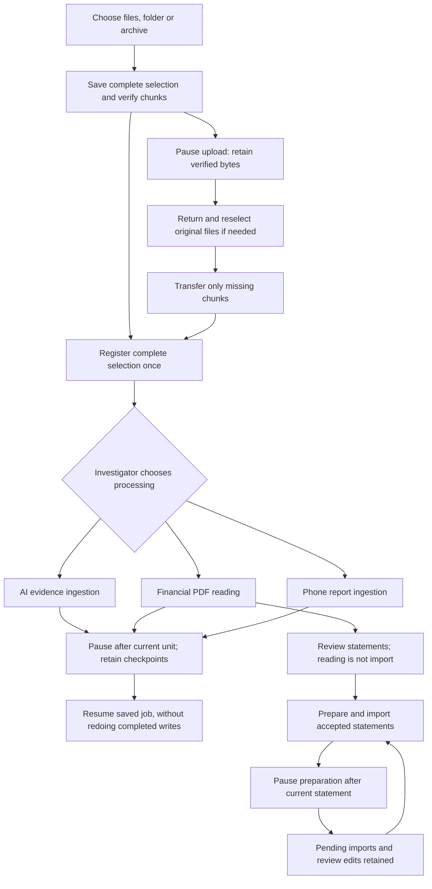
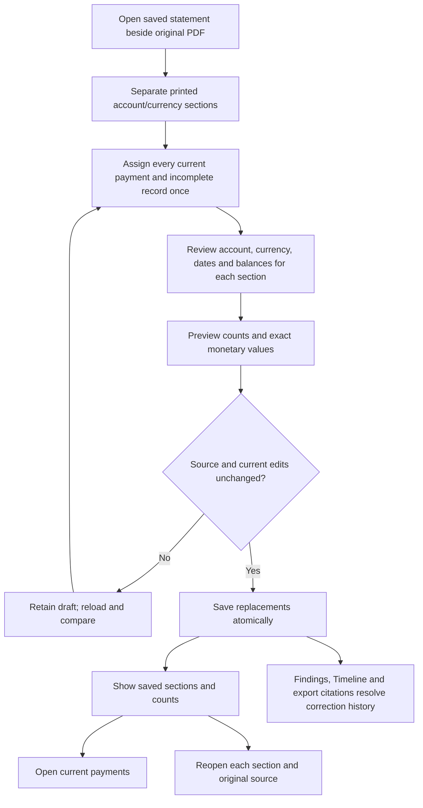
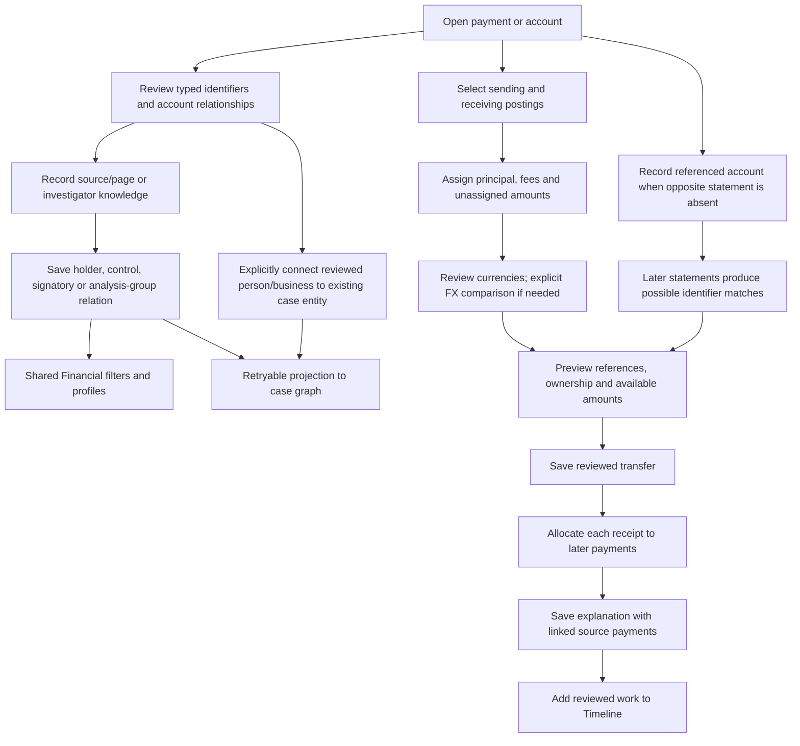

# Connected recovery, transfer and identity workflows

23 September 2026. Companion to the main action inventory and completion register.

## Retain work during interruptions

The batch page keeps preparation/import controls beside progress. Already-running
PDF readings have separate controls there because a reading may serve several
financial batches. Each control names its scope. Pausing a PDF reading group does
not pause unrelated AI jobs. A safe statement commit finishes before pause is
acknowledged. Closing the page does not discard server work.

## Correct a previously combined import

The original reading remains evidence. Recovery is an explicit investigator
choice; no historical mixed import is silently rewritten. Decimal rescaling
preserves a printed amount when its currency label is corrected; it is not an
exchange-rate conversion. Retrying the same accepted request returns its receipt.

## Review transfers and common ownership

Identifiers are typed: account number, CLABE and IBAN can support account matches;
customer, contract and holder tax identifiers are context and never automatically
merge bank accounts. Matching names do not establish ownership. Referenced
accounts create no statement, transaction or balance. Joint holders and effective
dates remain explicit. Only a current reviewed common holder establishes an
internal transfer for the selected account scope.

A saved split transfer consumes only its reviewed principal/fee portions. Fees
and unassigned amounts remain visible as external activity; same-currency
internal principal is counted once. Cross-currency amounts remain separate with
the reviewed comparison. An onward allocation is an investigator interpretation,
not proof that a particular receipt funded a later payment.

The case graph uses stable case-scoped account/party nodes. Its visible status is
pending, current or unavailable; retry uses saved decisions. Investigator graph
names, notes and unrelated edges are retained. Retraction removes managed
ownership/identity relationships only. Generic graph deletion/merging cannot
silently destroy reviewed financial identities.
