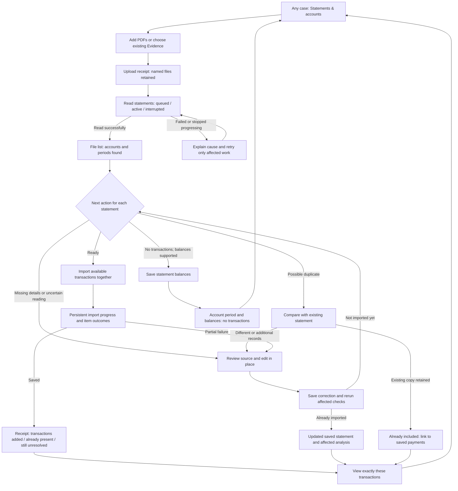

# Platform-wide statement ingestion, correction and import workflow plan

Current delivery status: [23 September implementation and verification](release-verification-2026-09-23.md). The plan below preserves requirements and initial observations; its original Planned labels are not the current implementation status.

22 September 2026. **Status: investigated and planned; not implemented or accepted.**

This is the implementation and acceptance reference for Alex's latest feedback, reproduced in BNB2 and applicable across Loupe Financial. It extends the [financial workflow reference](README.md) and [acceptance record](../alex-financial-acceptance.md). Earlier passing tests or releases do not close these new reports.

## Outcome and scope

An investigator working in an existing case must be able to add statements, leave while they are read, see which payments are available to investigate, correct missing or wrong details beside the source, import once, and return to any unresolved work. The screen must explain this without assistance from Neil or an engineer. Large batches and PDFs containing many statements must follow the same journey as a single PDF.

At every point, the workspace must answer:

1. Which case, PDF, account and statement period am I working on?
2. Has Loupe read it, and what did it find?
3. What is already saved in Transactions or account coverage?
4. What remains unresolved, and does that affect totals or only a check?
5. What can I do here, what will it change, and how do I get back?

This plan covers both currency reports, concurrent processing/queued PDFs, duplicate handling, the unresponsive 109-transaction import, flagged statements, missing holder/account/dates, and the lack of clarity about processing versus importing. BNB2 is a reproduction and acceptance example, not the boundary of the fix. No new case, wholesale removal, or manual re-entry of an entire batch is a prerequisite.

## Platform-wide acceptance requirement

The user explicitly requires these workflows for **all existing and future cases and ingestions**. Implement them in the shared Financial services, data contracts, editors and processing infrastructure. No production behavior may be gated on BNB2, a customer, a filename, a particular account, a fixed transaction count or these screenshots.

- All entry points converge on the same rules: upload in Financial, choose files/folders from Evidence, process a single file or batch, retry, reread, reopen and correct an existing import.
- Existing imports, saved drafts, source versions and accepted jobs must remain usable after deployment. Add compatible data migrations/projections where needed; do not require every investigator to delete and re-import a case.
- Statement correction, dates, status, durable receipts and duplicate prevention work across banks, currencies, account types, single/multi-account PDFs and multi-period PDFs. A supported currency catalog remains shared; no case-specific three-currency list.
- Bank-specific extraction rules belong in reusable, source-supported layout recognizers. A new or ambiguous layout follows the same clear review/recovery journey; this requirement does not promise perfect automatic extraction of every future PDF.
- Manual corrections survive rereading and model/parser changes until an explicit reviewed replacement. A successful repair of BNB2 alone does not satisfy this requirement.
- Concurrent users, cases and jobs are acceptance scenarios. Access, account identity, imports and duplicate decisions remain case-scoped. A statement legitimately disclosed in another case must not be silently skipped because it exists elsewhere.
- Validate both legacy data and entirely new ingestion with different cases, names, account numbers, dates and counts. Assert unchanged source/decision history and the same totals in Transactions, accounts, exports and linked casework.

BNB2 is the first realistic regression case. The release gate also requires an unrelated fresh case and a separate legacy case using different bank layouts/currencies, plus cross-case isolation and shared-capacity tests. Use synthetic/isolated records for write and failure tests; choose authorized live records for final acceptance.

## Evidence established before planning

| Evidence | Finding | Consequence for the plan |
|---|---|---|
| Alex's two currency screenshots, code inspection and read-only live BNB2 review | The visible currency selector is disabled whenever an import exists. A separate **Edit account and balances** editor contains a working currency selector. | Fix the correction journey at the field the investigator sees. Merely adding another control elsewhere repeats the failure. |
| Saved-statement editor and backend request model | Holder, account, bank, currency and balances are supported; corrected statement start/end dates are absent from that saved-detail writer. The lower review fields become read-only after import. | Add persistent date correction and use one editor for displayed details before and after import. |
| Exact live Kapital review | Four saved USD payments coexist with “0 payment readings in the current PDF”, repeated balance readings and a layout warning. | Separate saved case data from a fresh extraction. A currency correction alone does not establish extraction completeness. |
| Currency detection code and screenshot | The photographed account section says `Moneda MN`; the page also contains peso/dollar overview sections. The detector's Mexican-issuer handling is limited, and `MN` is not among its current national-currency aliases. | Inspect the exact source geometry and account section. Recognize national-currency labels in verified issuer context; do not choose a currency from the filename or a different account's section. The precise route that selected USD is still to be reproduced. |
| Batch UI and worker code | The confirm endpoint queues work; the UI briefly says “Confirming…” and then relies on refresh. Batch processing walks batches sequentially; each pass checks files before importing pending items. The evidence worker is configured for several concurrent jobs, not one. | Investigate fairness, queue dispatch, file preparation, import execution and UI reporting separately. Alex's “two kinds of processing” diagnosis is plausible but not yet proven. |
| Duplicate/import code | An existing import of identical PDF bytes and its statement scope is recognized; repeated identical import requests can return the existing receipt. Overlapping periods are warnings rather than automatic exclusions. | Do not claim that all duplicate statements are automatically skipped. Explain each match and its treatment. |
| Live BNB2 at inspection | The files view showed 175 active PDFs and two with saved statements. Recent batches were available for review, some with reading failures. The Kapital batch showed two file entries but one imported statement. | Current live state differs from the 150-file screenshot. Reconstruct the original attempt from durable records/logs; do not present today's counts as proof that the 109-transaction attempt succeeded or failed. Trace repeated file entries to source versions before calling them duplicate statements. |

Only navigation and opening/cancelling an editor were performed in BNB2. No imports, corrections, retries, removals or reprocessing were submitted. Queue starvation and the original 109-transaction failure remain open diagnostic questions.

## The connected journey

Statements & accounts remains the home for this work. Files, processing runs and account coverage are views of the same evidence, not separate paths with different answers. Upload begins the normal reading/preparation journey once; choosing existing Evidence explicitly starts or resumes it. Importing into Transactions remains an explicit action. A 51-period PDF can be prepared and imported together; opening every period is optional unless a specific decision is required.

## 1. Know what has been read, saved and imported

**Investigator objective:** return to BNB2 and immediately understand progress and the next useful action.

**Journey:** open Statements & accounts → see the case-wide file list → filter to work needing action or open a batch → open a named statement → return to the same filtered list and position.

Implement one authoritative status response used by files, batches, individual review, account coverage and Transactions. Keep three independent facts:

| Fact | User-facing states | Meaning |
|---|---|---|
| PDF reading | Waiting to be read; Reading; Read; Reading failed/interrupted | Whether the source has been processed. “Read” never implies transactions were imported. |
| Statement import | Not imported; Import queued; Importing; Imported; Balances saved; Already included; Left unimported; Removed from Financial | Whether this account/period contributes to the case and where to see it. |
| Review checks | No detected issues; Needs a decision; Imported with checks outstanding; Reviewed difference | What is unresolved. Successful import is not a guarantee of complete extraction or reconciliation. |

File summaries derive from their individual statement periods. For example, a 51-period file with 50 imported periods must say **50 of 51 periods imported**, not simply Imported. A read PDF whose statement count is not known must say so. No-transaction evidence must be distinguished from “no transactions could be read.”

Show units on every count: PDFs, statement periods, imported transactions, incomplete readings and checks are different quantities. Primary totals within a status dimension must reconcile to that dimension's total. Review badges may overlap imported status, but must be labelled, for example **24 checks across 9 statements**. Historical source versions must not inflate the count of current logical PDFs.

Every row shows filename, account/period when known, reading status, import status, imported/available counts and a context-specific next action. Compact rows, search, pagination and status filters keep a 150-file run usable. Shared filtering includes person/company and account multi-selection where known; unidentified items remain reachable.

**Acceptance:** Alex can identify what is in Transactions, what is awaiting import, what failed, and what only needs a check without opening every PDF. Counts agree after correction, import, leaving and returning, refresh, another user's save and removal/reprocessing. A successful empty statement is visibly complete.

## 2. Process PDFs while other work is running

**Investigator objective:** add financial PDFs while general evidence processing is active and know whether the job is progressing.

**Journey:** add PDFs → receive a retained-file receipt → see Waiting or Reading with last progress → leave the page → return to the same job → import completed statements while remaining files continue.

First trace the reported BNB2 attempts through file acceptance, engine dispatch, worker start, extraction, Financial preparation and import. Record request/job identifiers, stage, start/last-progress times, attempts and recoverable failures. Check whether an item is genuinely waiting, already processed elsewhere, blocked by a stale file status, repeatedly failing or merely not refreshed in the UI. Identify which other processing type was running from records before designing its concurrency test.

Then make scheduling fair and bounded. Financial import commits must not wait behind an entire unrelated extraction run. Process eligible work in bounded turns across batches; isolate failures and retain per-source ownership so simultaneous jobs cannot write the same statement twice. Protect capacity for both PDF and general processing; raising the global worker count alone is not an accepted fix.

Show honest progress using completed files/pages where available. If progress stops, distinguish waiting for capacity, interrupted processing and a failed reading, with a safe action on the affected files. Queue health needs a separate check from worker liveness; a heartbeat is not proof the PDF is advancing. Avoid a fabricated time estimate or a spinner that can continue indefinitely. A network loss or server restart must recover accepted jobs without a second upload.

**Acceptance:** run a slow general-ingestion job and a mixed financial batch together; both advance within configured scheduling bounds. A stalled PDF does not block other files or already-ready imports. Restart a worker, interrupt the browser and repeat a submission: completed work remains, pending work resumes once, failure is visible, and no duplicate payments appear. Measure resource use before choosing deployment limits.

## 3. Correct the wrong currency from the statement being reviewed

**Investigator objective:** correct the denomination where it is displayed and see that the case now uses it correctly.

**Journey:** click the displayed currency beside the account/period → choose a currency → see the affected scope and unchanged numeric amounts → save → see confirmation → inspect the same transactions and return.

Use the same editable statement-details block before and after import. Remove the disabled decoy selector. In read-only access, show a plain value and the reason editing is unavailable. Keep the source alongside the fields; the control is reachable both at the statement header and from a currency-related check.

For an unimported statement, persist the choice with the draft and re-evaluate the amounts/checks without discarding other corrections. For an imported statement, invoke the audited saved-currency correction, preserving printed numeric amounts, names, categories, links and history. State **This corrects the currency label; it does not convert the amounts**. Review exact scope before saving; never relabel every statement on an account or in a mixed-currency PDF automatically.

Fix detection using the selected account section's labelled currency first, then well-supported issuer context. Test MN/M.N./Moneda Nacional, peso and dollar overview tables, incidental foreign-currency text and genuinely mixed-currency documents. Ambiguity leads to an explicit choice. A saved investigator choice wins on reopening and must not be presented as if it were the automatic reading. A conflicting detection is a suggestion to inspect, not “This statement uses X” asserted against the user's correction.

In the Kapital example, establish which section owns each of the four saved payments before applying a statement-wide change. If extraction combined different account/currency sections, split/assign the correct scope first. Simply changing the dropdown is insufficient to establish that all four should be MXN.

**Acceptance:** correct a wrong currency before import and after import; reopen and confirm saved currency, exact amounts, grouped totals, batch/file status, account view, exports and linked casework. Test differing minor-unit precision, conflict/cancel, a second user's edit and multi-currency source sections. Existing saved report snapshots retain their historical content.

## 4. Fill missing holder, account and statement dates directly

**Investigator objective:** click a blank field, enter what the PDF says and continue reviewing.

**Journey:** open a flagged statement → the relevant blank field is already visible/focused → type holder/account/start/end beside the source → save → see remaining checks and a clear next action → return to the batch.

Unify the duplicate sets of apparent input fields. Empty values must be real editable fields for an authorized investigator. Populated fields offer direct Edit in the same block. Include holder, bank, account number, currency, period start/end, opening/closing balances and their source references. Keep Save changes/Cancel visible, identify unsaved changes, retain drafts across navigation, and never discard typed values after a validation or stale-revision error.

Extend the saved-details API, history and account-period model to persist dates, not just render new inputs. Accept known dates and explicitly unknown values; validate real dates and start ≤ end. Do not substitute today's date, infer a transaction date from a statement boundary, or turn missing balances into zero. Where dates can be inferred from a printed day/month and an explicitly supplied statement year, present that separate affected-transaction change for review.

Account-number correction must preview whether it moves the statement to an existing account or corrects its present identity. It must not silently merge unrelated accounts or rewrite other statements. Holder-only edits must not create a new bank account. Date correction updates coverage, overlaps and checks while preserving independently printed transaction/booking/value dates. If a missing currency/required value prevents a reading from entering totals, explain that beside the field; an unknown holder alone should not invent or suppress a valid payment.

**Acceptance:** complete these edits on a draft, a balance-only saved statement and an imported statement. Reopen through files, batch and account coverage. Verify the values persist, the relevant flag resolves, unrelated payments/dates/accounts do not change, and return navigation preserves the task position.

## 5. Make the 109-transaction import produce a visible, durable result

**Investigator objective:** click Import once and know exactly what was added or why it was not.

**Journey:** batch shows the exact available scope → click Import → persistent accepted/queued/importing state → completion receipt → view imported transactions, or review only the statements that failed.

Reconstruct the original attempt before assigning a cause: capture the confirm response, ready-set revision, queued item state, worker outcome and persisted ledger result. Explicitly test a stale batch after currency/details correction and a failure whose item returns to attention with the import button still looking available. Distinguish request rejection, accepted-but-waiting, execution failure and successful import with stale display.

Have confirmation return an operation receipt identifying the submitted statement set. Poll/subscribe to that operation until every submitted item has an outcome, including after navigation or reload. Repeated clicks/retries refer to the same operation or existing saved import. Resolve uncertain network outcomes by checking the accepted request before sending another. A late worker must not overwrite a newer correction.

Use “Importing…” for actual work and “Import queued” while waiting. Report a durable result next to the action: transactions added, already present, incomplete readings retained outside totals, balances saved and statements that failed. For Alex's example, **109 transactions added; 4 incomplete readings need review** is a valid receipt only if persistence confirms those numbers. On partial failure retain successes and offer Retry failed statements; never restart the whole successful batch to address one failure.

Open Transactions using the receipt's exact current source set, not a guessed date range. State that scope visibly and provide Show all case transactions and Return to batch. Available counts and import actions update everywhere; a completed zero-item state offers View imported transactions instead of an unexplained disabled “Import 0 transactions”.

**Acceptance:** single click, double click, 409 revision conflict, delayed worker, one failed statement, browser close, response lost after commit, and reopening the receipt. Every path gives an understandable outcome with no duplicates. Test both one-statement 109+4 and a multi-statement partial-success batch.

## 6. Resolve flagged statements through guided actions

**Investigator objective:** understand a check, fix it at its source or record why it remains unresolved, then move to the next problem.

**Journey:** choose Needs review → select a specific check → open the correct PDF page and editable field/row → save a correction or a documented review decision → rerun the check → next unresolved item or return to the retained list.

Replace undifferentiated “issues” with actionable check records: what was observed, why it matters, whether it affects import/totals, source page, action and current resolution. Keep a stable check identity so a resolved problem does not reappear from an old batch summary. Original extraction messages remain available in history; active checks use current saved values.

| Check | Investigator action | Completion means |
|---|---|---|
| Missing holder/account/currency/dates | Edit that field beside the source | Saved value is valid, related checks recomputed. |
| Missing/incorrect transaction amount, direction or date | Edit row, add a missed payment, or mark the reading as non-transaction text with reason | Corrected payment enters the appropriate totals, or false reading is retained outside them. |
| Printed count/total differs | Show printed versus imported count/amount and difference; open relevant pages/rows | Arithmetic agrees, or difference remains explicitly reviewed with an explanation. Acknowledgement is not reconciliation. |
| Opening operation versus liquidation balance | Show both source labels and the balance column used by the transaction list | A consistent basis is selected; prior-period settlement is not counted twice. |
| Repeated summary balance | Select the actual balance control and retain repeated/source-only values | Summary lines stop appearing as bad transactions; real zero remains distinct from unreadable. |
| No transactions read | Establish from the source whether it is balance-only or extraction failed | Verified balance-only statement is saved with zero payments, or failed extraction has a recovery path. |
| Layout/extraction failure | Retry the relevant reading or edit/assign the needed rows, with a comparison to saved work | Existing edits/imports preserved until an explicit replacement; usable prior work is not erased. |
| Duplicate/overlap | Compare named statements using the workflow below | An explicit retained/excluded/additional-record decision. |

After import, the same issue must still lead to an editable current record. Do not take Alex to a disabled draft. A new reading is displayed as a comparison against saved case data with a clearly labelled replacement action; “four imported” and “zero newly read” cannot look like contradictory answers about the same dataset.

Bulk corrections apply to an explicit selection with a preview. Do not offer a blanket “mark all fixed” that hides missing money or genuine count differences. Usable transactions can remain available for investigation with unresolved checks; genuinely incomplete readings remain outside totals with a route to resolve them.

**Acceptance:** exercise every check class above, including after import and from a large batch. Saving resolves only the relevant check, returns visibly to the next step and updates all entry points. Test source-view failures, stale edits and multi-page navigation. Alex must not need to review all 51 periods to fix one field.

## 7. Explain duplicates at upload, review and import

**Current answer to Alex:** there is protection against repeat import of the same PDF/period, but no verified blanket guarantee that every duplicate statement is automatically skipped. Different scans, reissues and overlapping statements need comparison.

**Investigator objective:** avoid counting the same payments twice without losing additional evidence.

**Journey:** add/select a file → Loupe explains an exact existing copy or possible overlapping statement → open the retained import or compare copies → record the outcome → receipt says which records were counted.

| Situation | Planned behavior |
|---|---|
| Same request submitted again | Return the original operation/result; no second import. |
| Same PDF bytes and same statement scope, already included | Show Already included with link, date and saved count. Retain disclosure/source history; do not import again. |
| Same source still processing or being imported | Attach to/show the active operation instead of creating duplicate work. |
| Same source with changed parser output or investigator edits | Show a version comparison/replacement path; do not overwrite corrections or call a conflicting reading an identical import. |
| Same content in a different scan/export | Show a duplicate candidate with supporting comparison; keep an explicit recorded choice of which reading counts. |
| Same account and overlapping dates only | Show overlap and differences; never silently skip. Additional transactions or a corrected reissue may be legitimate. |
| Same amount/date/description repeated within a statement | Keep both unless there is source evidence they are the same row. Repeated payments can be real. |
| Previously removed/excluded statement | Explain the earlier decision and offer the existing explicit restore/process-afresh route. Do not silently resurrect it. |

Derive current file counts from logical sources while keeping processing versions in expandable history. Check repeated filenames/source versions in BNB2; filename equality alone proves nothing. Include already-included and duplicate-review outcomes in the import receipt. Case isolation remains enforced.

**Acceptance:** same file twice, same file in two simultaneous batches, renamed byte-identical file, new scan, corrected statement, partial month, multi-period PDF, duplicate exclusion/restore and a real repeated payment. Counts and totals must reconcile and every automatic skip must have an inspectable reason.

### Additional report: Loupe may itself be creating duplicates

Alex subsequently reported that the platform appears to create duplicate financials. Treat this as a possible data-integrity defect and a release gate, not only a request for clearer duplicate labels.

Clarified entry path: Alex uploads the PDF **once to Evidence, then selects Send to Financial**. This is not a second user upload. Returning to Evidence and searching by filename must still show the original upload once. Financial preparation and repeated sends must reuse its source history; any internal reading record must not masquerade as another uploaded PDF. The distinction about separately uploaded evidence applies only to actual separate user uploads, not this handoff.

Existing-copy remediation is part of the fix: resolve already stored internal readings using same-case original/parent links and matching file hashes, show the original once in Evidence search/folders/counts, and attach the existing readings to its history. Apply this when reading existing records, with no requirement for Alex to delete, re-upload or reprocess them. Preserve the underlying IDs, originals, citations and imported records. Unproven matches remain separate for investigation. Local regression coverage includes an existing original plus two old internal readings and verifies that grouping does not change any saved file. **Live remediation remains on hold until the user explicitly permits deployment; ongoing ingestion must not be interrupted.**

Code inspection confirms `create_statement_version` writes a byte-identical PDF copy with a new EvidenceFile ID, the same folder/name/hash and parent/root metadata. Financial preparation can invoke this for a previously processed file that lacks financial text/table geometry, as well as for explicit rereading/recovery. Folder selection currently enumerates PDF file records without collapsing that source-version lineage. The Financial file-list hook also does not expose/group that lineage. This establishes a mechanism by which internally created versions can be selected or displayed as additional files; it does **not** establish that BNB2's ledger currently counts payments twice.

Audit four separate levels before changing records: (1) distinct supplied PDFs versus generated reading versions, (2) active processing jobs/batch memberships, (3) current imported account/period readings, and (4) current admitted payments and their contribution to totals. Follow source hashes, parent/root IDs, request IDs, statement scopes and correction chains. Use filename matches only to find candidates, never as the decision rule. The report must distinguish display-only duplication, redundant work and duplicated ledger contributions, with counts and totals separated by currency/account type.

Required journey: **add/select a source → reuse or create an explained reading version → process once → import each actual statement scope once → view one logical statement with expandable history**. Old versions remain accessible for provenance but are not advertised as fresh PDFs to import. Folder preparation resolves the intended current source/version, excludes removed work unless explicitly restored and joins an already-active operation. Explicit new reading requests retain history without automatically creating a second counted import. Differing supplied copies and changed readings use the comparison path above.

Acceptance must include the full loop that can generate the defect: general Evidence processing → send to Financial → create the required reading → select the folder again → repeat while another run is active → import → reread/replace → leave and reopen. Repeating the loop cannot increase current logical-file, imported-period or admitted-payment counts unless genuinely new evidence or periods were added. Test multiple-account/currency/period PDFs and conflicting investigator edits so source grouping never swallows legitimate records.

If the audit finds payments counted twice, prepare an affected-record and totals comparison, retain original files/citations/history and use the reviewed exclusion/replacement workflow. Do not mass-delete matching filenames or silently alter client totals. Prevention in shared ingestion code and regression coverage must accompany any correction to existing data.

## 8. Restore confidence in existing casework, starting with BNB2

The workflows above must apply to already-uploaded files, saved drafts and existing imports in every case, not just new ingestion. Build a case-scoped, read-only reconciliation report linking logical PDF → reading/version → batch item → saved statement period → current transaction set. Run it first against the reported BNB2 work. Surface mismatched status, stale checks, outstanding accepted imports and possible duplicate scopes without rewriting client data.

Opening BNB2 after deployment must show current facts immediately. Status projections and recoverable jobs can be refreshed safely; changes to financial evidence, currency, account identity, duplicate exclusions or replacement readings still use the corresponding visible investigator action. Preserve original PDFs, prior edits, Findings/Observations, Timeline links and report history. No mass cleanup or re-import is implied by this plan.

End-to-end acceptance uses synthetic/isolated records for failures and write tests, followed by live observation and the specific authorized correction/import in BNB2. Previous authorization to deploy is not authorization to remove client records for a demonstration. The separate pending request to upload two other PDFs to neil finance remains separate from this plan.

## Delivery order and release gates

Deliver vertical journeys, each including its server state, screen behavior, failure recovery and verification:

1. **Establish the truth and visible progress.** Reconstruct the reported queue/import attempts, define consistent statuses/counts, implement durable operation receipts and fair processing. Gate: two processing types plus import/retry/reopen work and report correct results.
2. **Correct a statement in place.** Unified details editor, saved dates, scoped currency correction/detection and account identity handling. Gate: open existing wrong/missing data → edit → save → Transactions/coverage → back, including conflicts and preserved history.
3. **Finish the remaining review work.** Guided checks, saved-versus-new reading comparison, duplicate decisions and existing-batch status reconciliation. Gate: review each unresolved condition to a visible outcome without losing successful imports or manual edits.
4. **Accept the combined platform-wide journey.** Complete a realistic mixed batch, including a multi-period PDF, empty statement, mixed currencies, missing metadata, duplicate candidates, slow job and partial failure. Verify files/batches/reviews/Transactions/accounts agree and survive leaving/returning. Reproduce BNB2, then pass the unrelated fresh/legacy case matrix, source-version duplication loop and cross-case isolation checks before recording live acceptance and remaining limits.

Do not ship a new label or dropdown alone as completion of this feedback. Implementation may be incremental, but a release claim must name which whole journeys passed and which remain open. Update the [action inventory](action-inventory.md) when controls change and the [acceptance record](../alex-financial-acceptance.md) with observed results rather than promises.

## Implementation map

| Area | Starting points | Work |
|---|---|---|
| Consistent statement state | `StatementFilesPanel.tsx`, `FinancialBatchPanel.tsx`, `import_batches.py`, `batch_import_history.py` | Shared file/period/import/check projections; logical-file counts; persisted operation receipt and current check resolution. |
| Processing | `evidence_processing_service.py`, `evidence_intake.py`, `import_batches.py`, evidence-engine `worker.py`, `batch_dispatch.py`, `batch_orchestrator.py`, job sync/janitor | Observe stage transitions; fair bounded scheduling; separate progress from liveness; recover accepted work and stale ownership. |
| Details/currency | `StatementImportPanel.tsx`, `ImportedStatementDetails.tsx`, `StatementCurrencyControl.tsx`, `statement_details.py`, `statement_currency_edit.py`, `statement_currency.py` | Unified editor, dates in contract/model/history, scoped corrections, detection evidence and downstream invalidation. |
| Flags and source review | `import_issues.py`, `review_arithmetic.py`, `PrintedStatementTable.tsx`, batch review and saved review/recovery services | Stable actionable checks; saved-versus-new comparison; source-focused editing before/after import. |
| Duplicates | `statement_import.py`, `statement_import_overlap.py`, `duplicate_query.py`, `duplicate_decisions.py`, source-version/intake services | Idempotent accepted work, exact-copy links, explicit uncertain matches, no filename-only exclusion. |
| Validation | Backend SQL tests, component/Chromium journeys, existing workflow references | Contract tests plus complete realistic browser journeys; live claims supported by revision and observed behavior. |

## Completion checklist

- [ ] Currency control corrects the displayed statement before and after import, with appropriate scope and no numeric conversion.
- [ ] Missing holder, account and dates can be entered directly, saved and reopened.
- [ ] Concurrent general and financial processing makes progress and recovers without duplicate work.
- [ ] The reported 109-transaction import has a diagnosed outcome and a reliable receipt/retry path.
- [ ] Each flagged statement has an understandable, reachable resolution path after import as well as before.
- [ ] Duplicate behavior is explicit and tested for exact copies, different scans and overlaps.
- [ ] Internally generated reading versions do not inflate logical-file counts, create repeated active work or add duplicate current payments through folder selection/retry/reread loops.
- [ ] Counts distinguish files, periods, payments, incomplete readings and checks everywhere.
- [ ] Existing BNB2 data, investigator edits and links survive; no fresh-case workaround is required.
- [ ] Browser checks cover large batches, 51 periods, viewport scrolling, keyboard operation, leave/return, refresh, permissions and failures.
- [ ] Release record distinguishes implemented, locally verified, deployed and live accepted; remaining extraction/corpus limits are stated.
- [ ] The same journeys pass for unrelated new and legacy cases, different banks/currencies/account types, all ingestion entry points and concurrent users/cases. No case/file-specific production exceptions are used.
