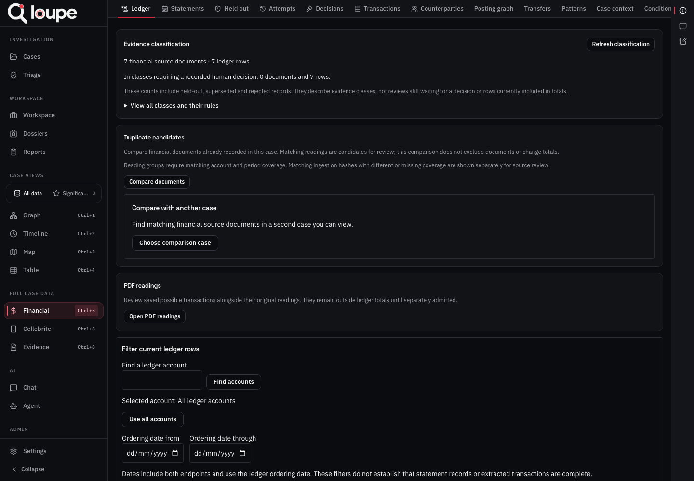
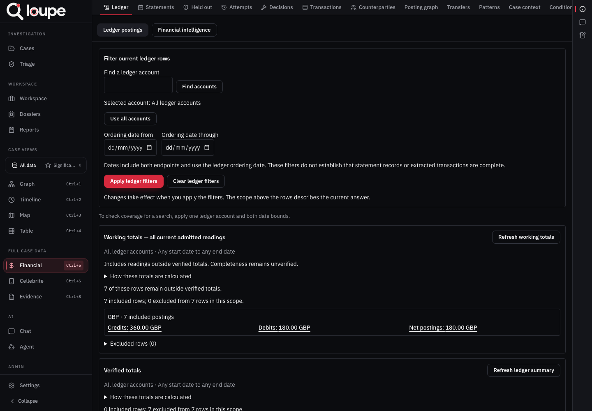

# Loupe financial user guide

Step-by-step instructions for reviewing financial records, investigating payments and preparing reports.

**Edition: 10 September 2026.** This guide describes the financial screens in the local application. A server may show an older version until it is deployed. Screenshots use a development case with synthetic transactions. They illustrate the controls, not findings about a real person.

## Contents

1. [Start here](#start-here)
2. [Find your way around](#find-your-way-around)
3. [Add a PDF](#add-a-pdf)
4. [Select possible transactions](#select-possible-transactions)
5. [Review each reading](#review-each-reading)
6. [Record statement dates and balances](#record-statement-dates-and-balances)
7. [Finish the PDF review](#finish-the-pdf-review)
8. [Record how a source was received](#record-how-a-source-was-received)
9. [Read and filter the ledger](#read-and-filter-the-ledger)
10. [Correct a reading or change its inclusion](#correct-a-reading-or-change-its-inclusion)
11. [Check statements and missing periods](#check-statements-and-missing-periods)
12. [Review duplicates](#review-duplicates)
13. [Investigate names, accounts and trends](#investigate-names-accounts-and-trends)
14. [Compare possible transfers](#compare-possible-transfers)
15. [Review patterns and payment claims](#review-patterns-and-payment-claims)
16. [Trace funds in one account](#trace-funds-in-one-account)
17. [Trace funds between accounts](#trace-funds-between-accounts)
18. [Record asset purchases and resale assumptions](#record-asset-purchases-and-resale-assumptions)
19. [Prepare an indirect financial workpaper](#prepare-an-indirect-financial-workpaper)
20. [Download reports and supporting records](#download-reports-and-supporting-records)
21. [Compare and check saved packages](#compare-and-check-saved-packages)
22. [Stop work and return later](#stop-work-and-return-later)
23. [Solve common problems](#solve-common-problems)
24. [Complete your case review](#complete-your-case-review)
25. [Words used in Loupe](#words-used-in-loupe)

## Start here

### Open this guide while working

Select **Financial guide** above the financial tabs. The button stays visible while you scroll a financial screen or switch tabs. The guide opens in a modal, which is a panel over your current screen. Select a contents link to jump to a procedure, or select **Guide contents** to return to the list. Select **Close** or press Escape to return to the case. Opening the guide does not save or discard the form underneath it.

### What you need

Ask your administrator for the Loupe address, your own sign-in details and access to the case you will work on. Reading a case and editing it are separate permissions. If you can view records but cannot save a decision, ask for editing access to that case.

Keep the original files supplied to you. Work from the evidence registered in the correct case. A file on your computer is not available to colleagues until it has been uploaded to their Loupe server. Local development cases are not copied to the server by a software deployment.

You do not need an AI connection to prepare a PDF locally and review its stored text. The optional AI proposal button needs a working provider configured by your administrator. Start with ordinary PDF preparation and manual review.

### Your first complete task

For your first use, follow sections 3 to 7 with a test document before working on a live case. Practise selecting rows, saving a decision and reopening it. Finalization closes further additions from that PDF reading, so practise that step in a test case too.

The normal order of work is:

1. Upload or select the PDF and prepare it for review.
2. Compare the extracted table with the original page.
3. Select actual transaction rows and save them for review.
4. Check the amount, currency, account, direction and dates for each selected row.
5. Record printed statement dates and balances where available.
6. Check every intended page and batch, then finalize the PDF reading.
7. Inspect the working ledger and statement checks.
8. Investigate payments and save the reports you need.

### Four distinctions that affect your results

| What you see | What it means for your work |
|---|---|
| A possible reading or candidate | A proposed reading saved for review. It is outside the ledger totals. |
| A resolved reading | You have recorded a decision about it. It still needs finalization before it becomes a ledger row. |
| Working readings, including P3 | Current eligible documentary readings used for working analysis. Manually reviewed PDF rows can appear here. |
| Verified only | A narrower population that meets the application's verification and source rules. Resolving or finalizing a PDF does not automatically put it here. |

A working total of 1,000.00 and a verified total of 0.00 can therefore both be correct. Check the population label before quoting any number. An empty result means no rows were returned under the selected rules. It does not establish that no payments occurred.

## Find your way around

1. Open the Loupe address supplied by your administrator.
2. Enter your username and password, then select **Sign in**.
3. Open the case you are authorised to work on. Check the case name before uploading or recording anything.
4. Select **Financial** in the case navigation.
5. Use the tabs across the financial page. Scroll the page or tab strip when controls are outside the visible area.

*The financial page contains separate tabs for the ledger, review history and analysis. The case name identifies where your work is being recorded.*

| Tab | Use it to |
|---|---|
| Ledger | Open PDF readings, review evidence classes, compare duplicates, inspect totals and current rows. |
| Statements | Check recorded balances, printed controls and statement date coverage. |
| Held out | Inspect rows excluded from normal ledger use and record permitted inclusion decisions. |
| Attempts | Find recorded financial loading attempts and whether they completed. |
| Decisions | Read who changed a reading or its treatment, why, and what changed. |
| Transactions | Browse current documentary ledger postings and their source references. |
| Counterparties | Compare recorded payment names and review links to people or organisations. |
| Posting graph | Inspect accounts and recorded counterparty labels connected by individual postings. |
| Transfers | Compare possible incoming and outgoing sides of transfers between accounts. |
| Patterns | Review repeated payments, short payment paths and payment claims. |
| Case context | Read payments alongside wider case events. |
| Conditional tracing | Calculate explicitly stated tracing assumptions or prepare an indirect workpaper. |
| Trends | Compare ledger amounts over time. |

**Financial Intelligence**, where offered, is a separate set of extracted information. Use documentary ledger views for the reviewed financial workflow in this guide. An amount mentioned in a letter or interview is not a bank transaction merely because it appears in intelligence results. Section 15 explains how to compare a claim with the ledger.

## Add a PDF

### Upload and prepare a new file

1. Open **Financial**, then **Ledger**.
2. Select **Open PDF readings**.
3. In **PDF document**, choose the PDF from your computer.
4. Check the filename and case name.
5. Select **Prepare PDF for review** once.
6. Wait for preparation to complete. This step reads the PDF and prepares text and table information. Scanned pages may require OCR, which reads letters and numbers from page images.
7. When **Choose prepared PDF rows** becomes available, select it.
8. Confirm that the available source pages belong to the correct file.

*Choose a document, then prepare it. Preparation does not approve transactions or put amounts in the ledger.*

### Use a file already uploaded

1. Open **Open PDF readings**.
2. Select **Find uploaded PDFs**.
3. Choose the matching file from the results. Check its processing status as well as its name.
4. If the file is unprocessed, use **Prepare PDF for review**.
5. If preparation has completed, use **Choose prepared PDF rows**.

Do not upload repeated copies just because preparation is taking time. Check the saved status first. If the page reports a failed or interrupted attempt, note the filename and error before asking the administrator to investigate.

### Check whether preparation was useful

Open a page that contains transactions. Compare its stored text with the original PDF. Check a date, an amount and a description. Watch for missing decimal points, mixed columns, repeated headers and unreadable characters. A successfully prepared file can still contain extraction errors that need manual review.

## Select possible transactions

### Select rows manually

1. In **Choose rows from a PDF**, select the file and page from the available source pages.
2. If the page has more than one stored table, use **Previous table** or **Next table** to find the transaction area.
3. Read the original page beside the extracted table.
4. Click a table value to locate it on the original. Use **Show table location** when you need to inspect the table area.
5. Assign the proposed meaning of each relevant column. Identify dates and amounts from the printed headings and values. Leave meanings unknown when the source does not support a choice.
6. Tick **Use row** only for rows you intend to review as transactions.
7. Check that you have not selected an opening balance, a closing balance, a heading, a subtotal or a disclosure paragraph as a payment.
8. Select **Save selected rows for review**.
9. Wait for **Rows saved**. Open the saved readings to check that the intended rows are present.

Use the source viewer's **+** and **−** controls to change zoom, **Fit source width** to fit the page area, and **Show highlighted value** to return to the selected source location when those controls are available. Zooming does not change the saved reading.

Clicking a value to inspect its location does not select its row. Selecting a row does not confirm the amount or direction. Saving rows creates a review batch, which is a group of selected readings you can return to later.

### Use printed headings and account references

The source selector can show proposals based on exact printed headings and labelled account references. Inspect the cited cell before accepting a column proposal. A generic **Date** heading does not tell you whether the date is a transaction, booking or value date.

A masked account number may identify a useful section of a statement without identifying the full account. Do not combine different card endings or account sections merely because they appear in one PDF. Keep separate provisional accounts where the evidence does not establish a shared identity.

### Scan a page range

1. Open the page scan controls in the source selection area.
2. Enter the first and last pages you want to inspect. Scan at most 50 pages in one request; repeat for the next range in a longer PDF.
3. Choose the scan currency.
4. Use automatic column proposals where supported, or identify the possible date and amount columns from the source.
5. Select **Scan selected page range**.
6. Read the result for each page. Some pages may have suggestions; others may be unchecked or ambiguous.
7. Open the supporting cells for proposed readings and compare them with the original.
8. In the queue controls, select the pages whose proposals you want to save for review. Include undated fee and interest proposals only when you intend to review those separately.
9. Save the selected proposals using the queue's save control.
10. Check the saved batch list. Different layouts can create separate groups, even on the same page.

Do not count unchecked pages as reviewed. If saving stops partway through, inspect the list of confirmed saved groups before trying again. Earlier confirmed saves remain; restarting without checking may repeat work.

### Use optional AI proposals

1. Inspect the local scan and original table first.
2. Open **Model-assisted PDF nominations** for the selected source table.
3. Read the notice about sending that table's text to the configured model.
4. If that use is appropriate for your case, select **Request AI proposals for this page**.
5. Wait for the recorded result, then inspect every proposed row and its source cells.
6. Select only the proposals you want to review.
7. Select **Save selected model proposals for review**.
8. Review those saved readings using the same process as manual selections.

One request covers one table, up to 200 rows and 24 KB of source text. Proposals do not change source values or admit transactions. An empty proposal list does not prove that a page has no transactions.

If the response is interrupted, select **Check saved model attempt** first. Checking saved status does not call the model again. If no outcome is found, follow the offered same-request retry rather than creating repeated requests. **Close interrupted model attempt** prevents its result being used, but cannot undo a request already sent to the provider. A separate request may incur additional usage.

If an attempt is labelled **SIMULATED**, it is test data. Do not describe it as a successful call to an external AI model.

## Review each reading

### Open a saved batch

1. Return to **Ledger** and **Open PDF readings**.
2. Find the saved batch and select **Open readings**.
3. Read **Saved review progress**. The counts concern selected rows in that batch, not the whole PDF.
4. Select **Show only rows awaiting review** if you want to hide rows already decided.
5. Select **Review next pending row**, or open a specific reading.

*The saved batch shows pending, resolved and rejected counts. These example readings have already been decided.*

### Complete the review form

1. Inspect the original cells and PDF page beside **Reading and decision**. Check that the highlighted amount belongs to the selected row.
2. Choose the three-letter **Currency**, such as GBP, EUR or USD.
3. Enter the **Reviewed amount** as a magnitude, using a decimal point. For example, enter `61.62`, not `£61.62` or `6,162`. Keep a printed zero as zero when it is a genuine selected reading.
4. Search for and select the **Account** whose statement records this movement.
5. Choose **Money out** or **Money in** from that account's perspective. Do not infer the direction from a person's name alone.
6. Enter supported dates in the appropriate fields. The transaction date, booking date and value date can differ.
7. Check or enter the **Description**.
8. Enter **Counterparty as printed** only if the source supplies a name. This field preserves the source wording; it does not establish the person's identity.
9. Write a **Reason for decision** that identifies what you checked and explains any interpretation or correction.
10. Select **Record resolved reading**.
11. Wait for confirmation, then reload the review and inspect its status and history.
12. Continue with the next pending row.

A useful reason is specific: “Page 4, purchase row: printed amount is 61.62. Selected the card-ending 3539 account. Used the transaction date column, not the posting date column.” Avoid reasons such as “checked” when a decision involves uncertainty.

*The original source appears beside the review fields. This example has already been finalized, so its fields are read-only. An unfinished reading uses this area to record a decision.*

### Assess an unclear amount or date

Use **Assess original amounts** and **Assess original dates** to inspect the application's interpretations of the original text. These are aids to review. Compare alternatives with the source before entering your decision. A short year, ambiguous day/month order or OCR error needs a supported interpretation. Leave unresolved information pending when you cannot justify it.

For an undated fee or interest row, leave the transaction, booking and value date fields empty. The **Statement end date (ordering only)** option places an eligible undated row in order using its statement end. It does not claim the payment occurred that day. Finalization requires the matching printed statement-end control.

### Create a provisional account

1. Search existing accounts first.
2. If none is supported by the source, use the provisional-account controls in the review form.
3. Enter a **Provisional account label** that distinguishes the source, such as “Card ending 3539”.
4. Enter the **Reason for provisional account**, explaining what is known and what remains unknown.
5. Select **Create provisional account**.
6. Check that the new account is selected, then complete the reading decision.

Creating an account does not resolve the reading. It also does not establish the holder's identity.

### Reject or reopen a reading

If a selected row is a summary, duplicate selection or otherwise unsuitable, explain why in **Reason for decision** and select **Reject reading**. Reload to confirm the recorded result.

Before finalization, use **Reopen for review** when an existing decision needs reconsideration. Record the new reason and decision. After finalization, use the ledger correction or inclusion processes in section 10; the original candidate review is sealed.

## Record statement dates and balances

Use printed statement controls to compare reviewed transactions with what the statement actually reports. A control is a printed date, balance or period total used as a check.

### Add one printed statement period

1. Finish reviewing the rows you intend to assign to the period.
2. Open **Finalize reviewed rows**, then **Add printed statement controls**.
3. Under **Statement account**, choose the correct account and currency.
4. Select the reviewed rows belonging to that printed statement period.
5. Enter **Printed statement start** and **Printed statement end** from the statement.
6. Locate and select the supporting original cells for both dates using the source controls.
7. Enter the **Printed opening balance** and **Printed closing balance** where present, and select their original source cells.
8. If present, enter **Printed total money in** and **Printed total money out**, with their sources.
9. Choose **What do the printed balances represent?** Select **Money held in the account** for held funds or **Money owed to the issuer** for a debt balance, according to the statement.
10. Enter a **Reason for statement control readings**.
11. Select **Add statement to preview**.
12. Repeat for each separate account and printed period. Check the complete preview before finalizing.

Leave an unprinted balance blank. Blank means unknown. Enter `0.00` only when you have evidence for zero. Enter decimal amounts without symbols or thousands separators, retaining a minus sign if printed. When you choose money owed to the issuer, Loupe converts amounts owed to negative ledger balances and retains the original printed amount and your choice.

Do not use a purchases subtotal as total money out if fees or interest are listed separately. The direction total must cover all money in or out in that period.

### Save an unfinished statement editor

1. While entering a statement, expand **Save unfinished statement editor**.
2. Save the unfinished fields and selected source cells.
3. Check for **Unfinished editor saved** before leaving.
4. When you return, use **Load unfinished statement editor**.
5. Finish the fields and add the statement to the preview when ready.

An unfinished editor is not yet a reviewed statement in the preview.

### Save statements already added to the preview

1. Open **Save statement controls**.
2. If saved controls already exist, load them before replacing the draft.
3. Select **Save statement controls to case**.
4. Check for the saved confirmation.
5. On return, select **Load saved statement controls** and inspect the preview.

These two saves are separate: one preserves the editor you are still filling in; the other preserves statements you have already added to the preview. Source checks run again before finalization. If another reviewer has changed the draft, refresh and compare their version before saving again.

## Finish the PDF review

**Finalization seals this PDF reading in the case. Do not finalize the first batch while you still need to select rows from other pages.** You can leave recorded reviews saved while completing the rest of the document.

1. Open **Show document progress** under the saved readings. Inspect each page and use **Previous overview pages** and **Next overview pages** for longer documents. A page with no saved rows still needs inspection. Open every saved batch from the PDF and check its progress.
2. Confirm that every intended row has been selected. Revisit unchecked pages and separate account sections.
3. Resolve or reject every selected reading. Do not leave pending rows in the intended finalization.
4. Load and inspect saved statement controls, if used.
5. Open **Finalize reviewed rows** and read the preview, source checks and any errors.
6. If you are deliberately finalizing an incomplete document selection, read the incomplete-coverage acknowledgement and tick it only if it describes your decision.
7. Enter **Reason for finalization**, explaining the reviewed coverage and anything excluded or unresolved outside it.
8. Select **Finalize selected rows** once.
9. Wait for the receipt. If the connection is interrupted, reload and inspect the saved receipt before repeating the action.
10. Return to the ledger. Inspect the current working readings, totals and source links.
11. Open **Statements** and inspect the resulting checks.

Finalized manual PDF rows remain P3. Finalization does not certify complete extraction, identify every account holder or promote readings into verified totals. To change a written amount later, use a ledger correction. Do not attempt to reopen the original source selection as if it were an unsaved form.

## Record how a source was received

Custody records describe how a source came into the case and any reported transfers. They are separate from transaction review.

1. Open a source from PDF selection, **View source**, or a statement source control.
2. Expand **Source custody records**.
3. Read any existing reports before adding another.
4. Choose the **Report type**: Receipt, Transfer or Additional information.
5. Enter the reported event time if known, including its timezone. The example format `2026-09-10T14:30:00+01:00` means 14:30 with an offset one hour ahead of UTC. Leave the time blank if unknown.
6. Enter **Received from** where known and **Received by** for receipt or transfer reports.
7. Choose **How obtained**, such as Client supplied or Document production. Explain Other in the details.
8. Record **Native file availability**: Provided, Requested, Unavailable or Unknown. A native file is the original data format supplied by its system, rather than only a PDF rendering.
9. If you have a supporting certification, select **Choose a certification file from this case** and choose the correct uploaded file.
10. Enter **Details and reason**, then select **Record custody report**.
11. Reload custody history and confirm the report appears with the signed-in author and recorded time.

To correct a report, select **Correct this custody report**, enter the corrected account and reason, then save. The correction adds a record; it does not erase the earlier one. “No custody reports recorded” means earlier custody is unknown, not that custody was verified or uninterrupted.

## Read and filter the ledger

### Choose the records to examine

1. Open **Ledger** or documentary **Transactions**.
2. In **Ledger filters**, use **Find a ledger account** and **Find accounts** to locate an account. Select it, or select **Use all accounts**.
3. Enter **Ordering date from** and **Ordering date through** when restricting dates. Both endpoints are included.
4. Select **Apply ledger filters**.
5. Read the applied scope displayed above the answer. Unsaved filter edits do not change the current result.
6. Check working and verified totals separately, by currency.

An ordering date is the date Loupe uses to place a reading in sequence. For some undated items it can be the statement end, not a known transaction date. Read the row's date basis before relying on exact timing.

*Use the table and population labels to understand which readings the view contains. Example amounts in this guide are synthetic.*

### Search and sort the displayed population

1. In **Browse ledger rows**, type a description, name or reference into **Find in loaded rows**.
2. Choose **Table currency** before setting an amount range.
3. Enter **Table minimum amount** and **Table maximum amount** if needed. Bounds are inclusive.
4. Choose **Incoming** or **Outgoing** independently from the amount.
5. Choose **Table proof class** if you need one class.
6. Select the desired **Table order**. Sorting by amount requires one currency.
7. Use **Previous ledger rows** and **Next ledger rows** to inspect later pages.
8. Select **Reset table view** to remove the table-only settings.

A table search is narrower than the applied account/date capture. It does not search unprocessed PDFs. Changing currency clears the amount range so an old amount is not reused against a different currency.

### Open the source and the rows behind a total

Select **View source** on a reading. Check the original amount, page and source reference. Where a precise location is available, use the highlighting to find the printed value. If the original location is unavailable, inspect the document manually and record that limitation.

Open a credit, debit or net contribution control on the summary to see the exact rows contributing to it. Page through those rows and open their sources. Compare like currencies. Net postings are money in minus money out in the selected records; they are not an account balance without a supported opening balance and complete movements.

## Correct a reading or change its inclusion

### Correct an amount

1. Locate the current reading in the ledger.
2. Open its correction action and inspect the original source.
3. In **Correct ledger amount**, enter the correct unsigned amount and direction.
4. Select **Preview correction**.
5. Compare the before and after statement controls. Read any warning that the document will be excluded from verified totals or the replacement remains held out.
6. Enter **Reason for correction**, identifying the source and the error.
7. Select **Record correction** in the preview.
8. Read the saved outcome, then inspect **Decisions** and the original/replacement readings.
9. Reload the affected ledger and analysis views before using their totals. Recalculate any saved scenario you intend to use with the new readings.

For example, correcting a misread `61.26` to printed `61.62` creates a replacement. The original reading, source and reason remain available. Do not treat a saved export made before the correction as a current report.

### Hold a row out or restore it

1. Select **Set aside** on a current ledger row, or the action to let a row back in from **Held out**.
2. Read the current status and proposed action.
3. Inspect its source and previous decisions.
4. Enter the reason for the permitted action and confirm it.
5. Read whether anything was actually changed.
6. Check both the ledger and **Held out** after refreshing.

Restoring a row does not automatically make it verified. A correction or another exclusion may still affect its eligibility. If the application says someone changed the record since you opened it, reload and reassess the current record instead of resubmitting a stale form.

### Read the decision history

Open **Decisions**. Expand the relevant decision to inspect the reason, actor, time and affected records. For corrections, use **Original and replacement readings** and the available balance comparisons. Historical checks describe the records at that time; inspect current **Statements** for the latest checks.

## Check statements and missing periods

1. Open **Statements**.
2. Read each period's account, currency and recorded bounds.
3. Select **Check statement balances**. In **Statement balance checks**, compare opening balance plus money in minus money out with the recorded closing balance.
4. Expand **Recorded check and source details** for the period.
5. Open the printed balance and date sources. Compare running balances and direction totals where available.
6. If a difference appears, inspect candidate causes and their source rows. Treat suggestions as places to look, not automatic corrections.
7. Correct an actual reading error through the ledger. Refresh the checks afterward.
8. Use **Previous statement checks** and **Next statement checks** to inspect all periods.
9. If retaining the displayed checks, select **Download this page of statement checks**. Repeat for additional pages you need; that download contains the displayed page, not every statement.

*The Statements tab separates balance checks from date coverage. Select the check buttons to load results. An unopened check has not yet returned an answer.*

A balanced period only establishes agreement for the recorded controls and rows. Missing equal-value incoming and outgoing transactions could leave a balance unchanged. Continue checking source coverage.

### Inspect native bank-file checks

If native bank-file records have been loaded through a supported ingestion process, select **Recheck native bank-file controls** and inspect the current results. These checks concern the available native source and its recorded structure. They do not manufacture missing native evidence from a PDF. Ask the administrator about loading native formats; the PDF upload control is not a general bank-file importer.

### Inspect gaps, overlaps and requested coverage

1. Select **Check statement coverage**, then inspect the account entries and use the coverage pagination to reach the account you need.
2. Inspect the recorded periods, gaps and overlaps.
3. Open the period's source dates to verify that the bounds were recorded correctly.
4. For a specific question, apply the relevant account and date range in the ledger and read its requested-coverage result.
5. Record periods that are missing, unknown or unavailable before interpreting an empty transaction search.

An overlap may reflect repeated statements or deliberately overlapping records. A gap in recorded periods is a reason to seek or inspect evidence. Neither result proves the presence or absence of every individual transaction.

## Review duplicates

### Compare documents in this case

1. On **Ledger**, find **Duplicate candidates** and select **Compare documents**.
2. Inspect the compared account and period coverage, source hashes and stored readings.
3. Open both original sources. Check whether the documents represent the same evidence and whether one has information the other lacks.
4. Read matching source hashes across different or missing coverage separately. Identical bytes do not make two differently reviewed scopes interchangeable.
5. If excluding a duplicate is justified, use the available exclusion action and give a reason identifying the copy you are retaining.
6. Check the decision confirmation, current ledger totals and **Decisions**.

For a bulk exclusion, inspect every selected document before confirming. Keep at least the intended retained evidence and read the affected counts. Do not exclude candidates solely because their amounts match.

### Restore a duplicate exclusion

Open the recorded duplicate decision and its restore action. Read which rows can return, enter the reason and confirm. Only rows held out by that particular exclusion return. Corrected or separately held-out rows are not automatically restored. Both copies may count afterward, so recheck the ledger.

### Compare with another case

1. Expand **Compare with another case**.
2. Select **Choose comparison case**, then choose a different case you can view.
3. Run the comparison using the offered control.
4. Inspect matching sources and recorded coverage in each case.
5. Use **Open comparison case financial review** to inspect the other case when necessary.

A cross-case match does not merge cases or give access to restricted records. If the case is absent from the list, ask the case owner about access rather than copying data into a different case to bypass it.

## Investigate names, accounts and trends

### Read counterparty totals

1. Open **Counterparties** and use the ledger counterparty analysis.
2. Apply the account and ordering dates for the question you are investigating.
3. Choose **Analysis population**: Working readings, including P3, or Verified totals only.
4. Load the analysis using its read control.
5. Inspect incoming and outgoing totals separately for each currency.
6. Expand the contributing readings and inspect their sources.

The same printed name can refer to different people. Different spellings can refer to the same person. The default label grouping does not decide either question.

### Link accounts to a reviewed person or organisation

1. In **Transfers**, load the comparison, scroll to **Account flow perspective** and select **Review account-to-party links**. This opens **People and organisations linked to accounts**.
2. Reload the links and inspect existing decisions.
3. Select the accounts you intend to link.
4. Choose an existing party or **A new person or organisation**.
5. Enter the new name if applicable and **Reason and supporting evidence**.
6. Select **Save account links**.
7. Reload and inspect the saved links and history.

To undo a link, select the accounts, choose **Remove the existing links**, provide a reason and save. The original printed names and identifiers remain unchanged.

### Link payment readings to a reviewed identity

1. Open **Review people and organisations on payments**.
2. Search names, descriptions or references.
3. Inspect the sources of the readings you want to link.
4. Select those readings explicitly.
5. Choose an existing reviewed party or enter a new party name.
6. Enter **Reason and supporting source interpretation**.
7. Select **Save payment identity links** and inspect the saved history.
8. In counterparty analysis, select **Group by reviewed payment identity** if you want totals grouped by those decisions.

Name suggestions help find possible links. Check each suggestion's explanation and competing identities before selecting it. Links apply to the selected readings, not automatically to every future payment with a similar name. Use **Remove the selected links** with a reason when undoing them.

### Inspect the posting graph

1. Open **Posting graph**.
2. Choose its working or verified population and apply the needed scope.
3. Wait for the current postings to load.
4. Select a graph node to inspect its connected postings.
5. Open individual source readings from the accompanying list.
6. Use **All postings** to return from the selected node and page through the list if needed.

Each arrow represents a posting. An outgoing entry in one account and an incoming entry in another can therefore appear separately. Use a reviewed transfer scenario to count a proposed internal movement once.

### Read trends

1. Open **Trends** and use the ledger date analysis.
2. Apply account and date filters, then choose the population.
3. Load the date totals and choose the available daily or monthly grouping.
4. Inspect incoming and outgoing amounts by currency.
5. Open the contributing readings behind a period that needs explanation.

A peak can reflect missing periods, a large transfer or a genuine change in activity. Inspect sources and coverage before describing a trend as behaviour.

### Put payments alongside case events

1. Open **Case context**.
2. Choose the timeline population and apply the desired account/date scope.
3. Read the status of the wider case events. A failed event load is different from no events.
4. Use **Search this timeline** and **Timeline item type** to narrow the display.
5. Open a payment's source or the associated case event record.
6. Select **Download captured timeline and display filters** to retain the view.

A payment near an event in time does not establish that one explains the other. Unusable event dates can be absent from the chronological display while remaining in the download.

## Compare possible transfers

### Find and inspect possible pairs

1. Open **Transfers**.
2. Enter **From ordering date** and **To ordering date**.
3. Choose working or verified readings.
4. Set **Date tolerance** to the number of days appropriate for the comparison you want to test.
5. Select **Find possible transfers**.
6. Inspect each proposed outgoing and incoming pair. Open both source readings.
7. Compare the amount, currency, account, actual date basis and any payment-reference evidence.
8. Inspect competing partners for a posting before selecting a pair.

*Set the dates, population and tolerance before finding possible transfers. Matching values are candidates for inspection.*

Matching amounts and compatible dates suggest a possible pair. They do not prove that one funded the other. Supported identifier comparisons show their scope; an identifier match outside a supported date or format should not be treated as stronger evidence than the screen reports.

### Calculate a separate pairing scenario

1. Select the pairs you want to test. A posting can be used only once.
2. Enter **Basis for these pairings**, explaining the evidence and remaining uncertainty.
3. Select **Calculate paired movement scenario**.
4. Read the conditional movement totals and exclusions.
5. Select **Download scenario with source references** to keep the calculation and its assumptions.

The selected pair counts once in this scenario. The original incoming and outgoing ledger postings remain unchanged.

### Examine money entering and leaving an account group

1. In the scenario's **Account flow perspective**, select the accounts to examine together.
2. If using saved party links, check exactly which linked accounts are present in the loaded scope.
3. Read internal movements separately from external incoming and outgoing amounts.
4. Inspect unpaired postings that could still be internal transfers.
5. Select **Download account perspective and assumptions**.

Only selected pairs inside the chosen account group are treated as internal. An unidentified internal movement can remain in the external comparison until reviewed.

## Review patterns and payment claims

### Screen patterns

1. Open **Patterns**, then **Review patterns** if the claim comparison is showing.
2. Choose the population and apply the account/date scope.
3. Set **Screening window days**.
4. For a split-payment check, enter **Threshold amount** and **Threshold currency**. Leave the amount blank to omit this check.
5. Enable **Screen paths between accounts** if you want to inspect the supported short transfer paths.
6. Select **Screen captured ledger**.
7. Inspect every relevant candidate's source readings, timing and alternative explanations.
8. To retain a theory, enter **Theory title** and **Reasoning and alternative explanations**, then select **Save proposed theory with sources**.
9. Select **Open Workspace** to confirm the theory and supporting attachments were saved.

*The optional amount threshold is your chosen search criterion. The result is a set of readings to investigate.*

Repeated equal amounts, quick incoming/outgoing movements and split payments can have ordinary explanations. A threshold you choose is not automatically a reporting threshold, and a candidate is not a finding about intent.

### Compare a stated payment with the records

1. In **Patterns**, select **Compare payment claim**.
2. Find and select one account, then apply the account selection. The claim form supplies the date range for this comparison.
3. Copy the person's exact words into **Original quotation**.
4. Use the source picker to attach the document containing those words and its location.
5. Enter the amount and date ranges supported by the quotation. Preserve uncertainty, such as “about 500” or “during March”.
6. Choose **Claim currency** and record your interpretation of the account holder and payment direction in the available fields.
7. Enter **Basis for the ranges and account interpretation**.
8. Choose the comparison population and any additional tolerance. Zero tolerance compares the entered range exactly.
9. Run the comparison and inspect the matching readings and sources.
10. Select **Download claim comparison with sources**.
11. If recording your response, use the accompanying decision controls, explain agreement or disagreement and select supporting attachments. Confirm the resulting note in Workspace.

The **Minimum tolerance (whole currency units)** field takes whole units. For example, enter `1` for GBP 1.00, not `100`. The extra amount tolerance is the larger of the percentage of the range midpoint and the stated minimum. A non-match can result from incomplete records. The claim remains separate from ledger totals.

## Trace funds in one account

Tracing asks how selected calculation rules allocate money under assumptions you supply. Begin only after checking the account's readings, dates and source coverage.

### Load the account

1. Open **Conditional tracing**.
2. Select **Trace one account**.
3. Find and select one account.
4. Enter both ordering-date bounds and select **Apply ledger filters**.
5. Choose **Tracing population**.
6. Select **Load tracing inputs**.
7. Inspect the loaded currency, rows, excluded records and missing-evidence notices.

*Choose one account and date range before loading inputs. Tracing results depend on the assumptions you enter afterward.*

### State the assumptions and calculate

1. Enter the opening amount for the start of the selected period.
2. Explain the opening amount's basis. If it is unknown, obtain evidence or describe an explicitly hypothetical scenario rather than silently using zero.
3. Add a deposit attribution: choose **Attributed deposit**, enter a **Claim label**, enter the attributed amount and explain the **Attribution basis**.
4. Repeat for further deposits or claims. Do not allocate more than a deposit's recorded amount. Opening funds remain unattributed in this form.
5. Review the order of the movements. Use **Move earlier** only for the permitted same-date changes.
6. Record the basis for your assumed order. The display order is not proof of a bank's same-day processing order.
7. Select the calculation methods to compare.
8. Select **Calculate conditional scenario**.
9. Read each method's result, warnings and unidentified withdrawals.
10. Download the conditional scenario and readable report before changing assumptions or leaving the page.

### Understand the calculation choices

| Method shown | How to read its role in your scenario |
|---|---|
| Lowest intermediate balance | Tests how much attributed money survives under the method's treatment of withdrawals and later deposits. Read the detailed result and any ambiguity. |
| First in first out | Allocates withdrawals against earlier money before later money. Same-day order can affect the result. |
| Last in first out | Allocates withdrawals against later money before earlier money. Same-day order can affect the result. |
| Direct | Attempts one-to-one allocation where the captured records support it. Inspect any amount left unidentified instead of treating it as an allocation. |
| Pro rata | Allocates a withdrawal proportionally across the available components under the calculation's rules. Inspect rounding in the detailed output. |

Use the methods offered by the selected screen and record why you are comparing them. Loupe does not decide which method should govern the case. If methods produce different answers, retain that difference and explain the assumptions rather than presenting only the most favourable number.

Editing an assumption clears a stale result. Calculate again and save a new scenario. A downloaded scenario is a record of its captured inputs; it does not update when the live ledger changes.

## Trace funds between accounts

1. Open **Conditional tracing**, then **Trace between accounts**.
2. Enter **Trace from date**, **Trace through date**, population and transfer date tolerance.
3. Select **Load cross-account inputs**.
4. Choose the currency if more than one is present.
5. Enter an opening amount and opening basis for each account.
6. Inspect possible transfer pairs and both sources. Select the pairs to use, without reusing a posting.
7. Enter **Basis for selected transfers**.
8. Attribute root deposits to claims using their amounts and supporting basis. A receiving credit already selected as a transfer is not a separate root attribution.
9. Inspect the movement order and enter **Basis for cross-account order**. In ordinary forward timing, the selected receiving credit must follow its outgoing side.
10. Select the methods to compare.
11. Select **Calculate cross-account scenario**.
12. Read the results by method, account and transfer step, including all warnings.
13. Select **Download cross-account scenario**, and retain the readable report or audit package when required.

The calculation retains each account's original movements. It does not rewrite ledger dates or confirm ownership.

### Test backward timing only when you can explain it

If you need to test an earlier receiving entry against a later payment, select **Allow backward transfer timing** and enter **Basis for backward timing**. Inspect the resulting backward-timing labels. This is an explicit hypothesis about timing, not proof of causation. Circular account dependencies are refused. Do not change a printed date to force a forward result.

## Record asset purchases and resale assumptions

Use these controls within a loaded tracing scenario when you have evidence about how a withdrawal was used.

### Add a purchase interpretation

1. Expand **Optional asset-use interpretations**.
2. Select **Add asset interpretation**.
3. Choose the **Source withdrawal**.
4. Enter the **Asset description**.
5. Enter the amount funding the asset where only part of the withdrawal was used. When several purchases share one withdrawal, give an explicit amount for each.
6. In **Basis and source interpretation**, identify the purchase evidence and explain the allocated amount.
7. Check the order of multiple asset interpretations. Allocation and rounding follow the displayed order.
8. Recalculate the scenario and inspect **Conditional asset-use allocations** by method.

A selected transfer cannot also fund an asset in this form. Allocating a withdrawal to an asset does not establish ownership or current value.

### Add a full-disposal resale interpretation

1. In the relevant asset interpretation, select the available resale option.
2. Choose a later **Resale receipt** from the scenario.
3. Enter **Proceeds attributed to the full disposal**.
4. Explain the evidence for full disposal and the proportional allocation basis.
5. Recalculate and inspect **Conditional resale value substitution** separately from cash results.

The receipt already appears in the cash calculation. The resale interpretation does not add another receipt. Do not add the asset or resale result to cash as though it were additional money. The entered proceeds are allocated according to each method's acquisition-cost components, including a gain or loss under that assumption.

## Prepare an indirect financial workpaper

An indirect workpaper compares source-supported amounts where direct payment records do not answer the whole question. The form records your assessed inputs and work performed.

1. Open **Conditional tracing**, then **Indirect review methods**.
2. Choose a method from **Method**.
3. Enter the subject, currency and review dates.
4. Select **Search indirect sources** to find supporting files in the case.
5. For each amount field, enter the assessed amount, select its supporting source, give the page or section and explain how you arrived at the amount.
6. Use **Inspect source** to check the referenced file.
7. Enter an explicit zero only when supported. Leave unknown values unresolved.
8. Complete each required review item with its source, location and work performed. Mark it reviewed only when you have done that work.
9. Select **Calculate indirect workpaper**.
10. Read the missing-item list or resulting conditional difference.
11. Select **Download indirect workpaper** to retain it.
12. Select **Save workpaper in Workspace** if you want it attached to the case, then open Workspace to confirm the saved entry.

*Enter assessed amounts and their sources. Required review items ask what work supports the calculation.*

| Method | Information you must assess and enter |
|---|---|
| Net worth | Opening and closing assets and liabilities, personal outlays, non-taxable adjustments, applicable deductions and reported income. |
| Bank deposits | Deposits, expenditure outside deposits, changes in cash, transfers and other non-income items, costs, expenses, adjustments, deductions and reported income. |
| Expenditure | Money spent or applied, non-taxable funding, applicable deductions and reported income. |
| Cash-T | Reviewed cash uses and known cash sources, including opening cash and non-taxable sources. |

The required review covers starting assets and cash, non-income explanations, reasonable alternative leads, and the accounting and other applicable basis. Loupe does not supply deductions or investigate these explanations for you. A completed form is not independent verification of the entered amounts.

To resume a downloaded workpaper, use **Restore indirect workpaper** and select the original downloaded file. Inspect its restored subject, dates, inputs and result before editing. Changing a field clears the old result until recalculated.

## Download reports and supporting records

### Choose the right output

| You need to give someone | Use |
|---|---|
| Current ledger rows, totals and recorded source/review history | Ledger snapshot ZIP. |
| A particular searched and sorted table | Table-view export, with its separate table scope. |
| A readable ledger report | HTML inside the ZIP, or select the PDF option before downloading. |
| Original referenced files | Select the originals option before downloading the ledger export. |
| Tracing inputs and calculated alternatives | Conditional scenario JSON and readable tracing report. |
| A checked collection of tracing support | Tracing audit ZIP or assembled review package. |
| Selected statement checks | Download this page of statement checks. |
| An indirect review calculation | Download indirect workpaper, and optionally save it in Workspace. |

ZIP is a container of files. HTML is a report you open in a browser. JSON retains structured records for checking or reusing in Loupe's supported tools; you do not need to edit it to read the HTML report.

### Download a ledger snapshot

1. Open the ledger or documentary Transactions and apply the required account/date filters.
2. Read the applied scope and totals before exporting.
3. Choose the offered marking: No privilege marking, Confidential, or Privileged and confidential. Select the marking appropriate to your instructions; choosing it does not establish a legal status.
4. Select the PDF option if you need a paginated readable report.
5. Select the originals option if the recipient needs the complete referenced source files.
6. Select **Include wider case financial review history** if you need records beyond the selected ledger, including pending PDF readings and recorded case audit events.
7. Select **Download ledger snapshot**.
8. Wait for the download to finish. If source or integrity checks fail, investigate the stated issue rather than treating a partial download as complete.
9. Open the ZIP from your browser's downloads list or your computer's Downloads folder. Extract the entire ZIP into one folder so related files stay together.
10. Open `ledger-report.html`. If requested, open the included PDF too.
11. Check the case, exporter, preparation time, marking, account/date scope, populations, totals and limitations.
12. Retain the original ZIP as well as any extracted viewing copy.

The PDF option supports up to 2,000 captured readings. The originals option supports up to 100 files and 64 MiB. If a limit is exceeded, use a narrower documented scope or omit the optional PDF/originals as appropriate, then retain the needed separate captures. Do not describe several partial captures as one complete case export without checking their coverage.

Originals are complete files. They may contain pages outside the selected account or date range. Review that scope before sharing. When originals are included, Loupe checks their bytes against the saved hashes. When they are not included, a recorded source hash is not a fresh check of the original file.

Wider case history is intentionally broader than the selected ledger. Read the captured scope before sharing it. It does not add pending or rejected readings into the ledger totals.

### Export a searched table

1. Apply the main account/date filters.
2. Set the table search, currency, amount bounds, direction, proof class and order.
3. Open **Export this table view** and choose its PDF, originals and history options as needed.
4. Download the table-view export.
5. Inspect its captured search and order in the report.

The table capture includes every matching table page, not just the page visible on screen. The bundle also contains the fuller applied account/date snapshot. Its main totals refer to that fuller scope. Distinguish those totals from the searched table's population when describing the report.

### Download tracing reports

1. Calculate the single-account or cross-account scenario.
2. Download its scenario JSON first and retain it unchanged.
3. Use the tracing report controls to choose a marking and download the readable report.
4. Open the HTML report in a browser and check the assumptions, method alternatives, source references and any asset/resale tables.
5. Use the tracing audit download when you need the scenario, recalculation record and supporting files together.

The report explains the calculated scenario. It does not establish ownership, complete custody, independent extraction accuracy or an expert's opinion.

### Assemble a review package

The assembly controls are available with the ledger export tools.

1. Open **Assemble a review package**.
2. Under **Saved tracing scenarios (JSON)**, choose between one and eight scenario files you want included.
3. Optionally select a **Saved ledger export (optional ZIP)** from the same case.
4. If you have completed independent extraction validation, attach its reconciled review record and corresponding extraction predictions together. Do not substitute ordinary notes or a software test log.
5. Choose the review package marking.
6. Select **Prepare and download review package** and wait for the checked ZIP.
7. Extract the ZIP and open `review-index.html`.
8. Check the listed inputs, each capture's scope, method results and any validation or custody information.
9. Retain the ZIP and original input files.

The index links the retained files and keeps their scopes separate. Assembly does not merge ledger rows or make different captures contemporaneous. Enclosed files retain their original markings. Synthetic validation remains labelled synthetic. Missing measurements remain missing.

## Compare and check saved packages

### Compare two ledger exports

1. Open **Compare saved ledger exports** beside the export tools.
2. Select the **Earlier ledger export** and **Later ledger export** from the same case.
3. Select **Compare captured exports**.
4. Read differences in filters and scope before reading row changes.
5. Inspect readings reported as changed, added or absent.
6. Select **Download full export comparison** to keep all details, beyond the first references shown on screen.

A row absent from a later filtered export may still exist unchanged in the case. Different captured filters are not evidence of deletion. Comparing saved exports does not change the current ledger or add those ZIPs as case evidence.

### Check a saved tracing audit package

1. Open **Check a saved tracing audit package**.
2. Choose the **Tracing audit ZIP**.
3. If you retained its SHA-256 separately when it was prepared, enter it in **Previously saved SHA-256**. Otherwise leave the field blank.
4. Select **Check package**.
5. Read the file checks and recalculation result separately.
6. Inspect any changed output paths or package-description differences.
7. Select **Download verification** and retain it with the package.

SHA-256 is a file fingerprint: changing the bytes changes the fingerprint. A fingerprint kept separately helps identify replacement of a whole package. Matching a package's own internal list alone does not establish who supplied it.

A calculation can match under a different code revision. The verification reports that separately. A different calculated amount needs investigation. Do not edit the saved files to make a check pass; keep the original and ask the case lead or administrator to inspect the difference.

### Understand recorded history and timestamps

Exports can include recorded decisions and an audit chain, which links recorded events so alterations or gaps can be checked. It describes captured history from the point those records were introduced, not invented earlier events.

External timestamping is an administrator-operated process, not a button an investigator must find on these screens. If your case requires it, give the administrator the case and retained export you want covered, and ask for the retained verification record. Do not assume it runs automatically. A timestamp can support when a particular captured record existed; it does not verify the financial facts inside it.

## Stop work and return later

| Work | What to do before leaving | What to do on return |
|---|---|---|
| Selected PDF rows | Select Save selected rows for review and wait for confirmation. | Open PDF readings, find the saved batch and open its readings. |
| A review decision | Record resolved reading or Reject reading and check the confirmation. | Reload the batch and use the saved progress and pending filter. |
| A partially filled statement | Use Save unfinished statement editor. | Load unfinished statement editor. |
| Statements already added to a preview | Save statement controls to case. | Load saved statement controls and inspect them. |
| Custody or identity decisions | Save and confirm the recorded history. | Reload the relevant history before adding or changing anything. |
| A tracing or pairing calculation | Download the scenario and report you need. | Retain it as a captured result; use current inputs to calculate a new current result. |
| An indirect workpaper | Download it, and optionally save it in Workspace. | Restore the downloaded workpaper or inspect its Workspace entry. |
| A pattern theory or claim response | Use the provided Workspace save action and confirm the entry. | Open Workspace and inspect the saved entry and attachments. |
| A ledger report | Wait for the completed download and retain the ZIP. | Open the retained report or prepare a fresh capture for current records. |

Do not assume an open form has been saved. In particular, unsaved row-review edits, selections, tracing assumptions and local analysis settings are not a substitute for a recorded decision or downloaded result. Closing or refreshing a page can lose unsubmitted work.

If a save's outcome is uncertain, reload the saved record first. A repeated click is not a reliable way to find out whether the first request succeeded.

## Solve common problems

| Problem | What to do |
|---|---|
| I cannot see the case | Check that you signed into the correct server and account. Ask the case owner to check access. |
| I can read but cannot save | Ask for case editing access. Keep a note of the intended decision and source location. |
| There are no prepared PDF pages | Check the correct file's preparation status. Preparation must complete before stored tables can be selected. |
| The PDF has unreadable or misplaced text | Compare the original page with the stored table. Review OCR results carefully. Keep unsupported readings pending and report the page. |
| Scan results omit a page | Read its unchecked or ambiguous reason and inspect the page manually. Scan results do not establish full-document coverage. |
| AI reports authentication or provider failure | Use manual review where possible. Ask the administrator to check the server's configured provider. Do not paste a key into a case note. |
| A model attempt appears stuck | Check its saved status. Follow the same-request retry or interrupted-attempt controls; avoid repeated fresh requests. |
| The amount is zero | Inspect the source. A printed zero can be a valid reading; a missing or illegible value is unknown and should not be entered as zero. |
| No account matches | Search more narrowly, inspect the account references and create a clearly reasoned provisional account if justified. |
| A date is ambiguous | Inspect all cited date cells and the period context. Keep the type or year unresolved rather than guessing. |
| Finalization is disabled | Read the preview errors. Check pending rows, incomplete-coverage acknowledgement, finalization reason, source changes and statement controls. |
| I forgot pages after finalizing | Preserve the existing finalization and tell the case lead which pages were missed. Do not delete or blindly reimport to bypass the seal. Plan a separately identified supplementary review with duplicate checks. |
| Verified totals are zero | Inspect working totals and evidence classes. Finalized manual PDF readings remain P3. |
| A statement does not balance | Open printed controls and source readings. Check direction, account section, missing fees, duplicates and actual errors before correcting. |
| A period balances but rows are missing | Review page and row coverage. Matching balances do not prove that every transaction was captured. |
| A saved decision conflicts with another change | Reload the current record and its history, then make a new decision against that version. |
| A tracing result disappears | An input changed. Review the new assumptions and recalculate; use the earlier download for the old result. |
| A transfer has several possible partners | Open all relevant sources. Leave the choice unresolved unless you can explain a specific hypothesis. |
| The export says a source changed or is missing | Retain the message and source reference. Ask the administrator to inspect the stored file. Do not replace the source just to pass export checks. |
| A PDF export exceeds its limit | Narrow and document the scope, or download the non-PDF capture and prepare appropriately scoped reports. |
| A package check fails | Keep the original ZIP and verification result. Report the exact failure and avoid sharing it as a verified package. |
| A list says its count disagrees or data is incomplete | Treat it as a partial answer. Record the message and do not describe its total as the full case. |

### Inspect recorded loading attempts

1. Open **Attempts**.
2. Find the relevant attempt and read its status, start and end times.
3. Compare **Documents seen**, **Rows admitted** and **Rows set aside**. These are recorded attempt counts, not a guarantee that every source transaction was extracted.
4. If an attempt did not complete, inspect its available detail and any notice on the Ledger tab.
5. Give the administrator the attempt reference and status. Check what was already recorded before arranging another load.

PDF preparation status also appears in the PDF intake controls. Use the status for the action you actually submitted; the absence of a financial loading attempt does not prove that a PDF preparation job never ran.

### Inspect evidence classes

1. On **Ledger**, find **Evidence classification** and select **Refresh classification**.
2. Expand **View all classes and their rules**.
3. Read the displayed counts and rules for automatic admission, required human decisions, whether the class may produce ledger rows and eligibility for totals.
4. Check held-out and superseded records separately before interpreting these counts as current usable readings.

The class is calculated from source and verification results. There is no control here to manually change a label to make a total count.

### Report a problem so someone can reproduce it

Give the case name, filename, PDF page or reading reference, the screen, the action taken, the expected result and the actual result. Include the displayed error and whether a refresh changed it. Add a screenshot if it helps, after checking what case information it contains. For an interrupted save, say that its outcome is uncertain so the record can be checked before retrying.

## Complete your case review

Before giving another person the financial work, check these items against the question you were asked to answer:

- [ ] The correct case and original sources are identified.
- [ ] Every intended page and account section has been inspected, or omissions are listed.
- [ ] Selected readings have recorded decisions; unresolved material is identified.
- [ ] Finalized coverage and any deliberately incomplete selection are explained.
- [ ] Printed controls and missing statement periods have been inspected.
- [ ] Duplicates, held-out rows and corrections have been reviewed.
- [ ] Names and transfer pairings are described at the level the evidence supports.
- [ ] Each quoted total identifies its currency, population and account/date scope.
- [ ] Each tracing result includes its opening amounts, deposit attributions, order and method assumptions.
- [ ] Asset or resale interpretations are not added to cash totals as extra money.
- [ ] Reports open correctly and show the intended case, scope and marking.
- [ ] The original ZIPs and scenario files are retained unchanged.
- [ ] Missing source history, provider acceptance or independent accuracy measurements are not described as completed checks.
- [ ] The next reviewer can find the sources, decisions and saved work without relying on your open browser session.

## Words used in Loupe

| Word | Plain explanation |
|---|---|
| Account perspective | The account from whose point of view money comes in or goes out. |
| Admitted | A row allowed into the relevant ledger status. Its evidence class still affects which totals include it. |
| Audit chain | Linked records used to check recorded event history for changes or gaps. |
| Batch | A saved group of selected PDF readings. |
| Candidate | A possible reading awaiting or undergoing review. |
| Capture or snapshot | A saved set of records and settings taken at one time. It does not change with the live case. |
| Conditional | The result depends on specified assumptions. |
| Counterparty | The other name or party recorded for a payment. A printed name is not automatically an established identity. |
| Custody | The reported receipt and handling of a source. |
| Finalization | The action that writes reviewed rows and seals that PDF reading against further candidate additions or edits. |
| Hash or SHA-256 | A fingerprint calculated from exact file bytes or recorded content. |
| Held out or quarantined | Kept outside normal ledger use pending or because of a recorded condition or decision. |
| Ledger | The stored financial readings used by the documentary financial views. |
| Minor units | Whole units of a currency's smallest recorded subdivision. For GBP, 6,162 pence means GBP 61.62. Use the displayed currency when reading raw figures. |
| Native file | Data supplied in its system's original structured format, rather than only a PDF view. |
| OCR | Reading characters from an image of a page. It can misread characters. |
| Ordering date | The date used to put a reading in sequence. Its basis may differ from the transaction date. |
| P3 | The class retained by manually reviewed documentary PDF readings in this workflow. They can be used in working analysis while remaining outside verified totals. |
| Population | The set of readings chosen for an answer, such as working or verified only. |
| Provisional | Recorded for working use while identity or other information remains unconfirmed. |
| Reconciliation | Comparing the recorded movements with opening and closing balances or printed totals. |
| Scenario | A calculation saved with its selected records and assumptions. |
| Source reference | The file, page, cell or other location supporting a reading. |
| Statement control | A printed date, balance or total used to check the reviewed statement. |
| Superseded | Replaced by a later reading while the original remains in history. |
| Verified totals | Totals restricted to the application's eligible verified population, not every reviewed row. |
| Workspace | The case area where saved theories, notes and workpapers can be retained with attachments. |
